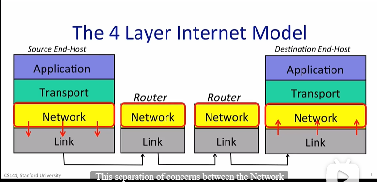
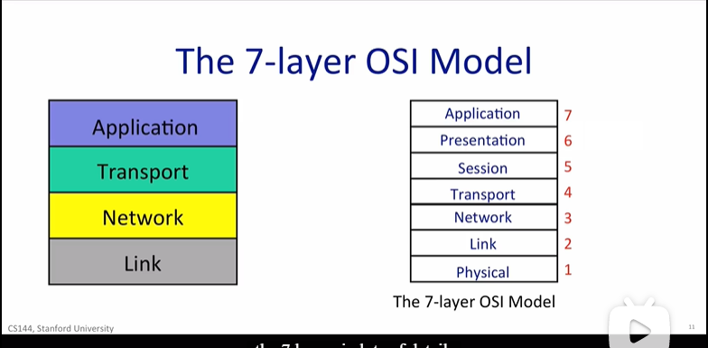
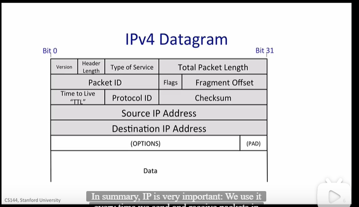

# Stanford CS144

- [CS144视频（b站）](https://www.bilibili.com/video/BV1wt41167iN?from=search&seid=12807244912122184980)
- [CS144课程网站（包括Pdf、Lab）](https://cs144.github.io/)

### 1-1Two application

- World Wide Web(HTTP)

  访问因特网

- BitTorrent

  - principle: breaks the file into "pieces" and the clients join to download one of "parts" 

  - first get the torrent file which describes some information about the data file you want to download.

    Also tells BitTorrent about the tracker-- stores the lists of other clients

  - ClienA发送request给Tracker,Tracker发送其他客户端的信息，你的客户端接收后再发送给你接受到的客户端名单
  - 动态交换数据

- Skype: a mixed system

  - NAT   NAT(阻挡某方面交流), 用Rendezvous server

  - NAT--NAT当客户端和另外的客户端（交流的双方）都有NAT时，用Relay来传递信息
  - No NAT, 直接交流信息

### 1-2

The 4 Layer Internet

- Link

  - end-hosts(主机终端)-- router（路由器） hop-by-hop(逐级传递) e.g. Ethernet(以太网) and WiFi

  - carry the data one link one time

- Network

  - deliver packets end-to-end from the source and the destination

  - 检查目的地 如果没到 回到Link 再继续传

  - must use Internet Protocol(IP)  can get lost no guarantees

- Transport

  弥补Network的无法保证数据正确，完整，有序的不足

  control congestion（阻塞）

  - TCP(Transmission Control Protocol) 

    - provides a service to an applicaiton, guarantees,top of the Network Layer service

    - reuse

  - UDP 
    - much simple
    -  no guarantee 

- Application

  byte-stream e.g. GET URL

- the 7-layer OSI Model(观察每个部分的协议（如何交流的）)

  

### 1-3 What the Internet is The IP  Service

Link Frame(Link Data(IP Datagram(IP Data(Data, Hdr), IP Hdr)), Link Hdr)

-  The IP Service Model四个特点

  - Datagram: self-contained (Data, IPSA,IPDA)

    anology(类比):邮局送信

    --IPDA-the destinaiton address

    --IPSA-the IP source address

    --routed by hop-by-hop

  - Unreliable

    超时/顺序出错/没有发送

  - Best effort(IP是由原则滴~)

    only make these errors when necessary

  - Connectionless  No per-flow state, might be mis-sequenced 

- Why is the IP service so simple

  - simple, lower cost to build and maintain

  - The end-to-end principle (If you can, you should)  

    Later: How transport Layer build reliable communication service over the unreliable IP network service.

  -  Allow a variety of reliable(or unreliable)services to be built on top

  - Works over any link layer

- The IP Service Model

  1. prevent packets looping forever.(加一个hop-count filed "TTL" 从128开始；减少损害而不是绝对禁止)
  2.  will fragment packets if they are too long. (e.g. Ethernet 1500bytes)
  3. uses a header checksum(减少送错风险)
  4. allows for new versions of IP(IPv4 32 bit && IPv6 128 bit)
  5. allows add something to header(很少使用)

- IPv4 Datagram

  - Destination IP Address

  - source IP Address

  - Protocol ID(tells us what is inside the data field)

    e.g. If has the value "6"--the data contains a TCP Segment(便于解析)

    The Internet Assigned Numbers Authority(IANA) defines over 140 different values of Protocol ID

  - Version
  - Total Packet Length
  - ....

  

  

### 1-4 Life of a Packet

- TCP Byte Stream

  -  3-way handshake 

    i. client: SYN 

    ii. server: SYN/ACK 

    iii. client: ACK

  - 如何具体实现(图示为TCP例子)

    - Client IP address TCP port

      IP address: the network layer uses it to deliver packets

      TCP port: deliver data to which software

    - Server IP address TCP port:80(usually)

    - Routers(通过路由中转)

      hops用于Client, Routers, Server的连接

      e.g. Client -- wireless WIFI(Router) --  更大更广的Router (决定用哪个hop) -- Server 

      Inside Each Hop 会有很多选择(patterns),Router会选择最优的
  
  - Under the Hood
  
    - wireshark stream establishment and data exchange
  
      **Wireshark**（导线鲨鱼，前称**Ethereal**，空灵）是一个免费开源的网络[数据包](https://zh.wikipedia.org/wiki/封包)分析软件。网络数据包分析软件的功能是截取网络数据包，并尽可能显示出最为详细的网络数据包资料。
  
    - traceroute route packets take through Internet
  
      traceroute，现代Linux系统称为tracepath，Windows系统称为tracert，是一种电脑网络工具。它可显示数据包在IP网络经过的路由器的IP地址。
  
    - 实践抓包尝试（看了半天）

### 1-5 Principle: Packet Switching

- Packet: self-contained

- Packet Switching: Independently for each arriving packet

-  Two consequences

  1. Simple packet forwarding.

     No per-flow state required(don't need state for each flow--self-contained )

  2. Efficient sharing of links.

     Statistical Multiplexing

### 1-6 Principle: Layering

- characteristics

  (e.g. Layering in the postal service)

  - functional components
  - communicate sequentially (above and below)
  - provides a service to the layer above, using the services below

- Layering in a computer system

  self-contained

  edit-compile-link-execute

   (e.g. C programming language)

  sometimes break it (NATs)

-  Reasons for layering
  1. Modularity
  2. Well-defined service
  3. Reuse
  4. Separation of concerns
  5. Continuous improvement
  6. Peer-to-peer communications

### 1-7 Principle: Encapsulation(结合1-6)

- Layer Model

  WIFI ((IP packet(TCP(HTTP GET))))

- Flexibility

  (e.g. VPN套娃)

  Ethernet link frame(IP (TCP(TLS(IP(TCP(HTTP))))))

### 1-8 Memory, Byte Order, and Packet Formats

-  Endianness
  1. Litter endian: x86
  2. Big endian: ARM Network byte order

-  Portable Code
  - convert network byte order to your host order
  - C functions: htons(), ntohs(), htonl(), ntohl() #include <arpa/inet.h>
  - be careful when handle network data

### 1-9 Names and Addresses: IPv4

- Goal of Internet Protocol Address
  - Stitch many different network together
  - network-independent, unique address

- 32 bits long: a.b.c.d

- Netmask: apply this mask, if it matches, in the same network

  255.255.255.0 first 24 bits match

  255.255.252.0 first 22 bits match

  255.128.0.0   first 9 bits match

  Smaller netmask means larger network

  - ifconfig  

     en1

- Address Structure
  - network + host
  - Class A, B, C: 0 +7 +24, 10+14+16, 110+21+8

- Classless Inter-Domain Routing(CIDR) 无类域间路由 (没听懂)
  - any number of bits 
  - e.g. Stanford 5 / 16 blocks -- 325,000 addresses  5*2^(32-16)

- IANA: Internet Assigned Numbers Authority

- RIRS

### 1-10 Longest Prefix Match

- Forwarding table is a set of CIDR entries

- Algorithm used to chose matching entry(先前面Match，后面prefix匹配)

- default: 0.0.0.0/0

- Question:

  171.128.16.0 link 171.0.0.0/10 Or171.0.0.0/8  why latter one?

### 1-11 Address Resolution Protocol(ARP)

