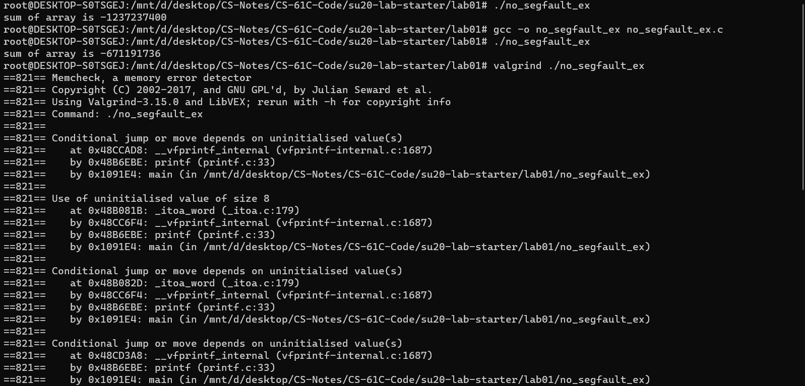
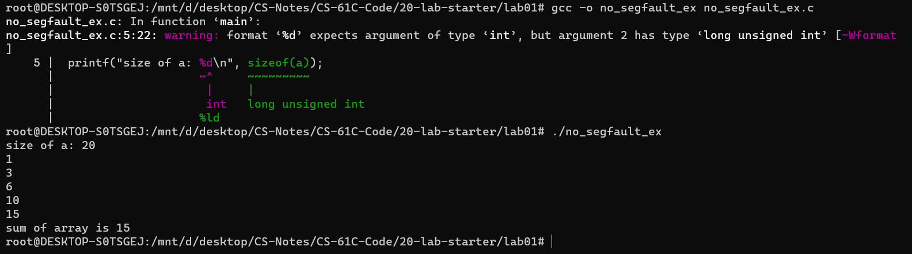
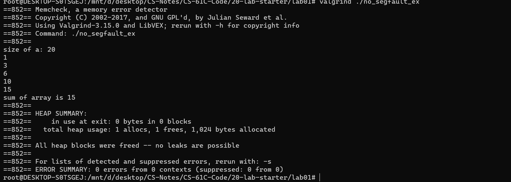
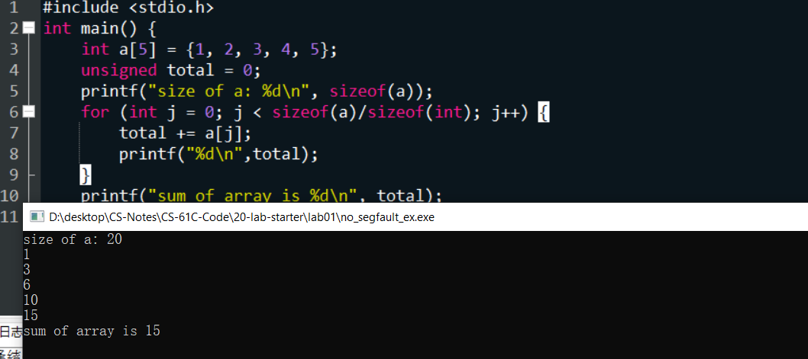

## 资源汇总

### GDB card: [CS 61C](https://cs61c.org/resources/pdf?file=gdb5-refcard.pdf)

[homework2015](https://inst.eecs.berkeley.edu//~cs61c/sp15/ )

[GitHub - ijpq/MyCS61C: this repo contains self-learning in UCB-CS61C of our group and it's appreciate that anyone would like to join me.](https://github.com/ijpq/MyCS61C)

## Discussions

### discs0

aims: a conceptual check

1.1 true (not exactly) 1.2  false 1.3 false 1.4 true

2 (a) 1. 0b10010011 0x93 0d147; 2. 63 0b0111111 0x3F the later the same method, so skip it

2 (b) 1. 0b1101001110101101 skip the same way

2 (c) 2^16 = 64 Ki the same skip

2 (d) 2 Ki = 2^11  skip the same

3 (a) two's 127 -128  (**don't understand the homework when I was doing them)**

3(b) biased not know exactly   

3(c) 3

3(d) 256 unsigned  **No such integer? 1to256 instead of 0 to 255**

3(e)(拍照纸上)

​	Thought: we assume that x `abcdefgh` with 8 bits. a,b,c,d,e,f,g,h all represent 0 or 1.

​	

​			

3(f)

​	why the three radices shine? 

 	base 10: maybe that's because people have 10 fingers

​	 base 2: It's better for computer. But why it's better for computers, I don't know.

​	 base 16: one digit of base16 can symbol 4 digits of 2. But why base 8 is not used. I don't know neither.

**Extracts from the solution:**

**Binary signals are less likely to be garbled than higher radix signals, as there is more “distance” (voltage or current) between valid signals. Additionally, binary signals are quite convenient to design circuits, as we’ll see later in the course.**

4(a) 2 overflow reference: Two's Complement Overflow Rules

4(b) 1.8bits 2.7bits 3. ? an: 7bits 64 numbers 4. 2^43 < 12* 2^40 <  2^44

### discs1

**1**

 1.1 false 1.2  pointer: (google a pointer is a variable whose value is the address) 这里和Java里的`reference variable` 进行一个简单的区分，Java严格没有指针，参考文章[对比C/C++，浅析Java里的指针和引用_晚秋星辰-CSDN博客](https://blog.csdn.net/dengpeng0419/article/details/47452027)

In fact, an array variable is the first address of the array. 

1.3 `invalid argument.` (the result of compile) `warning: passing argument 1 of ‘free’ makes pointer from integer without a cast [-Wint-conversion]`

1.4  don't know

**2**

 2.1 `pp` evaluates to the address of `p` `0xF9320904` 

​		`*pp` evaluates to the address of `0x2A` `0xF93209AC`

​		`**pp` evaluates to `0x2A`.

2.2 (a) If the size of arr is 0 and then return 0. Otherwise it will returns the sum of the array `arr`.

​	  (b) `sum` variable calculates the number of `0` value in the array, and the value to reture is the minus sum.

​	  (c) 

```c
//bitwise operator x = y, y = x;
x = x ˆ y;
y = x ˆ y;
x = x ˆ y;
//the procedure of prove is interesting
```

​	(d) write the XNOR in C

```c
int baz(int x, int y){
    int a = ~x & ~y;
    int b = x & y;
    return a & b;   //Xor a | b
}
```

**3**

**3.1**

(a) 

```c
void swap(int *x, int *y){
	int tep = *x;
    *x = *y;
    *y = tep;
}
```

(b)

```c
int mystrlen(char* str){
    int count = 0;
    while(*str){
        str += 1;
        count++;
    }
    return count;
}
```

**3.2**

(a) `sizeof()` --> the number of Bytes. It should be `sizeof(summands)/sizeof(summands[0])`

​		Or use `size_t n` as the parameter of the methods.

(b)  `error: lvalue required as increment operand`  `(*(string + i))++;` why don't know 优先级顺序是同级关系(c, 结合方向右到左) (cpp 中 ++ 优先)

(c) 


### discs2


## labos

### lab0

 课程基本注意事项（自学者没有homework账号）

 git 一些基本命令(我写在了自己的笔记里)

 至少学会一种`text editor` Vim/Emacs/Nano

### lab1

#### Exercise 2: Catch those bugs! && Exercise 1: See what you can C

- `-c`,GCC会编译并汇编该代码

- `-o`, which is used to specify the name of the executable file that `gcc` creates

`$ gcc -o program program.c $ ./program`

- `-g` flag , which stores information in the executable program for `gdb` to make sense of it.

  `gcc -g -o hello hello.c`

  `gdb hello`

- `gdb`卡片，基本debug的操作

  GDB card: [CS 61C](https://cs61c.org/resources/pdf?file=gdb5-refcard.pdf)

    1. *set the arguments*
    2. create a breakpoint
    3. execute the next line of C code in the program after stopping at a breakpoint?
    4. debug the code inside the function
    5. continue the program after stopping at a breakpoint?
    6. print the value of a variable
    7. displays the value of a variable after every step
    8. show a list of all variables and their values
    9. quit

#### Exercise 3: Debugging w/ YOU

 注意`gcc`版本问题使用`redirection`需要`gcc` 8.0 以上版本

​    `./a.out < fileName.txt`

#### Exercise 4: Valgrind’ing away

盲点知识：

```c
struct Point {
int x;
int y;
struct Point *p;
};
struct Point *ptaddr;
/* arrow notation */  (箭头和.不同的表示)
int h = ptaddr->x;
int h = (*ptaddr).x;
```

 bohrbugs:  they manifest reliably under a well-defined, but possibly unknown, set of conditions(编译器能检测到)

 heisenbugs: often due to mis-managed memory(检测不到)

practice: tortoise and hare(龟兔赛跑)

 对于一个Node * hard

```c
    (*(*hare).next).next EQUALS hare->next->next 但是第二种更简单
```

在两种环境下测试结果不一样：（问题，教案上明显说的是第二种情况）

第一种：



删掉no_segfault_ex后的结果重新测试





devC++结果:



删掉后结果和devc++测试结果一致，说明大体是这样。

为什么有错误但成功运行了呢？我个人猜测是gcc编译器在背后里帮我们把sizeof(a)的问题处理掉了，具体怎么处理。我不知道。但是这里我们发现用valgrind检测会查到memory的错误，这也是它厉害的一个地方了。

#### lab2

#### Exercise 0: `Makefiles`(不太会，稍微看了下)

`Makefile` Tutorial : [Makefile Tutorial By Example](https://makefiletutorial.com/#why-do-makefiles-exist-)

1. Which target is part of a rule that deletes all the compiled programs?
2. Which target is part of a rule that makes all the compiled programs?
3. Which compiler is currently being used?
4. What C standard are we currently using?
5. How would we reference a variable FOO in a makefile?
6. What operating system does the term “Darwin” represent?
7. What line creates the lfsr program from its object files? (Give its line number.)

#### Exercise 1: Bit Operations

- base knowledge

  bitwise operations such as and (&), or (|), xor (^), not (~), left shifts («), and right shifts (»)

- 貌似在某个bit 取`v`时，其实也可以采用 `0|v`方式

- 对 `xor`的理解

  ```c
  //多用于多bit数字的场景。以单bit运算为基本出发点，固定其中一位为0，发现最后的结果就是另外一个数字等价位上的值；同理，固定其中一位为1，结果为另一个数字等价位值的取反。
  if(bitStatus == 1)*x &= ~(1 << n);
  else if(bitStatus == 0){
      *x |= (1 << n);
  }
  ```

#### Exercise 2: Linear Feedback Shift Register

- 对于大端法和小端法，最高位所在位置不同，这里的最高位是最左边（大端法最高位在低地址，这里是大端法）

- 位运算的对象是数字而非指针，如果要得到某一位，只需要把第n位移到最低位和1取&即可

- 疑惑：为什么会有65536种正整数结果

#### Exercise 3: Linked Lists

 Java写过很多次，感觉比较esay!

#### Exercise 4: Memory Management

- `make vector_test`没成功使用 `gcc -o vector vector.c vector_test.c`测试成功
- `make vector-memcheck`没成功
- make理解不到位

### lab3

学习参考:

​	[RISC-V Assembly for Beginners. If you are new to assembly programming… | by Erik Engheim | The Startup | Medium](https://medium.com/swlh/risc-v-assembly-for-beginners-387c6cd02c49)

​	Computer Organization and Design RISC-V edition 

#### Exercise 1: Familiarizing yourself with Venus

简单熟悉下 venus的一些操作

#### Exercise 2: Translating from C to RISC-V

​	同上

#### Exercise 3: Factorial

折腾了很久，看似很简单。

## Project

### Project1

指针指针傻傻分不清？

思考的统一性！

 如果你这样思考：画出了一个指针然后这个指针指向的位置区域，那么每一个部分都这样思考

 指针赋值的话赋值的其实是其中一个指针指向的地址，而不是指针本身。但指向指针的指针存放的是指针的地址。

 不然的话，就简单理解这个指针原先存的那部分地址，然后改变了，存在那部分地址。

```c
//把table->data[location]理解为指向NULL或者是已经分配过内存的Bucket
//理解了其实就是一个头插法  5/10
//画图理思路很重要但是有时候好像也没必要哈
	//struct hashBucket* temp = table->data[location];
	//table->data[location] = newBucket;
	//newBucket->next = temp;
  newBucket->next = table->data[location];
  newBucket->data = data;
  newBucket->key = key;
  table->data[location] = newBucket;
  
```

```c
//My code
//problems: if we want to find data in a bucket. We can't iterate all the buckets
void insertData(HashTable *table, void *key, void *data) {
  // -- TODO --
    unsigned int location = table->hashFunction(key);
    //judge if table->data[location] is NULL
    if(table->data[location]){
      while(table->data[location]){
        table->data[location] = table->data[location]->next;
      }
      table->data[location] = (struct HashBucket*)malloc(sizeof(struct HashBucket));
      table->data[location]->key = key;
      table->data[location]->data = data;
      table->data[location]->next = NULL;      
    }
    else{
      table->data[location] = (struct HashBucket*)malloc(sizeof(struct HashBucket));
      table->data[location]->key = key;
      table->data[location]->data = data;
      table->data[location]->next = NULL;
```

`stringHash`的数学原理:

参考回答：[Why does Java's hashCode() in String use 31 as a multiplier? - Stack Overflow](https://stackoverflow.com/questions/299304/why-does-javas-hashcode-in-string-use-31-as-a-multiplier)

`A nice property of 31 is that the multiplication can be replaced by a shift and a subtraction for better performance: 31 * i == (i << 5) - i. Modern VMs do this sort of optimization automatically.`

```C
//str1是分配了某定长的字符串，在这个字符串中的某个位置给他设定成'\0'，比如，str1[2] = '\0',那么整个字符串就变成了'\0'，而不是str1字符串的第二个位置是'\0'

//

#include <stdio.h>
#include <stdlib.h>
 
int main(void)
{	
	char * str1 = "hello,world";
	printf("%s",str1);
	str1[2] = '\0';
	printf("%s\n", str1);
	str1[2] = 'l';
	printf("%s\n",str1);
}

```

```c
//版本1的processInput()函数
void processInput() {
  // -- TODO --
  int size = 60;
  int i = 0;
  char *c ;
  //str1 word 
  char *str1 =(char *)malloc(size) ;
    //str2 entirely lowercase
  char *str2 =(char *)malloc(size) ;
  //str3 all but the first letter lowercase
  char *str3 =(char *)malloc(size) ;
  while ((c = fgetc(stdin) )!= EOF)
  {
    if(isalpha(c)){
      //read c into str1
      str1[i] = c;
      i++;
      //read all characters of the word
    while (isalpha(c = fgetc(stdin)) )
    {
      str1[i] = c;
      i++;
    }
    //convert str1 to 3 types
    int j = 0;
    char a = str1[j];
    if (islower(a))
    {
      str2[j] = a;
      str3[j] = toupper(a);
    }
    else{
      str2[j] = tolower(a);
      str3[j] = a;
    }
    j++;
    for (; j < size; j++)
    {
      str2[j] = tolower(str1[j]);
      str3[j] = tolower(str1[j]);
    }
    //find if 3 types are in dictionary
    if(findData(dictionary, str1) != NULL || findData(dictionary, str2) != NULL || findData(dictionary, str3) != NULL){
            fprintf(stdout, str1);
    }
    else{
      fprintf(stdout, str1 + " [sic]");
    }
    //the last char c should be print to standard output
    fprintf(stdout,c);
    i = 0;
    }
    else{
      fprintf(stdout,c);
    }
  }
  free(str1);
  free(str2);
  free(str3);
}

```

```C
//第二个版本
void processInput() {
  // -- TODO --
  int size = 60;
  int i = 0;
  int c ;
  //str1 word 
  char *str1 =(char *)malloc(size) ;
    //str2 entirely lowercase
  char *str2 =(char *)malloc(size) ;
  //str3 all but the first letter lowercase
  char *str3 =(char *)malloc(size) ;
  while ((c = fgetc(stdin) )!= EOF)
  {
    if(isalpha(c)){
      //read c into str1
      str1[i] = (char)c;
      i++;
      //read all characters of the word
    while (isalpha(c = fgetc(stdin)) )
    {
      str1[i] = (char)c;
      i++;
    }
    //convert str1 to 3 types
    int j = 0;
    char a = str1[j];
    if (islower(a))
    {
      str2[j] = a;
      str3[j] = toupper(a);
    }
    else{
      str2[j] = tolower(a);
      str3[j] = a;
    }
    j++;
    for (; j < size; j++)
    {
      str2[j] = tolower(str1[j]);
      str3[j] = tolower(str1[j]);
    }
    //find if 3 types are in dictionary
    if(findData(dictionary, str1) != NULL || findData(dictionary, str2) != NULL || findData(dictionary, str3) != NULL){
            fprintf(stdout, "%s", str1);
    }
    else{
      fprintf(stdout, "%s [sic]",str1);
    }
    //the last char c should be print to standard output
    fprintf(stdout,"%c",c);
    i = 0;
    }
    else{
      fprintf(stdout,"%c",c);
    }
  }
  free(str1);
  free(str2);
  free(str3);
}

```

```c
//最终AC版本
void processInput()
{
  // -- TODO --
  int size = 60;
  int i = 0;
  int c;
  //str1 word
  char *str1 = (char *)malloc(size);
  //str2 entirely lowercase
  char *str2 = (char *)malloc(size);
  //str3 all but the first letter lowercase
  char *str3 = (char *)malloc(size);
  while ((c = fgetc(stdin)) != EOF)
  {
    if (isalpha(c))
    {
      //read c into str1
      str1[i] = (char)c;
      i++;
      //read all characters of the word
      while (isalpha(c = fgetc(stdin)))
      {
        str1[i] = (char)c;
        i++;
      }
      //convert str1 to 3 types
      int j = 0;
      char a = str1[j];
      if (islower(a))
      {
        str2[j] = a;
        str3[j] = toupper(a);
      }
      else
      {
        str2[j] = tolower(a);
        str3[j] = a;
      }
      j++;
      for (; j < size; j++)
      {
        str2[j] = tolower(str1[j]);
        str3[j] = tolower(str1[j]);
      }
      //find if 3 types are in dictionary
      if (findData(dictionary, str1) != NULL || findData(dictionary, str2) != NULL || findData(dictionary, str3) != NULL)
      {
        fprintf(stdout, "%s", str1);
      }
      else
      {
        fprintf(stdout, "%s [sic]", str1);
      }
      memset(str1,0,strlen(str1));
      memset(str2,0,strlen(str2));
      memset(str3,0,strlen(str3));
      //the last char c should be print to standard output
      if(c != EOF){
        fprintf(stdout, "%c", c);
      }

      i = 0;
    }
    else
    {
      fprintf(stdout, "%c", c);
    }
  }
  free(str1);
  free(str2);
  free(str3);
}

```


