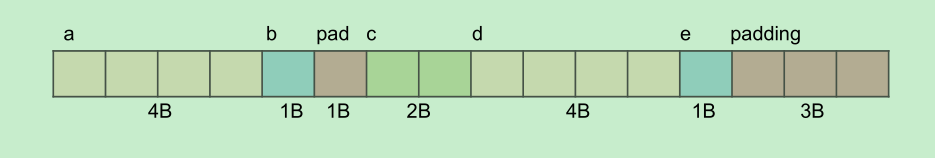
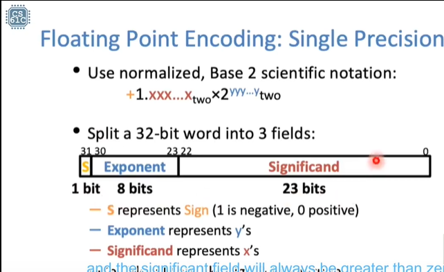
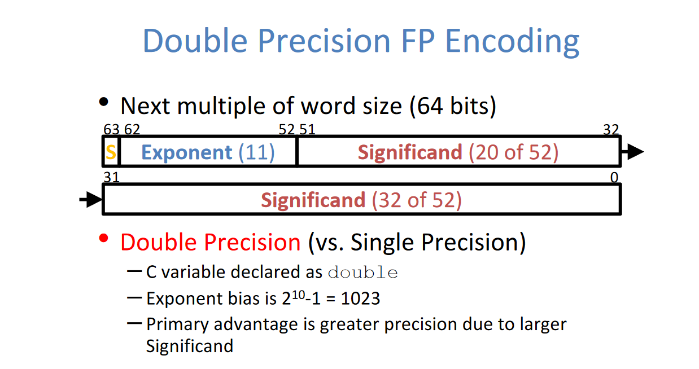
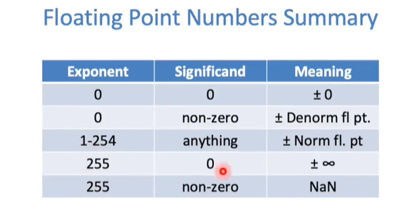
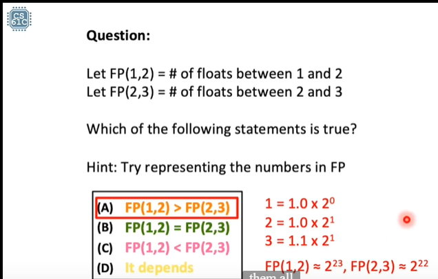
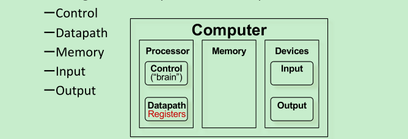
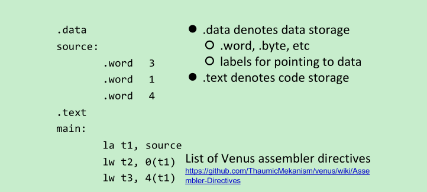

# CS61C:Great Ideas in Computer Architecture

## why I want to learn it and write note

 In this demo, I want to share with you about my current situation and feelings when I study the course so that you can
consider that if you will learn it or if you have the similar ideas with me.

- I have finished Nand2TetrisI on coursera and learn CS according
  to [Teach yourselfCS-CN](https://github.com/keithnull/TeachYourselfCS-CN/blob/master/TeachYourselfCS-CN.md) .
- I'm not majoring material science in university and I want to learn the basic about CS which makes me lose myself in.
- It is not easy for most students to learn the most famous foreign country's CS course by themselves so I want to
  record my study note concretely as possible as I can.
- Enjoy study!

## how to learn this course for me

How long: 24(h)

From my perspective, I want to get an offer maybe in August. I also want to learn some fundamental courses about the
computer science. I'm attracted by its beauty.

So I will look at all the lecture of this course and then pick some lectures to learn. And more time to read the book
CSAPP and do some labs.

Happy coding!

## Resources

Books:

**P&H**: The first edition of Patterson and Hennessy's *Computer Organization and Design RISC-V Edition* book ("P&H"), ISBN 0128122757.

**K&R**: *The C Programming Language, Second Edition* by Kernighan and Ritchie. We will reference its sections in the reading assignments. Other C programming books are also suitable if you are already comfortable with them, but our lectures will be based on K&R.

**WSC**: *The Datacenter as a Computer: An Introduction to the Design of Warehouse-Scale Machines*, which is freely available online [here](https://inst.eecs.berkeley.edu/~cs61c/resources/WSCBarrosoHolzle.pdf).

**资源**

 **(课件、作业、lab、project 都发布在这里)**

[官网](https://inst.eecs.berkeley.edu/~cs61c/su20/)

[lab 和 project 的 starter](http://link.zhihu.com/?target=https%3A//github.com/61c-teach)

[Videos](https://www.bilibili.com/video/BV1jy4y1E7AY?p=22)

推荐CS61C Fall2020的Video，老师讲的特别激情。

学CS61C过程中搜索到的神奇的东东:

构架底层级别的0.3-0.5选手。https://testerhome.com/articles/29582

里面也有一些自学经历内容，关于UCB CS61C的

## lec01 Course Intro, Number Representation

preparation the basis you should know about this course 2's complement 进制转换 unsigned

- Six Great Ideas In Computer Architecture
    1. Abstraction
    2. Technology Trends
    3. Principle of Locality/Memory Hierarchy
    4. Parallelism
    5. Performance Measurement & Improvement
    6. Dependability via Redundancy

- Website Textbooks Piazza(discussion)

- Course Assignments and Grading

  12 total Labs(partner)  4-Projects

- Successful Behaviors

    - Practice, practice, practice
    - Find a learning community
    - Avoid comparison, do your best, and judge yourself on your progress alone.

    - You learn best from your mistakes.

- Number Base Examples

  9472ten = 9000 + 400 + 70 + 2

  General Formula

- 2^10 `Kibi` 2^20 `Mebi` 2^30 `GiBi` 2^40 `Tebi` 2^50 `Pebi` 2^60 `Exbi` 2^70 `Zebi` 2^80 `Yobi`

- Bias Notation

  unsigned value + bias = 'actual' value
  
  A notation that represents the most negative value by 00 … 000two and the most positive value by 11 … 11two, with 0 typically having the value 10 … 00two, thereby biasing the number such that the number plus the bias has a non-negative representation.(摘自 P&H P194 没弄明白 )
  
  维基百科 移码示例：
  
  -120D = -01111000B（真值）
  
  [原码](https://zh.wikipedia.org/wiki/原码)：11111000
  
  [反码](https://zh.wikipedia.org/wiki/反码)：10000111
  
  补码：10001000
  
  **移码**：00001000
  
  这样的移码也可以叫做偏移值为128的移码，也是标准移码，即10000000B+（-1111000B）=10000000B+（10001000B）=00001000B。这样移码就可以表示为原数的补码加上偏移值。在[IEEE 754](https://zh.wikipedia.org/wiki/IEEE_754)浮点数表示中移码是非标准的，它的偏移值为2k-1，也就是说对于[单精度浮点数](https://zh.wikipedia.org/wiki/单精确浮点数)的偏移值为127。

## lec02 C:Introduction,Pointer

- Compilation

    - C - compiled language

    - map C programs into machine code

    - Advantages

      Excellent run-time performance

      fair compilation time

    - Disadvantages

      architecture-specific(CPU type and OS)

      repeat until correct all bugs(Slow procedure)

- Typed Variables in C

  `int`    signed integer 5,-12

  `short`    `int`(short)

  `long int`

  `char`

  `float`

  `double`

- Characters

  i. Encode characters as numbers

  ii. ASCII

  iii. A char takes 1 bit

- Typecasting in C

  i. weakly typed language

  ii. Can typecast anything(be careful)

- Typed Functions in C

- Structs in C

  i. define compound data types

  ii. group of variables, possibly including other structs

  iii. Structs Alignment and Padding in C(enough space and aligns)

  ```c
  //sizeof(struct foo) == 12, 3 unused bytes
  Struct foo {
  int a;
  char b;
  struct foo *c;
  }
  ```

- Unions in C

  i. enough space for the largest element

- operators

  nearly identical

- C Syntax: main

  `int main(int argc, char *argv[])`

  `-argc` argument count contains the number of strings

  `-argv`    argument value is an array

- True or False

  i. No explicit Boolean type

- Pointers

    - variable that contains an address
    - `void *` can point to anything(be careful !!!)

    - `int *x,y,z`  ! = -- > `int *x,*y,*z`
    - pass by reference

## lec03 C Arrays,Strings, More Pointers

- Struct Alignment

  ```c
  struct hello {
  int a;
  char b;   // char 填的时候，如果地址非word(4 Bytes)或者half-word,自动填齐
  short c;
  char *d;
  char e; // 最后结果需要是n个Bytes
  };
  sizeof(hello) = 16
  ```

  

- Arrays

    - Pitfall: An array in C does not know its own length, and its bounds are not checked!

      (learn how to debug later!!!)

    - better write pattern

      ```c
      //If the code is long, it is really easy to change the length of the array.
      const int ARRAY_SIZE = 10;
      int ar[ARRAY_SIZE];
      for(int i=0; i<ARRAY_SIZE; i++)
      ```


- `ar[i]` is true equals to `*(ar + i)`

  i. An array variable looks like a pointer to the first (0th) element

  ii. To zero an array, the following three ways are equivalent:
  `1)for(i=0; i<SIZE; i++){ar[i] = 0;}`
  `2)for(i=0; i<SIZE; i++){*(ar+i) = 0;} 3)for(p=ar; p<ar+SIZE; p++){*p = 0;}`

  iii. K&R: “An array's name is not a variable”

  ```c
  //*p:1, p:40, &p:20
  //*a:2, a:24, &a:24(meaningless)
  void foo() {
  int *p, a[4], x;
  p = &x;
  *p = 1; // or p[0]
  printf("*p:%u, p:%u, &p:%u\n",*p,p,&p);
  *a = 2; // or a[0]
  printf("*a:%u, a:%u, &a:%u\n",*a,a,&a);
  }
  ```

  iv. Array size gets lost when passed to a function

  ```c
  int foo(int array[], unsigned int size){
      printf("%d\n", sizeof(array));
  }
  ```

  v. C String

  ​    `\0` terminator

  `#include <string.h>`:

  ​        `int strlen(char *string)` `int strcmp(char *str1, char *str2)` --> the difference between their ASCII

  ​        `char *strcpy(char *dst, char *src)`


- More pointers

    - Pointer Arithmetic: pointer ± number

      cautiously, the code is hard to read.

    - Increment and Dereference

      `++*p` `*--p` （右到左）

      `(*p)++`

    - Pointer `Misc`(杂项)

      传值和传址

## lec04: C:Memory Management and Usage

- C Memory Layout

  stack(LIFO): local variables, grows downward

   Stack pointer(SP): moves up and down with the procedure

   Misuse Example: return local variable from functions

  heap: space requested via malloc() and used with pointers;

  ​    `sizeof()`

  static data: global and static variables, does not grow or shrink

  code: loaded when program starts, does not change

- Address

    - Endianness

      Little Endian、Big Endian

    - Allocating Memory(should check NULL)

      `malloc`(): continuous blocks, uninitialized, return pointers

      `calloc`(): `void *calloc(size_t nmemb, size_t size)`

       like malloc(), except it initialized all values of 0

      `realloc`(): `void *realloc(void *ptr, size_t size)`

       	need more or less memory in an array

    - Releasing Memory

      `free`(p), p is pointer

- Memory Errors

    - Segmentation Fault

      attempts to access memory not allocated to it

    - Bus Error

    “A fatal failure in the execution of a machine language instruction resulting from the processor detecting an
    anomalous condition on its bus. Such conditions include invalid address alignment (accessing a multi-byte number at
    an odd address), accessing a physical address that does not correspond to any device, or some other device-specific
    hardware error.”

    - Common Memory Problem

        1) Using uninitialized values
        2) Using memory that you don’t own –Using NULL or garbage data as a pointer –De-allocated stack or heap variable
           –Out of bounds reference to stack or heap array
        3) Freeing invalid memory
        4) Memory leaks

## leco5: Floating Points

- Floating Point

  10进制科学计数法(Scientific Notation)迁移到二进制，二进制的点，左半部分和右半部分

  New proper nouns: significand, binary point(floating point), radix(base), exponent

    - Single Precision

      32-bit word into 3 fields

      

      

      

      Biased notation:

       why use it?

        1. compare numbers easily(保证数组非负线性，补码的一个弊端非线性)

            compare order: Sign --> Exponent --> Significand

      The Exponent Field:

       1. bias: -127

        2. encoding: +127 e.g. 2^1 exp = 1 ==> 128 ==> 10000000two

        3. cases

           Normalization:

            Exponent != 0 || != 255

           Denormalization:

            all 0

           Special cases:

            11111111(255):

            NaN != 0
      
            infinite: all 0
           
           

- Floating Points: special cases

  可参考文章结合阅读思考： https://zhuanlan.zhihu.com/p/343049681

  `0 00000001 00000000000000000000000` & `0 00000000 11111111111111111111111` 的理解

  *非规格数**实际指数**的计算方法(实际指数 = 1 - bias), 和规格数**实际指数**的计算方法(实际指数  = 指数位的值 - bias)**不同*** (gradual underflow)

  *① 为什么规定非规格数的尾数前隐藏的整数部分是 **0.**  而规格数尾数前隐藏的整数部分是**1.*** 

  *② 为什么非规格数的真实指数的计算公式是 **1 - bias**, 而规格数的真实指数的计算公式是 **指数部分的值 - bias** 了*

  

  结合1:norm number,  2:denorm(subnorm) number, 3: infinity and NaN

  ​        

  - In scientific notation: 32bits of 0 and the result is not zero.

    (e.x. 0x00000000 is 1.0*2^(-127) != 0)

    2^(-127)  2 to negative 127

  - Representing ± ∞

    Infinity is a number. (eg. x/0 > y) it is right. x/0 = infinity. inginity is greater than y.

  - Representing NaN

    0/0, sqrt(-4), ∞ - ∞

    Useful for debugging. (VS 上出现过NaN 想一想有多少种可能性出现NaN, 2^23，大概800万种)

    (exponent:255 significand:non-zero NaN **why and details you don't need to know now** (maybe later ))

  - Norm numbers and denorm numbers

    **norm:** 

    ​	exponent:1-254 signficand: anything

    **denorm**:

    ​	exponent: 0 sigificand:non-zero (No leading 1)

    ​	Think: smallest denorm, largest denorm, smallest orm and teir gap. 

  **不懂得地方**:

  Exponent: 0, Significand:0 这种情况下偏码计算的值是0吗？

  Denorm Norm

  fl. pt. #

  fl. pt 不明白什么意思

- Floating Points Limitations

   Assume x is the result

   Overflow:  abs(x) > 2 ^123

   Underflow: 0 < abs(x) < 2^-149

    - Floating Point Gaps: get larger with larger exponent

    - FP addition is NOT associative

      Small + Big + Small != Small + Small + Big

      不是很理解的地方(+一个后面的小练习)

      ​    


浮点数具体的每部分和历史

当然内容很丰富

## lec06:Introduction to Machine Language: RISC-V architecture(重点来啦)

学习资料：

​	[RISC-V Assembly for Beginners. If you are new to assembly programming… | by Erik Engheim | The Startup | Medium](https://medium.com/swlh/risc-v-assembly-for-beginners-387c6cd02c49)（很好的一篇for beginner的文章）

​	CS61C课程

Assembly Language Program(e.g. RISCV)

比Hack computer(macro assembler的简化)更硬核，现代应用的东东。

- CISC

  Complex Instructions Set Computing

  实例(x86系列)

- RISC-V

  Reduced Instructions Set Computing

  Litter-Endian

  特点

  - 简单  ARM架构（基于RISC-V设计思想）设计在手机上

  - 甚至让x86体系向RISC-V靠近

  - 处理速度快

    .png)

- RISC-V架构只是对Registers进行操作

- 为什么又sub但没有subi，我们知道subi可以用addi加负数的方式进行表现，但是为什么还要又sub呢？

  一种思考是，add和sub是对两个寄存器中的数进行操作，不知道正还是负

  另一种思考是，RISC-V简洁到不要subi了但是CISC-V还是有（猜测）。

- 计算机组成架构图

  

- 手册RISC-V Reference Data  (google 搜索green card)

- Data transfer

  `memop reg, off(bAddr)`

  values can start off in memory

  ​	don't understand it clearly

  

  .data static segment or data segment

  .text text segment

     la load address

  **Sign Extension**  don't understand it completely(结合CSAPP看懂了)

  Assembler Directives

  https://github.com/ThaumicMekanism/venus/wiki/Assembler-Directives

- Control flow instructions

  `beq` branch equal
  
  `bnq` branch not equal
  
  `j` jump
  
  `blt` branch less than
  
  `bge` branch greater than or equal
  
  Program Counter stores the address of the current code which will be executed
  
- Shift Instructions(csapp看懂了，再看不会，复习用的例子)

  ```
  
  # sample calls to shift instructions
  addi
  t0,x0 ,-256 # t0=0xFFFFFF00
  slli
  s0,t0,3 # s0=0xFFFFF800
  srli
  s1,t0,8 # s1=0x00FFFFFF
  srai
  s2,t0,8 # s2=0xFFFFFFFF
  addi t1,x0 ,-22 # t1=0xFFFFFFEA
  # low 5: 0b01010
  sll s3,t0,t1 # s3=0xFFFC0000
  # same as slli s3,t0,10   为什么等于10移位
  ```
  
  
  
- la t3, n

  
  
- 

  

## leco7:More RISC-V, RISC-V Functions

6.11看懂

lab写的吃力 汇编代码

## lec08:RISC-V Instruction Formats

## leco9:Running a Program: CALLs(写project了)

## leco10:Combinational Logic(这个我会，嘿嘿)

## leco11:Sequential Digital Logic(会，但有点晕，想学可以深入)

Logisim的使用，虽然之前接触使用过

## leco12:RISC-V CPU Datapath, Control Intro(搞CPU了，可深入)

之前学Nand2Tetris这部分简化了，你直接按照diagram补充一些细节就可以了

## leco13:RISC-V CPU Control, Pipelining(看了下，真TM硬核)

## leco14:RISC-V Pipeline Hazards!

## leco15:Memory Hierarchy, Fully Associative Caches

## leco16:Direct-Mapped and Set Associative Caches(涉及到缓存)

## leco17:Multilevel Caches, Cache Questions(更多的缓存)

## leco18:Operating Systems, Virtual Memory Intro(操作系统)

## leco19:Virtual Memory

## leco20:Input/Output

## leco21:Flynn’s Taxonomy and

Data-level Parallelism(并行，之前没接触)

## leco22:Amdahl’s Law and

Thread Level Parallelism

## leco23:Multithreading Issues, Cache Coherency

## leco24:Warehouse Scale Computers, MapReduce

## leco25:Dependability: Parity, ECC, RAID

## leco26:View from the Top