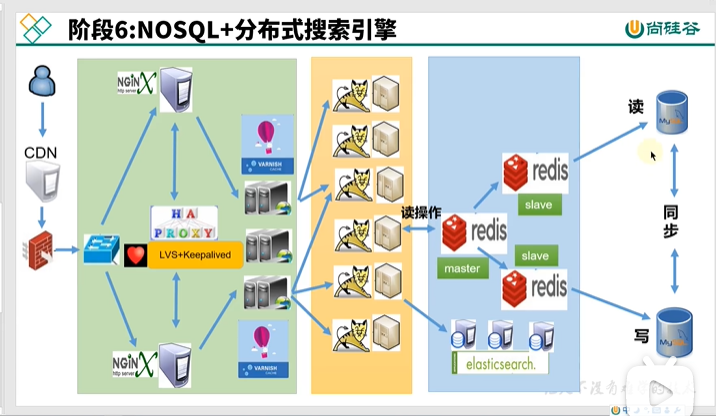
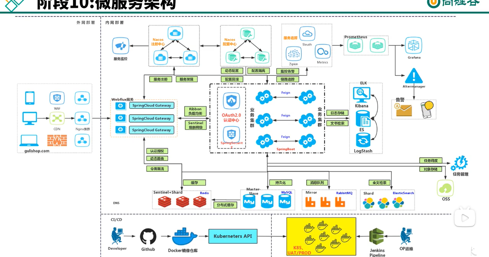
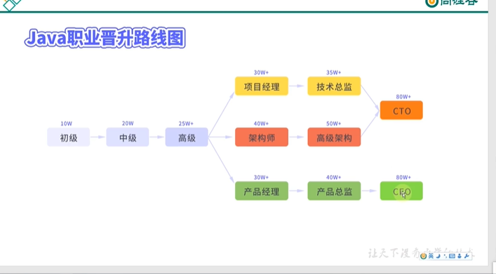
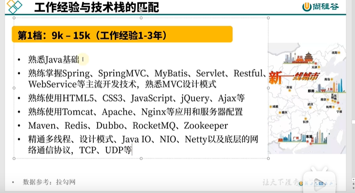
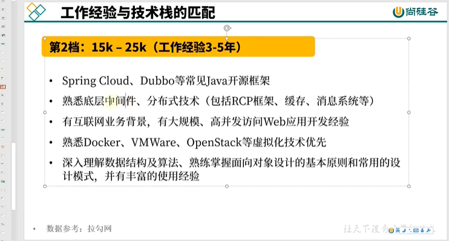
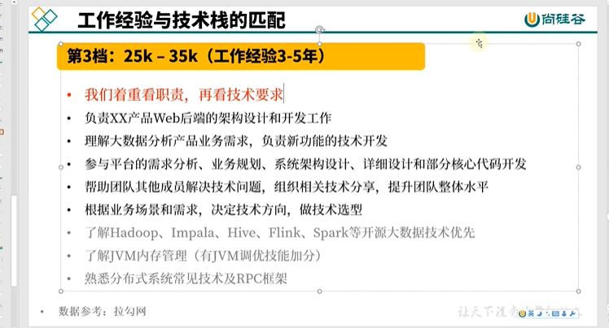

Java后端是我现阶段学习的一个主要的方向。

对于四大的课程，我很想学习，初步思考了下主要从事方向的问题，语言其实还是一门工具，

如果真的有兴趣的话，本科仍有1年的时间，可以去主动探索计算机科学的世界，弥补自己想学4大的课程。

- Java开发的一个巨大的优势就是短期内不需要和计算机系统，了解底层的一些东西也能满足开发的需要，是自己现阶段学习的一个重点，目标是要打好基础，学习SSM(spring,spring mvc, mybatis)框架，撸一个项目出来。

- 如何打好基础，教材阅读Java 核心基础 I,II。辅助github开源项目JavaGuide面试指南。

## 对Java学习路线图的思考

Java8新特性

Java并发编程

JVM虚拟机

Git

Docker

Maven

Spring

SpringBoot2

## Core Java

阅读教材沉淀思考的环节还得补上。方式，以面试题以点带面，同时按照感兴趣章节进行慢慢推进。

## 尚硅谷宋康红主讲Java零基础小白七节必修课

- 如果要深入学习计算机科学，C，C++是绕不开的，配上国外经典课程
- 我的理解：人生不只是编程，仍有很多美好的东西值得追求（爱情，自己的兴趣，朋友，健康的身体等）

- 语言是一门工具与技术，每一个技术背后都有商业公司的推动, 背后的实质是需求推动技术发展

  (e.g. 国内:T-C/C++, A/Java, ByteDance/都有，但新兴的go语言

   国外：Google Python、R语言等)

- 互联网架构技术迭代

  阶段1-3

    1. All In One 单机集中构建网站

    2. 应用服务器配置集群

        - nginx（转发到具体的应用服务器） + 应用服务器配置集群

       nginx主要功能： 反向代理+动静分离+负载均衡

        - session的一致性：

          1、session复制到所有服务器

          2、同一个ip 同个服务器

        - nginx挂了怎么办: 多个nginx LVS(Linux虚拟化服务,可做反向代理)+Keepalived(定期检查nginx是否活着)

  阶段4：CDN(Content Distributed Network)+Varnish服务器配置集群

    - CDN: 加速用户访问速度

    - Varnish: HTTP加速器

      静态文件放在nginx

      动态文件放在Tomcat，对于相对静态的动态文件放到Varnish中（降低服务器压力）

  阶段5：数据库读写分离

  阶段6：NOSQL+分布式搜索引擎

  

    - 读的文件放到redis中, 增加读取速度

      数据库相对于磁盘层面

      redis相对于内存层面

  阶段7：NOSQL(HA)+分库分表+MyCat

    - Codis: redis集群的解决方案,合并redis

    - 读库水平拆，写库垂直拆（MyCAT分表）

      问题：

        - 运维的操作和获取
        - 分布式事务的提交

  阶段8：分布式文件系统

    - 小视频、图片、音频放到分布式文件系统

  阶段9：应用服务化拆分+消息中间件

  消息中间件（同步异步）

  (e.g. ActiveMQ等 java语言编写的)

  阶段10：微服务架构 分布式的

    - 

Java职业晋升路线图

- 

- 初级 10W 辅助性工作（辅助中高级工程师）
- 中级 20W 模块化的开发(90%业务是中级工程师开发)
- 高级 25W+ 模块的优化 培养初级和中级
- 项目经理30W+ 评估项目周期、成本，收益
- 架构师 40W+ 项目采用的具体架构
- 产品经理 30W+ (不需要很高技术没项目背景) 产品整体形态

技术先转移路线图

- 大数据（数据挖掘、处理 ）40W+
- 微服务（互联网架构） 40W+
- 全栈式（前后端全覆盖）40W+

工作经验与技术栈的匹配

- 

- 

- 

- ....

互联网大厂的职场级、薪资揭秘(公共资源)

- 阿里双序列职业发展体系 技术岗P系列 M管理

  业绩和价值观各占50%

- 腾讯14级 末尾淘汰制 业绩70% 行为30%

- 百度 技术序列T3-T11 T5/T6属于部门骨干 产品运营P 后勤支持部门S 管理序列M

  业绩考核70% 行为30%

- 字节跳动(ByteDancer)淡化职级 加班 大小周120%工资加班费

  57:43 年龄97%为80、90后

  一共10级 1-1 1-2 2-1等5-1

  薪酬高25%-40%

- 京东 T级 技术 T1-T11

- 美团 P专业路线 M系列 管理路线

- 滴滴 D5-D12

- 小米 13到22级

  去KPI，去title，去管理

- 华为 7级 技术

  技术等级+13=任职资格，没有严格的匹配关系，不一定是13

  狼性文化，但有背景原因。撑起华为,中美两个大国的博弈，弱势的一方很多代价是由人来承受的。996如果不可避免，如果从996系统中脱身，实现自己的理想。

## Lambda编程

在刷leetcode的时候，很明显感到自己对lambda语法了解甚少，这成为Java语言学习中的一个阻碍，也不利于后序对Stream的一个深入学习。

参考资料：

[Lambda Expressions (The Java™ Tutorials > Learning the Java Language > Classes and Objects) (oracle.com)](https://docs.oracle.com/javase/tutorial/java/javaOO/lambdaexpressions.html#use-case)

[深入浅出理解JAVA 8 Lambda表达式 Stream_just xiaoqiang-CSDN博客](https://blog.csdn.net/crpxnmmafq/article/details/72510314)

[深入理解Java 8 Lambda（语言篇——lambda，方法引用，目标类型和默认方法） | lucida](http://lucida.me/blog/java-8-lambdas-insideout-language-features/)

现状：

被警告去学习

如果你不知道什么是函数式编程，或者不了解 `map`，`filter`，`reduce` 这些常用的高阶函数，那么你不适合阅读本文，请先学习函数式编程基础（比如 [这本书](http://www.amazon.com/How-Design-Programs-Introduction-Programming/dp/0262062186/)）。

回忆了一些视频和之前学习的内容，之前学习最多只是涉略到了匿名内部类，lambda表达式的使用，是怎么写的，但具体为什么这样做，这样做除了少写代码之外的好处，对框架学习有什么联系等等，这些都暂时没有答案。

不过几个模型得去写，comparable接口，接口作为传递参数等等。常见的传递到Arrays类中的sort方法。

