写在前面

一些工作后前辈的博客

[在ThoughtWorks工作这几年我学到了什么？ | 黄博文的地盘 (huangbowen.net)](https://www.huangbowen.net/2015/11/11/what-i-learn-in-thoughtworks/)


### Homework 要求

- 小步提交，**及时 push（至少每天 push 一次）**。 请大家把 commits 及时 push 到 GitHub 上。原因如下：Coach 有一个脚本，会定期统计大家的提交情况，主要是为了了解大家的学习投入情况等，为后面改进学习设计提供数据支撑。

- 无需录屏

  

### 提交方式：

- 将录屏上传到平台（**录屏要求和平台推荐** 请查看屏说明及工具推荐](https://trello.com/c/VnXbY3KC/142-assignment-录屏说明) ） **注意信息安全**
- 提交获取录屏的方式到 assignment repo 下的 [RECORDING.md](http://RECORDING.md) 文件中（e.g., 访问链接、密码等）
- Push 代码到自己的 GitHub org

### Deadline 🚩

- 没有特殊说明的 Step 的 Assignment 在当前 Step 结束之后的一周内完成
- Step 1 的 Assignment 在 Step 1 结束后的两周内完成
- 此项为推荐提交时间，非硬性要求

### Assignment 完成步骤 🚩

- 按照说明获取Assignment repo
- 独立完成代码
- 按照要求完成录屏 （可以多做几遍，达到熟练的程度再录屏），关于**录屏要求以及工具选择**，请查看
- 录屏的具体获取方式请写在 `RECORDING.md` 中，确保 buddy/coach 能够访问
- 提交 repo 到 GitHub
- 提交金数据表单 [提交 Assignment 表单](https://jinshuju.net/f/LjK6a0) 通知 Buddy "已完成" XX Assignment

## How to learn

用到的笔记仓库：Java

书籍： Core Java I,II Modern Java

围绕着需求点循序渐进进行学习


## Conventional Commits

https://www.conventionalcommits.org/en/v1.0.0/

easy set of rules for creating an explicit commit history;automated tools

```
<type>[optional scope]: <description>

[optional body]

[optional footer(s)]
```

structural elements, to communicate

1.fix: fix patches a bug  (correlates with PATCH in Semantic Versioning)

2.feat: introduces a new feature (MINOR)

3.BREAKING CHANGE: a commit that has a footer `BREAKING CHANGE:`, or appends a `!` after the type/scope, introduces a breaking API change (correlating with [`MAJOR`](http://semver.org/#summary) in Semantic Versioning). A BREAKING CHANGE can be part of commits of any *type*.

4.`build:`, `chore:`, `ci:`, `docs:`, `style:`, `refactor:`, `perf:`, `test:`, and others.

5.*footers* other than `BREAKING CHANGE: <description>`


## CLI

https://trello.com/c/1gEaPqW0/3-day02-course-cli-introduction

**应该学到的东西**

复杂问题化繁为简解决（多试） 做至少两次

工作场景没人告诉你怎么做，训练

使用命令： sort、uniq、grep、cut、sed、awk

Shell脚本的技巧：参数检查、Process substitution、快速调试

如何执行自定义命令

管道的思想

数据处理和数据展示要分离  awk

自己负责代码的正确性（职业道德）

耐心(编程乐趣)

**Beginner Mistakes**

https://wiki.bash-hackers.org/scripting/newbie_traps


**内容**

**前期准备**

git bash的一些坑

```shell
$ ll $HOME/bin
total 1
-rwxr-xr-x 1 ASUS 197121 37 May 24 21:27 topc*

$ ll $HOME/bin
total 0
lrwxrwxrwx 1 ASUS 197121 53 May 24 21:54 topc -> /d/desktop/gtb-2022-shi-zhiwen/homework-cli-topc/topc*


解决方法
export MSYS=winsymlinks:nativestrict 

一些小技巧：
	Ctrl + R (reverse-i-search)

./topc 本地模式

topc  全局模式

软链接 symbolic link 

链接
ln -s $PWD/topc $HOME/bin

list information
ll $HOME/bin

```

 

**长视频**

```shell
${1}  意思?
echo $? The next command will show us the exit status of the previously-run command.

declare -r INPUT_FILE="history.log"
					"${1}"
					"${1:?input file is required!}"

cat history.log | cut -d' ' -f1 
| sort | uniq -c | sort -n

topc 2>/dev/null  重定向标准错误流 stderr

echo 'ps aux|  grep shell' | sed 's/ | /\n/' | cat -vet
sed 's/ \+| \+/\n/' 
sed 's/ *| */\n/' 


sed命令:https://www.gnu.org/software/sed/manual/sed.html


cat "${INPUT_FILE}" \
    | sed -E 's/ *\| */\n/' \
    | cut -d' ' -f1 \
    | sort \
    | uniq -c \
    | sort -n
    
sed -E 's/^echo$//'       ^ $ 表示开头和结尾 
```

常用方法 *man -h Or --help*

漫长的过程 需要时间积累

统计次数 *sort*

*uniq -c * 加入了很多空格对齐

文件不存在时，给出适当的提示信息(stderr、non-zero exit code)

*goole shell style guide*      规范

\ 后面不要有空格

\ 反斜杠表示转义

sed命令:https://www.gnu.org/software/sed/manual/sed.html

sed: stream editor  filter text in a pipeline


**Conventional Commits**

正确的解决方法，小步提高，每天坚持一点点。

把注意力集中处理问题

```shell
if [[ $# -eq 0 ]]; then

​echo "usage: todo <init|list|add|edit|remove|mark|unmark> [args]"

fi


```

```SHELL
[ $# -eq 0 ]
`$` refer to `value of` and
`#` refer to `number of / total number`
`$#` refer to `The value of the total number of command line arguments passed.`
ll 
`$1` for `value of 1st argument passed`
`$2` for 'value of 2nd argument passed`


ln -s $PWD/todo $HOME/bin
ln: failed to create symbolic link '/c/Users/ASUS/bin/todo': File exists

$ ll $HOME/bin
total 1
-rwxr-xr-x 1 ASUS 197121 238 Jun 13 14:27 todo*
lrwxrwxrwx 1 ASUS 197121  53 May 24 21:54 topc -> /d/desktop/gtb-2022-shi-zhiwen/homework-cli-topc/topc*

⚫ $0：文件名；
⚫ $#：传递到脚本的参数的个数；
⚫ $*：以一个单字符串显示所有向脚本传递的参数。


declare LAST_TASK_ID
LAST_TASK_ID=$( cat "$TASKS_FILE" | tail -n1 | cut -d' ' -f1)
declare -r LAST_TASK_ID

多个ID实现在 remove这里
批量处理 一个出现了问题 然后如何处理

需求方需要你实现的时间

declare -r TASK_ID="$2"
sed -i'' "s/^${TASK_ID} /-&/" "$TASKS_FILE"
这里 & 的意思  代表了前面的 TASK_ID
for xxx in xx; do
	xxx
done

写完 做回归测试

再次修改

remove 负数-情况
cut -b 2-
grep -o '[0-9]'

mark 的功能实现

if [[  $1 == 'mark' ]]; then
	for in ;do
		sed -i
	done
fi
```

能不用 else 就不用 else  可以google

先写出 “假的测试用例”

​	1、满足需求我就使用哪怕被推翻

 	2、用经验去预判，什么情况、时候会被推翻


CRUD

c create/add  

r read 总得读(list)/ 特定地读 todo read xxx (TASK ID/ 内容)

u update  改/ 完成了某个命令之后 修改 (mark) / 输错了， add内容需要修改 

d delete  

## Java Fundamental & Advance Knowledge

### Fundamantal

**重写 equals方法：** 

```java
        if(this == obj) return true;
        if( obj == null || getClass() != obj.getClass()) return false;
        PersonForEquals that = (PersonForEquals) obj;
        return that.yearOfBirth == yearOfBirth && that.name == name;
```

**Array:**

如何复制已有的数组到新的数组并指定相应的长度

切分数组到两个数组

将一个数组所有的元素放到一个字符串之中

翻转一个数组

**CharType:**

常见的一些转义字符(Escaped Character)：

==> enum怎么写 ==> *BACKSPACE((char)0x0008)*

**Collections集合:** 

字符串类型集合转为字符串数组 Collection<String> ==> String arrays

集合的迭代器(Iterators迭代)

对集合进行排序 

**浮点数：**

Double类 

**String**

字符串中对某些元素进行替代

字符串中对空格进行取代

字符串中读取某些元素形成新的字符串

对字符串进行切分形成某种类型的数组

将字符串进行反转 注：字符串不可变，StringBuilder中有reverse方法

**继承类**

子父类构造器都有打印语句，构建了子类对象，请问, 打印的结果。

*If the subclass constructor does not call a superclass constructor explicitly, the no-argument constructor of the superclass is invoked. If the superclass does not have a no-argument constructor and the subclass constructor does not call another superclass constructor explicitly, the Java compiler reports an error*

简单来说，编译器会自动调用无参的父类构造器。

**IntegerType**

Integer.MAX_VALUE  2^31-1    Integer.MIN_VALUE   -2^31 9

**Java语言的艺术**

*In other languages, it is possible to work with blocks of code directly. The Java designers have resisted adding this feature for a long time. After all, a great strength of Java is its simplicity and consistency. A language can become an unmaintainable mess if it includes every feature that yields marginally more concise code. However, in those other languages it isn’t just easier to spawn a thread or to register a button click handler; large swaths of their APIs are simpler, more consistent, and more powerful. In Java, one could have written similar APIs that take objects of classes implementing a particular function, but such APIs would be unpleasant to use.*

**JDBC**

```java
注意的地方 ` backtick 而不是 '' 单引号
try(
        Connection connection = createConnection();
        final PreparedStatement statement = connection.prepareStatement(
                "INSERT INTO `todo_items` (`name`) VALUES (?)", Statement.RETURN_GENERATED_KEYS);
) {
    statement.setString(1, name);
    statement.execute();
    final ResultSet resultSet = statement.getGeneratedKeys();
    resultSet.next();
    return resultSet.getLong(1);
}
```

### Advance

0,1 背包


```java
// Input:
// Values (stored in array v)
// Weights (stored in array w)
// Number of distinct items (n)
// Knapsack capacity (W)
// NOTE: The array "v" and array "w" are assumed to store all relevant values starting at index 1.

for i from 0 to W do:
	m[0,j] := 0
for i from 1 to n do:
	m[i, 0] := 0

array m[0..n, 0..W];
for j from 0 to W do:
    m[0, j] := 0
for i from 1 to n do:
    m[i, 0] := 0

for i from 1 to n do:
    for j from 0 to W do:
        if w[i] > j then:
            m[i, j] := m[i-1, j]
        else:
            m[i, j] := max(m[i-1, j], m[i-1, j-w[i]] + v[i])
```


```python
class Solution(object):
    def findTargetSumWays(self, nums, target):
        """
        :type nums: List[int]
        :type target: int
        :rtype: int
        """
        #解析参数
        sums = sum(nums)
        nums = [2*i  for i in nums]
        obj = target +sums
        length = len(nums)
        #初始化
        dp = [[0]*(obj+1) for _ in range(length)]
        dp[0][0] = 1
        if nums[0]<= obj:
            dp[0][nums[0]] = 1                                     # 循环递推
        for i in range(1,length):                                  # 遍历物品
            for j in range(obj+1):                                 # 倒序遍历背包 从target遍历到
                if nums[i]<= j:
                    dp[i][j] = dp[i-1][j-nums[i]]+dp[i-1][j]
                else:
                    dp[i][j] = dp[i-1][j]
        print(dp)
        return dp[-1][-1]
```


#### Stream流 

**From Iterating to Stream Operations**

从Iterating 到 流操作代码的优化

```java
long count = 0;
for (String w : words)
{
 if (w.length() > 12) count++; 
}
||||||
||||||
vvvvvv
long count = words.parallelStream()
 .filter(w -> w.length() > 12)
 .count();
==============
long count = words.stream()
 .filter(w -> w.length() > 12)
 .count();

```

**Stream Creation**

turn any collection into a stream with the stream method of the Collection interface

```java
Stream words = Stream.of(contents.split("\\PL+")); // split returns a String[] array
```

一些常见的流操作

```java
Stream silence = Stream.empty(); // Generic type  is inferred; same as Stream.empty()

Stream echos = Stream.generate(() -> "Echo");

Stream randoms = Stream.generate(Math::random);

Stream.iterate(BigInteger.ONE, n -> n.add(BigInteger.ONE));

Stream.iterate(0, i -> i + 1);
```


**The filter, map, and flatMap Methods**

```java
wordStream.filter(i -> i.length() > 4);
wordStream.map(String::toUpperCase);
nameStream.map(AnimeCharacter::new);

final Stream<Stream<Character>> nameStream = Stream
            .of("Naruto", "Kisuke", "Tomoya")
            .map(StreamingTest::letters);
nameStream.flatMap(Function.identity());
```

**Extracting Substreams and Concatenating Streams**

```java
return optional.orElse(defaultValue);
words.stream().reduce(0, (sum, word) -> sum + word.length(), Integer::sum);
numbers.stream().reduce(Integer::sum);
stream.collect(
                Collectors.groupingBy(
                        KeyValuePair::getKey,
                        HashMap::new,
                        Collectors.summingInt(KeyValuePair::getValue)
                )
        );
Stream.of(
            new KeyValuePair<>("Harry", 2002),
            new KeyValuePair<>("Bob", 2014),
            new KeyValuePair<>("Harry", 2033)
        ).parallel();
stream.collect(
                Collectors.groupingBy(
                        KeyValuePair::getKey,
                        HashMap::new,
                        Collectors.counting()
                )
        );
stream.collect(
                HashMap::new,
                (accumulated, entry) -> accumulated.put(entry.getKey(), entry.getValue()),
                HashMap::putAll
        );
stream.collect(
            ArrayList::new,
            ArrayList::add,
            ArrayList::addAll
        );
yieldOptionalStream -> yieldOptionalStream.findFirst().flatMap(YieldOptional::get);
yieldOptionalStream -> yieldOptionalStream.findFirst().flatMap(YieldOptional::get);
s -> s.map(value -> result.add(value.toUpperCase()));
s -> s.ifPresent(value -> result.add(value.toUpperCase()));
() -> empty.orElseThrow(IllegalStateException::new)
Optional.empty();
characterStream.sorted().distinct()
       final Stream<Stream<Character>> nameStream = Stream
            .of("Naruto", "Kisuke", "Tomoya")
            .map(StreamingTest::letters);
nameStream.flatMap(Function.identity());
nameStream.map(AnimeCharacter::new);
wordStream.map(String::toUpperCase);
```

**Other Stream Transformations**


**Simple Reductions**


**The Optional Type**


**Collecting Results**


**Collecting into Maps**


**Grouping and Partitioning**


**Downstream Collectors**


**Reduction Operations**


**Primitive Type Streams**


**Parallel Streams**


## Build tools

a build: 将 source code 文件 转化为 standalone software artifact than can be run on a computer

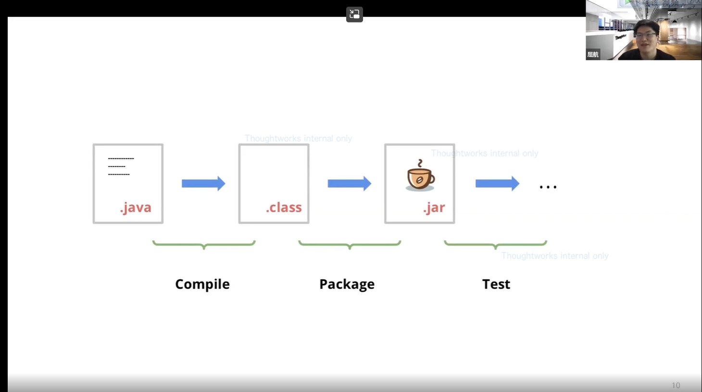


### 构建demo

用Java 自带的工具来实现打包的过程

演示涉及命令： 

​	git branch -a 

​	git switch 0-build-with-java-cli

​	git clean -xdf

对应上图的命令过程： 

​	javac App.java -d build 将编译后生成字节码文件到build文件夹下	

​	jar cvf App.jar -C build .

这个过程，一个人做、团队做的话，重复性很强，也很容易出错

有了问题，就有人发现问题，去解决问题，软件工程师发明的build tools 来帮助 build automation

不同的构建工具

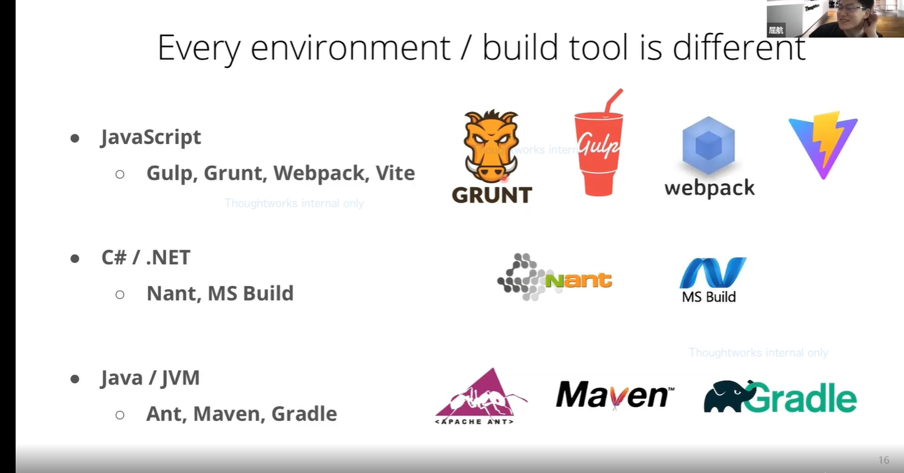

争对Java的话， Ant, Maven, Gradle。 理解历史各种优缺点

Ant: configuration 灵活性好 xml

Maven: Convention 规范好，灵活性差 xml

Gradle: 结合了Ant 和 Maven 出现的一个 build tool 使用groovy，kotlin等 DSL语言 学习过程陡峭， 定制化插件需要学习很多内容


### Gradle

官方网站：https://gradle.org/

Write in Java, C++, Python or your language of choice.

Use Gradle's rich API and mature ecosystem of plugins and integrations to get ambitious about automation. 

Scale out development with elegant, blazing-fast builds. 

Feat: 

- High performance
-  JVM foundation
- Conventions
- Extensibility
- IDE support
- Insight

跟着视频教程或者以下的内容构建一个Java App

 [Building Java Applications Sample (gradle.org)](https://docs.gradle.org/current/samples/sample_building_java_applications.html)

Gradle Wrapper

**新需求：使用 Gradle 6.8.3版本进行构建**

Check the current gradle version

1. ./gradlew -v
2. 查看gradle/wrapper/gradle.properties文件中的distributionUrl属性

Modify the current gradle version

1. gradle wrapper --gradle-version 6.8.3

2. build.gradle中增加

   wrapper{

   ​	gradleVersion='6.8.3'

   }

3. 手动修改gradle/wrapper/gradle.properties文件中的distributionUrl属性


**Tasks In Gradle**

gradle init 等等命令 init 等其实就是 tasks

结合官方文档和视频进行学习

[Build Script Basics (gradle.org)](https://docs.gradle.org/current/userguide/tutorial_using_tasks.html#sec:projects_and_tasks)

**常用Tasks**

clean  ./gradlew clean

build  ./gradlew build

test  ./gradlew test

tasks ./gradlew tasks

help ./gradlew help --task build

**问题**

运行build时候，希望先执行编译，测试，打包

目的：看一下gradle的实现机制  --> Task Dependency

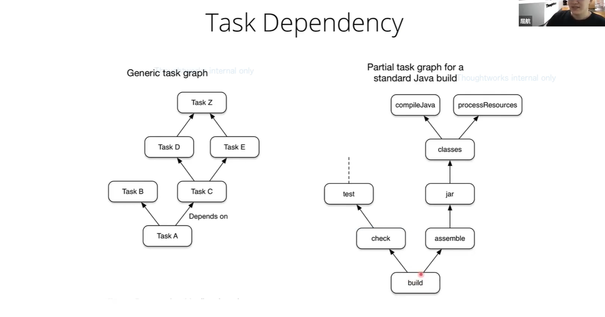

gradle build --dry-run 查看依赖的tasks 

**一些小技巧**

排除一个依赖的task， 参数 -x  ./gradlew build -x test

**Project In Gradle**

**需求：**

切换到 2-build-multi-project-with-gradle分支

运行 ./gradlew run 查看结果

通过 path 实现只运行app

./gradlew projects

./gradlew help --task run

./gradlew app:run


**Depandency Management**

**Q:**问题：希望引用别人的代码来实现功能，如何引用呢？

**A:**使用坐标 Coordinates

坐标有两种表达方式

​	第一种： commons-cli:commons-cli:1.4      ---> Binary Repository

​	Group			Artifact			Version

​	第二种： 实例 com.google.guava:guava:29.0-jre

**Q:**如何找到相应的库

**A:**使用 Searching Engine

两个常用的： MVNREPOSITORY SONATYPE


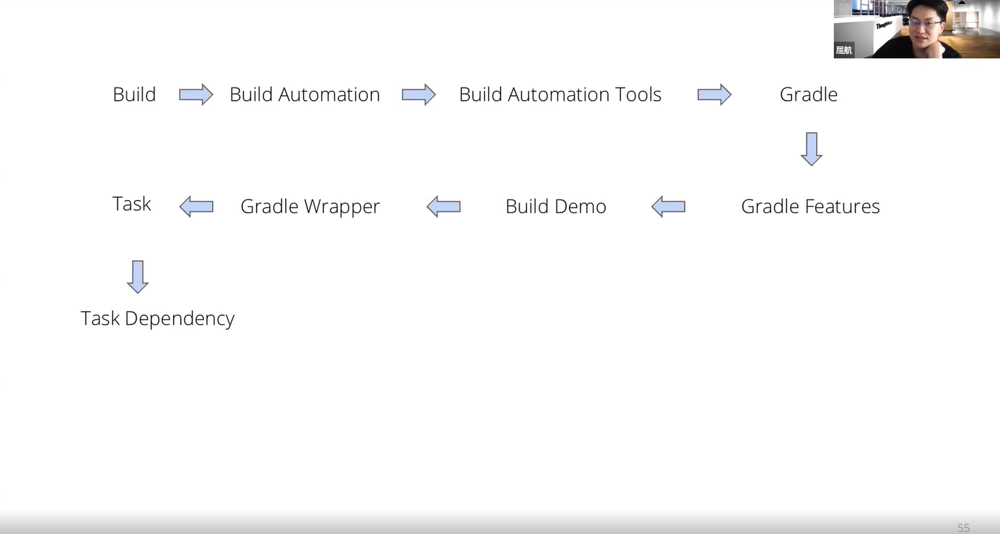


## JDBC

学习的文章：

https://docs.oracle.com/javase/tutorial/jdbc/basics/connecting.html

**新概念**

配置

data source

url

userName

password

Driver


## Java Console Application

"cat ~/.todo/tasks"

**应该学到的东西**

Assignment 的目的是学以致用，在运用当前 step 所学的知识和技能合理完成题目要求的前提下，你 应该/可能 会使用（但不限于）以下内容：

1. 使用 CLI git 完成本地的提交管理及与远端的各种同步操作；
2. 在 Java 中 [如何](https://stackoverflow.com/a/586345) 获取用户的 $HOME 目录位置；
3. 在 Java 中对文件路径进行操作，推荐使用 [Path API](https://www.novixys.com/blog/java-path-api-tutorial/) ；
4. Java 的基础语法
   1. if/for 等控制语句
   2. 创建文件夹及文件
   3. 文件读写（推荐使用 BufferedReader 和 BufferedWriter，这里是一个 [参考](https://www.youtube.com/watch?v=hgF21imQ_Is) ）
5. 通过 Gradle 在 console 里运行一个 Java Application；

**需要看的API**

Files

Path


**视频演示**

我的思路txt版本：

init: 在系统目录(user.home)下创建一个 .todo的文件夹，在这个文件夹里面创建一个tasks的文件。tasks文件里面存放的是todo清单里面的内容。 需要判断的地方，.todo文件夹是否存在，tasks文件是否存在


list: 先写伪格式的数据之后再修改。 mark 和 remove 会对代码产生修改的需求

格式 

第一类 # To be done

1 task 01

第二类 # Completed

Empty

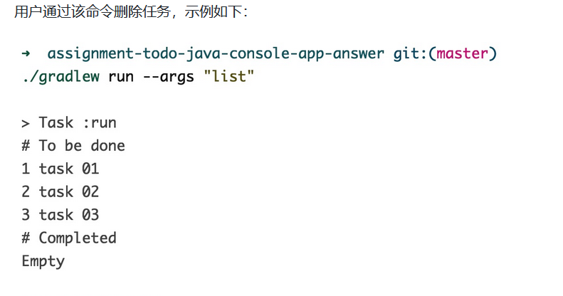

add:

tdd测试驱动

```shell
./gradlew run --args "add foobar"
./gradlew run --args "add foobar buzz"
./gradlew run --args "add 'foo bar'"
./gradlew run --args "add 'foo    bar'"
./gradlew run --args "add foobar 'foo   bar'"
```

输入的命令是文本

文本中第一个参数是 add 后面的内容必然会有空格，甚至还有单引号

如何区分和区别对待


mark:


remove:

删除的是 # To be done的内容

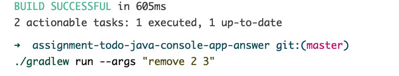

删除任务的具体要求有：

1. 需通过参数指定任务的 ID；
2. 如果要一次性指定多个任务，任务 ID 之间以空格分隔；
3. 指定的任务不存在时，无需输出任何提示，视为操作成功；
4. ID 中包含非数字字符时，请等同于“任务不存在”场景，进行处理；
5. 删除任务后，继续添加任务时，不能复用已有的 ID；（例如，已有任务 ID 为 1、2、3，删除 ID 为 2 的任务后，新增任务，则新任务 ID 为 4）


结合上一次 assignment review 的大部分结果，**请务必注意**：

1. 所有固定的输出内容，如：“命令不存在的提示”、“初始化成功后的提示”，要同需求描述或截图完全一致，否则自动化测试会判其为失败；

2. 需求中对于任何不确定的细节，请及时跟 coach 联系、确认；

   

目标：

```shell
./gradlew run --args "init"
./gradlew run --args "list"
./gradlew run --args "add foobar"
./gradlew run --args "add foobar buzz"
./gradlew run --args "add 'foo bar'"
./gradlew run --args "add 'foo    bar'"
./gradlew run --args "add foobar 'foo   bar'"

--args 后 数组空格切分传入参数

```

打开idea 的一种很好的方式: 打开 build.gradle

usage, init, add

//usage

​	不传参数，返回所有的操作列表

```java
args.length == 0.if
```

args 不可能传入为null

//init

```
init 的目的就是在本地建立一个文件夹

System.getProperty("user.home"); .var 生成快捷键
filePath = Path.of( homePath + File.separatpr + ".todo");
fileNameWithPath = filePath + File.separator + "tasks";
"init".equals(args[0]); .if 生成快捷键 
```

//add

add 做的命令是解析参数，第一个元素命令，第二个是传给 add 的名字

## Todo Java Console Application with Database

**Prepared Statements**

https://dev.mysql.com/doc/refman/8.0/en/sql-prepared-statements.html

MySQL 8.0 支持 server-side prepared statements

好处： 充分利用client/server binary protocol

如何充分利用呢？

1. 处理 statement 更少的花销. e.g. 很多列的数据库，只查、改、增、删小部分内容 

2. 保护防止 SQL 注入

一些性能：

1. Prepared Statements 在应用程序上性能；争对不同应用程序(C, Java, .NET)
2. 在 SQL 脚本上性能
3. PREPARE
4. SQL 语法

更好的了解sql: 两本书 learning sql & sql cookbook


Before 'init': 判断 tasks 在数据库中是否存在

https://www.baeldung.com/jdbc-check-table-exists 可深入的地方：源码的深入和理解

切分 args 元素 进行插入

将 String[] 转为 String的方式  

​					||
​					||

衍生： 将 String[] 去掉第一个元素后 转为 String 的方式


jdbc的插入模板使用

```
//JDBC insert

// id  increment

// name  Task 001
```


## Regex Java

Reliance on Earlier Chapters

Java’s Regex Flavor

The Pattern.compile() Factory

Pattern’s matcher method

```html
egrep -i ’\<([a-z]+) +\1\>’ files˙˙˙
egrep considers each line in isolation
```


## Web Basics

**How the Web Works**

**DOM**


**Populating the page: how browsers work **


**HTTP**

https://datatracker.ietf.org/doc/html/rfc7231#page-7

safe


idempotent 幂等性

https://www.cnblogs.com/weidagang2046/archive/2011/06/04/idempotence.html

https://developer.mozilla.org/en-US/docs/Glossary/Idempotent


cacheable


**Fetching data from the server**

data-driven 数据驱动


## Database

SQL 必知必会 https://book.douban.com/subject/35167240/

SQL 基础教程 https://book.douban.com/subject/27055712/

MySQL Cookbook https://github.com/moriom/js-practice/blob/master/MySQL%20Cookbook%2C%203rd%20Edition.pdf

- 掌握多种类型查询语句的编写
- 掌握 SQL 查询语句的执行顺序
- 能够使用常用聚集函数来汇总数据
  - AVG()
  - COUNT()
  - MAX()
  - MIN()
  - SUM()
- 能够使用 GROUP BY 子句与 HAVING 子句进行数据分组
- 理解左连接、右连接、内连接、外连接等连接查询方式的差异，并能熟练使用


## HTML&CSS

- How the Web Works
  - [MDN How the Web works](https://developer.mozilla.org/zh-CN/docs/Learn/Getting_started_with_the_web/How_the_Web_works) [阅读材料]
  - [10分钟带你了解互联网是如何运作的！](https://www.bilibili.com/video/BV1Rz4y197Jd?from=search&seid=16684215392801422564&spm_id_from=333.337.0.0) [11 min 视频]
- 浏览器是如何运作的 
  - [浏览器是如何运作的](https://www.bilibili.com/video/BV1x54y1B7RE/?spm_id_from=333.788.b_7265636f5f6c697374.1) [20min 视频]
  - [渲染页面：浏览器的工作原理](https://developer.mozilla.org/zh-CN/docs/Web/Performance/How_browsers_work) [阅读材料]
- HTTP 
  - [HTTP概述](https://developer.mozilla.org/zh-CN/docs/Web/HTTP/Overview) [阅读材料]
  - [HTTP Crash Course & Exploration](https://www.youtube.com/watch?v=iYM2zFP3Zn0) [38 min 视频]

**The box model**

css以box为基本的布局单位

制作更加复杂的css，对boxes有非常好的理解

两种Boxes: **block boxes** and **inline boxes**

几个没弄懂的知识点：

https://developer.mozilla.org/en-US/docs/Web/CSS/:focus

https://developer.mozilla.org/en-US/docs/Web/CSS/Pseudo-classes

https://developer.mozilla.org/en-US/docs/Web/CSS/display

了解TW:

https://github.com/ThoughtWorksInc

子元素

```
error: This is probably not a problem with npm. There is likely additional logging output above
```


```
AssertionError: Timed out retrying after 4000ms: Expected to find element: `ul.todo-lists li:first .delete-btn`, but never found it


```

## JavaScript

https://developer.mozilla.org/en-US/docs/Web/JavaScript

## Todo Web Application

新结构： 前后端分离

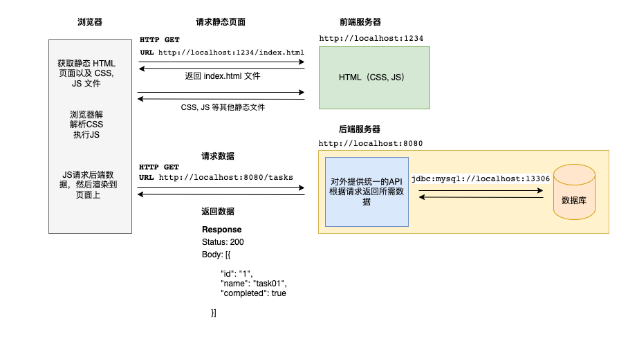

学习点：

​	HTTP server get的请求

​	JS的交互、渲染

​	后端服务器获取数据等等


### 前端部分

"parcel" build tool 特点自己学习

json-server: mock server


### 后端部分

**a simple http server**


## TWU-C

### TWU-C介绍

工作后，每天8小时 沉浸式完成

学以致用

咨询师专业的技能和价值

引入中国区的项目来完成一些目的

**缓冲区**

相对短的时间内，提升职场的意识


### TWU-C目标与内容

目标：TW文化

TW业务与客户服务意识

角色专项技能与TW工作方式: 敏捷做项目交付，敏捷的实践，与传统公司不同地方

影响力和发展培养： 员工成长，个人的影响力、发展他人

关键词：**商业模式**


### TWU-C形式

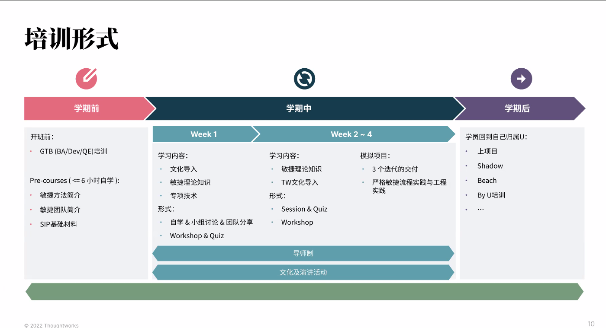


### TWU-C开班前准备

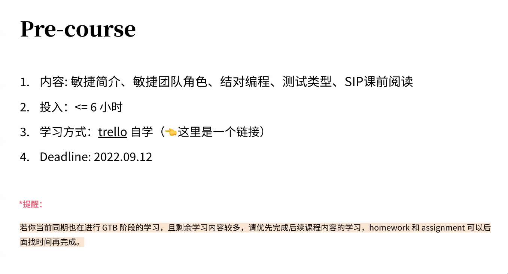

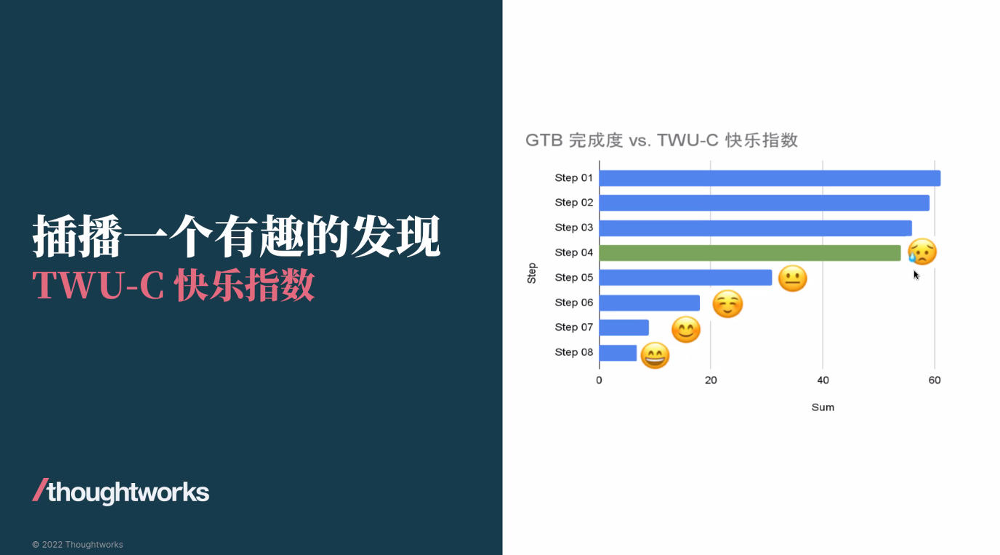

每个人都会有这个机会


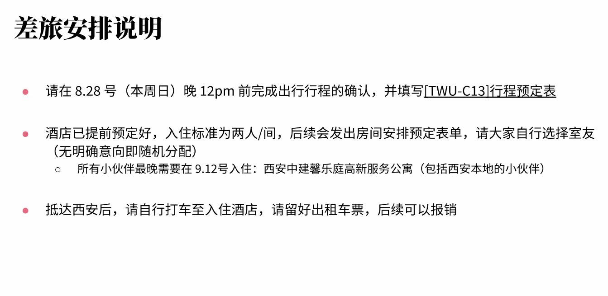

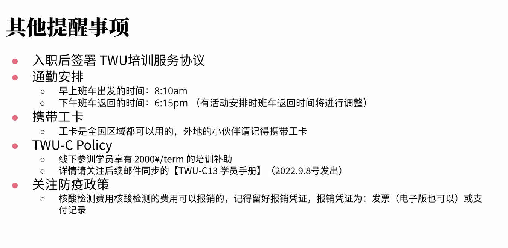


### Q&A


## npm Docs

一些概念：

The npm registry: contains packages, many of which are also Node modules, or contain Node modules

package: a file or directory that is described by a `package.json` file 

[Creating a package.json file](https://docs.npmjs.com/creating-a-package-json-file)

Packages can be unscoped or scoped to a user or organization, and scoped packages can be private or public.

- "[About scopes](https://docs.npmjs.com/about-scopes)"

  A scope allows you to create a package with the same name as a package created by another user or organization without conflict.

- "[About private packages](https://docs.npmjs.com/about-private-packages)"

- "[Package scope, access level, and visibility](https://docs.npmjs.com/package-scope-access-level-and-visibility)"

接下来实践的内容:[Creating a package.json file | npm Docs (npmjs.com)](https://docs.npmjs.com/creating-a-package-json-file)

**Prettier vs eslint**


## 授人以鱼不如授人以渔


## 系统设计

海外兔：https://osjobs.net/system/

一亩三分地：https://www.1point3acres.com/bbs/thread-456546-1-1.html

Lee215：https://osjobs.net/interview/posts/%E7%BC%96%E7%A8%8B%E8%89%BA%E6%9C%AF%E5%AE%B6-lee215-%E7%9A%84%E7%AE%97%E6%B3%95%E6%97%85%E7%A8%8B/


