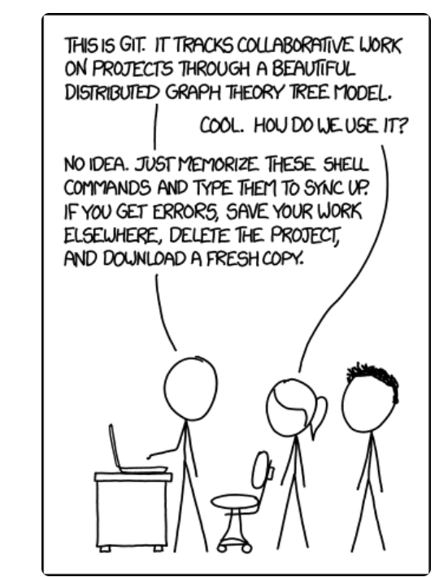

# Git

## Resources for Studying

- [Pro Git](https://git-scm.com/book/en/v2): a book to help you learn more and deeply

- [MIT 6.NULL - git](https://missing.csail.mit.edu/2020/version-control/): good course with texts and videos

- [Learn Git Branching](https://learngitbranching.js.org/?locale=en_US) : visual and interactive way to learn Git on the web

  

## Some tips

`www.youtube.com##.ytp-scroll-min.ytp-pause-overlay` youtube 上暂停视频有相关弹窗，这样可以取消

登录账号打开youtube观看而不是打开在网站上链接的youtube视频

## MIT 6.NULL -  git

### A Brief for git

### VCS

**what**:

Version control systems: track the changes to the source code

**why** 

why is it useful?

- work by yourself:

  see the changes (snapshots, branches and more)

- work with others:

  see other's changes(resolve the conflics during concurrent development)

**how**

**what you can know**

- Who wrote this module?
- When was this particular line of this particular file edited? By whom? Why was it edited?
- Over the last 1000 revisions, when/why did a particular unit test stop working?

**How does they realize?**

I don't know. Maybe futher learning.

#### Git 

 **the de facto standard for version control.**

de facto --> existing or holding a specified position in fact but not necessarily by legal right.

[XKCD comic](https://xkcd.com/1597/) captures Git’s reputation



一些吐槽

**Top-down learning**:starting with its interface / command-line interface) can lead to a lot of confusion.  （除了记incantations神奇的咒语，什么都不会）

**Bottom-up learing**

**target**: a beautiful design can be *understood*.

我们以这种方式学习

*starting with its data model and later covering the command-line interface. Once the data model is understood, the commands can be better understood, in terms of how they manipulate the underlying data model.*

### Git's data model

#### **很多VCS最后why git?** 

[VCS](# VCS) 这里想使用 internal links的共功能没有成功

well-thought-out model that enables all the nice features of version control

- maintaining history
- supporting branches 
- enabling collaboration. 

#### Snapshots

**Git terminology** 

- **snapshots**: top-level directory
- **blob**: a file, a bunch of bytes
- **tree**: a directory, maps names to bolbs or trees

#### Modeling history: relating snapshots

- history: directed acyclic graph (DAG) of snapshots

- a snapshot 可能对应多个parents，比如merge的情况

- Git calls these snapshots “commit”s

- Commits in Git are immutable.

- ```plaintext
  o <-- o <-- o <-- o <---- o
              ^            /
               \          v
                --- o <-- o
  
  ```

#### Data model,as pseudocode

将git的 data model用伪代码方式结合数据结构联系起来

```plaintext
// a file is a bunch of bytes
type blob = array<byte>

// a directory contains named files and directories
type tree = map<string, tree | blob>

// a commit has parents, metadata, and the top-level tree
type commit = struct {
    parents: array<commit>
    author: string
    message: string
    snapshot: tree
}
```


#### Objects and content-addressing

- Object: a blob,tree, or commit.

- In Git data store, all objects are content-addressed by their [SHA-1 hash](https://en.wikipedia.org/wiki/SHA-1).(40 hexadecimal characters.)

  ```plaintext
  objects = map<string, object>
  
  def store(object):
      id = sha1(object)
      objects[id] = object
  
  def load(id):
      return objects[id]
  ```

  ```plaintext
  100644 blob 4448adbf7ecd394f42ae135bbeed9676e894af85    baz.txt
  //print the content of the id
  git cat-file -p 698281bc680d1995c5f4caaf3359721a5a58d48d
  ```

  

#### References

```plaintext
git cat-file -p 698281bc680d1995c5f4caaf3359721a5a58d48d
```

按照"69xxx"来访问好像也太不方便了！怎么办呢？

Git提供了一种human-readable names for SHA-1 hashes解决方式，也叫做"references"

References:

- pointers to commits

- mutable

- the `master` reference usually points to the latest commit in the main branch of development

- ```plaintext
  references = map<string, string>
  
  def update_reference(name, id):
      references[name] = id
  
  def read_reference(name):
      return references[name]
  
  def load_reference(name_or_id):
      if name_or_id in references:
          return load(references[name_or_id])
      else:
          return load(name_or_id)
  ```

  

- a special reference HEAD: where we currently are

#### Repositories

*repository*: data objects + references

### Staging area

这里主要是说这个区域存在的必要

详细笔记参考 huangrt01 [CS-Notes/git.md at master · huangrt01/CS-Notes · GitHub](https://github.com/huangrt01/CS-Notes/blob/master/Notes/Output/git.md#gits-data-model)

Ctrl + F "staging area"

也可以自己找资料补充学习

### Git command-line interface

#### Basics

- 

#### Branching and merging

- 

#### Remotes

#### Undo

### Advanced Git

### Miscellaneous