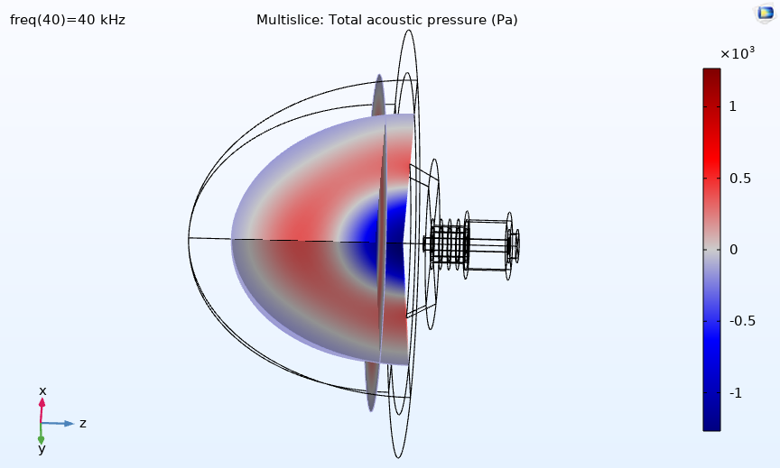
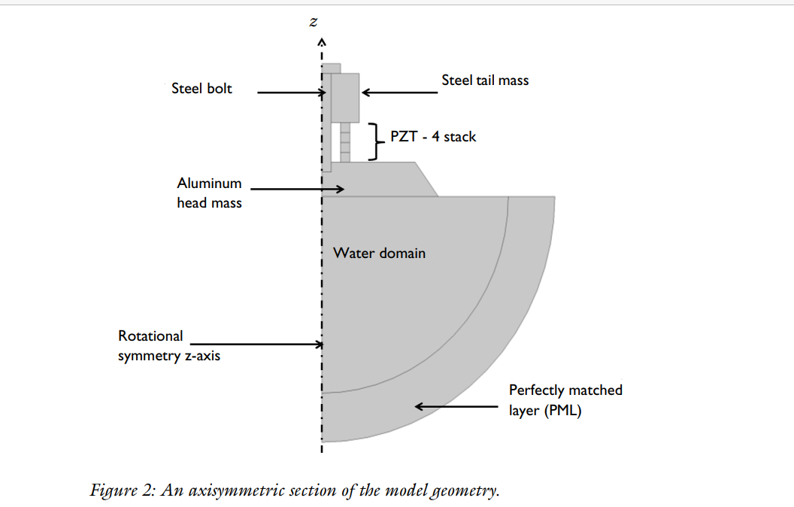
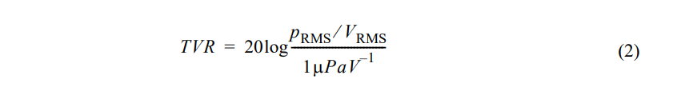
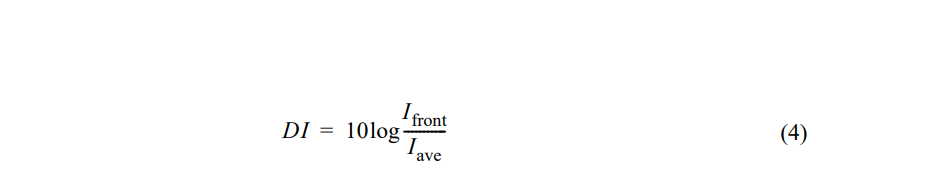

# Comsol Multiphysics

[压电换能器及超声传输的模拟和分析 (comsol.com)](http://cn.comsol.com/video/piezoelectric-transducers-and-ultrasonic-simulations-in-comsol-multiphysics-webinar-cn)

*The Acoustic-Piezoelectric Interaction, Frequency Domain multiphysics interface combines the Pressure Acoustics, Frequency Domain and Piezoelectric Devices interfaces to connect the acoustic pressure variations in fluids to the structural deformation in both solids and piezoelectric solid domains. The physics interface also includes features from Electrostatics to solve for the electric field in the piezoelectric material. It may, for example, be used to model piezoelectric transducers for sonar or medical applications and to enhance the impedance matching layers as well as the far-field radiation patterns of the transducer.*

*The Helmholtz equation is solved in the fluid domains and the structural equations in the solid domains together with the constitutive relationships required to model piezoelectrics. Both the direct and inverse piezoelectric effects can be modeled, and the piezoelectric coupling can be formulated using the strain-charge or stress-charge forms.*

## Some concepts

​	Frequency Domain: 频域 数学函数/信号以频率而非时间形式传递的分析空间

​	solids domains: 固体域

​	piezoelectric  solid domains: 压电固体域 

​	the direct and inverse piezoelectric effects: 正反压电效应

​	stress-charge

​	strain-charge* 

​	The Helmholtz equation

​		

​	the frequency response  频率响应

​	the effect of prestress in the bolt 预应力的影响

​	the outer curved surface tail mass 外部钢尾质量

​	the piezo disks 压电片

​	RMS *root mean square*: 均方根

​	the radiated pressure field  辐射应力场

​	sound pressure level 声压等级

​	the spatial radiation pattern senstivity 空间辐射灵敏度

​	the transmitting voltage response(TVR) curve 传输压力响应曲线

​	the directivity index(DI)方向性指数

​	Perfectly matched  layer (PML): PML域

​	Rotational Symmetry 旋转对称性 

An interesting websites: [Rotational Symmetry (mathsisfun.com)](https://www.mathsisfun.com/geometry/symmetry-rotational.html)

Piezoelectric actuator technology: 压电驱动技术  基本原理是基于[压电陶瓷](https://baike.baidu.com/item/压电陶瓷/4787841)材料的逆压电效应，通过控制其机械变形产生旋转或直线运动。

三本对声学书的介绍 + 马大猷

一个很有意思的网站: [infocobuild - Expand Your Knowledge](http://www.infocobuild.com/index.html)

## Library

### tonpiz_transducer

#### Introduction

A tonpilz transducer is used for relatively low frequency, high power sound emission. It is one of the popular transducer configuration for SONAR applications. The transducer consists of piezoceramic rings stacked between a head mass and a tail mass which are connected by a central bolt. In this example the frequency response of the transducer is studied to determine structural and acoustic response of the device such as deformation, stresses, radiated pressure, sound pressure level, exterior-field beam pattern, the transmitting voltage response (TVR) curve, and the directivity index (DI) of the sound beam.

#### Model Definition

 PML: model the  absorption of sound waves

##### Physics Implementation

​	The multiphysics couplings necessary to model this system are available  as predefined nodes under the Multiphysics branch. Coupling:

​	Acoustic-Structure Boundary:

​	Piezoelectric Effect:

##### Material Orientation

d33: 压电常数   

压电常数不仅与应力TI、应变SI有关，而且与电场强度Ei、电位移Di也有关。

描述[压电体](https://baike.baidu.com/item/压电体/2160469)的力学量和电学量之间的线性响应关系的[比例常数](https://baike.baidu.com/item/比例常数/53707431)称为压电常数。

压电常数是压电体所特有的一组参数，是三阶张量，它反映了压电体的力学性质与介电性质之间的耦合关系

PZT-4 disks actuate 

欧拉角(Euler angles)： 

在此坐标系中，欧拉角设 为 $\alpha$ = 0、 $\beta$ = $\pi$ 和 $\gamma$ = 0。请注意， COMSOL Multiphysics 软件采用 Z-X-Z 形式的欧拉 角。

##### Exterior Filed Calculation

boundaries between the inner water  domain and the PML domains

visualize the beam pattern in 2D and 3D polar plots

both amplitude and phase of the acoustic pressure and sound  pressure level (SPL) at any point in space outside the computational domain

##### Meshing Considerations

maximum mesh element size is specified as 1/5th of the smallest wavelength of interest

##### Computing Transducer Characteristics

###### Specific Acoustic Impedance 比声阻抗

比声阻抗 $Z_aco$ 计算为与接触水的前质量块表面阻抗与水的特性阻抗 $Z_0$ 之比

$Z_0$ 值计算为温度为 293.15 K 时水的密度与水中声速的乘积。

$\rho$* $\nu$

###### Transmitting Voltage Response(TVR) 发射电压响应 

TVR 表示在距离 1 m 处测得的、由 1 V 额定电压驱动的换能器灵敏度

###### Directivity Index(DI) 指向性指数

指向性指数 (DI) 给出了发射声波束的方向性度量 （参考资料 3），即外场 （大于瑞利 半径）中换能器前方一定距离处的强度 Ifront 与由相同强度的全向声源传输的强度 $I_ave$ 之比的度量。在换能器前方 10 m 处计算指向性指数。

物理量 $I_front$ 可以计算为换能器一定距离处的均方根压力与特性阻抗 $Z_0$ 之比。物理量 $I_ave$ 可以计算为总辐射功率 $P_tot$ 与半径为计算指向性指数时采用的换能器前方特定距离 的球体表面积之比。

##

Problem:

