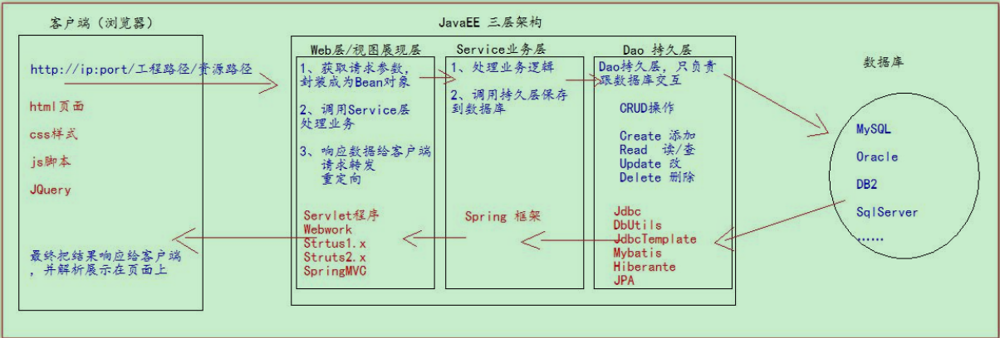
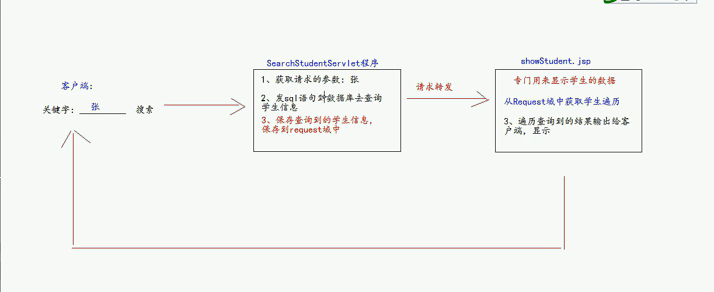
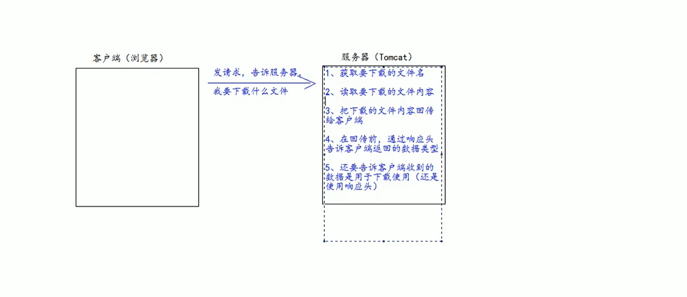

## jQuery

## 书城第一阶段

- 给注册绑定单击事件

- 验证用户名、密码、确认密码、邮箱验证、验证码

  具体步骤：

  1. 通过 `$("").val()` 获取对象
  2. 验证格式转为正则表达式对象/ /
  3. 利用正则表达 *.test()*判断

  几个注意的地方：

  - 邮箱验证正则表达
  - 验证码动态来自于服务器

## 书城第二阶段

- `JavaEE`项目的三层框架

  

  分层的目的是为了解耦。解耦就是为了降低代码的耦合度。方便项目后期的维护和升级。

  

- 开发代码角度开发流程

  先创建书城需要的数据库和表

  id、用户名、密码、邮箱

  编写数据库表对应的 JavaBean 对象

  编写工具类 `JdbcUtils` `（这块代码比较固定，三部分static、getConnection, close）`

  i. 添加价包，有箭头标记的表示可以直接使用，两种添加方式

  1. WEB-INF下创建lib，复制价包,

     打开`File`下`Project Settings`下的`Library`导入价包到`Module`，

     在`Module`下选择你想要添加的具体模块，''依赖''添加`Library`

     选择`Artifacts`中的`Fix`

     `Apply` `Ok`

     有标记的价包表示可以使用

  2. jar包那右键`add as library`

  ii. 读取`jdbc.properties`属性配置文件 

  iii. 从流中加载数据

  iv. 创建数据库连接池

  编写 `BaseDao`

  导包

  `dbutils`下的`queryRunner`类 Insert\Update\Delete 语句

  泛型 <T>T

  query时传进去参数 `(Class<T>type, String sql, Object...args)`

  ```java
  @param type 返回的对象类型
   * @param sql
  执行的 sql 语句
   * @param args sql 对应的参数值
   * @param <T>
  返回的类型的泛型
  ```

  ```java
  //利用queryRunner执行的语句
  queryRunner.query(connection,sql, new BeanListHandler<T>(type),args);
  //一行 new BeanListHandler<T>(type)
  //多行 new BeanListHandler<T>(type)
  //一行一列 new ScalarHandler()
  
  ```

  编写 `UserDao` 和测试

  - 构造器需要一个空的

  - `sql`语句注意``符号而不是''

  - ```java
    //能直接查看方法的功能，参数，返回值和说明
    /**
    * 登录
    * @param user
    * @return 如果返回 null，说明登录失败，返回有值，是登录成功
    */
    ```

    

  

  编写 `UserService` 和测试

  - `UserService`接口 一个业务一个方法 （登录、注册、查看）

  - `UserServiceImpl`具体实现类，涉及数据库操作

  - 快速生成`Test`, (Ctrl + Shift + T)

  编写 `web` 层

  1. 实现用户注册的功能

     `RegisterServlet`程序获取参数，检查是否正确

     

     - web阶段使用：base+相对
     - 框架阶段：绝对路径

  2. 实现用户登录功能


## 书城第三阶段

1. 页面`jsp`动态化
2. 抽取页面中相同内容

## XML

- 什么是XML？

  可扩展性标记性语言

- 作用
  1. 用来保存数据,数据具有自我描述性
  2. 可作为项目模块的配置文件
  3. 还可以作为网络传输数据的格式（现在JSON为主）

- 语法
  1. 文档声明
  2. 元素（标签）
  3. xml属性
  4. xml注释
  5. 文本区域（CDATA区）

- 技巧：浏览器能帮你校验

## Servlet

- 创建Servlet程序

  2020后的版本创建普通module然后右键`Add` `FrameWork` `Support`。再选择`WebApplication`

  然后就可以create new servlet

- Servlet-url地址定位到Servlet程序的访问

  browser To mapping-url To mapping-servlet-name To servlet-servlet-name To servlet-servlet-class 

- Servlet生命周期

  1. `constructor`

  2. `init`

     1 and 2 分别执行一次

  3. service方法

     访问一次执行一次

  4. destroy

     终止时执行

- 请求的分发处理

  对于get请求和post请求采用不同方式分别执行

  获取请求方式：采用`ServletRequest`下的子类`HttpServletRequest`中的`getMethod()`方法获取请求方式

- 继承`HttpServlet`类的方式去实现`Servlet`程序
  1. 继承`HttpServlet`类的方式去实现`Servlet`程序
  2. 根据业务请求重写`doGet`或者`doPost`方法
  3. `web.xml`中配置`Servlet`程序的访问地址

-  使用IDEA生成Servlet程序
  - 不使用Java EE6+
  - 配置信息

- 整个Servlet类的继承体系

   Interface 

  <-- Class `GenericServlet` （做了很多空实现，持有`ServletConfig`类的引用）

  <-- Class `HttpServlet`(实现了service()方法，并实现了分发请求处理,`doGet`,`doPost`负责抛异常，不支持请求) 

  <-- 自定义的Servlet程序:我们根据业务需要去重写`doGet`,`doPost`方法

- `ServletConfig`类(**视频未完全看懂**)

  Servlet配置信息,每个Servlet程序都有自己的`ServletConfig`，但获取只能获取自己的

  - 三大作用:

    1、可以获取 Servlet 程序的别名 servlet-name 的值
    2、获取初始化参数 `init`-`param`
    3、获取 `ServletContext` 对象

- `ServletContext`类

  是什么

  1. 接口，上下文对象

  2. 一个web工程，只有一个`ServletContext`对象实例

  3. 域对象(存取数据的操作范围（像Map）)

     存`setAttribute()` `getAttribute`()  `removeAttribute`()

     范围指的是整个web工程

  4. `ServletContext` 是在 web 工程部署启动的时候创建。在 web 工程停止的时候销毁。

  存储数据

  - `getServletContext()` 

    return `getServletConfig().getServletContext()`

- Http协议

  - 什么是Http协议：客户端和服务端通信时，发送数据需要遵守的规则,协议中的数据叫报文

  - 格式

    客户端——请求(GET和POST)

    服务端——响应

    - GET请求:

      请求行：

      ​	请求方式：GET

      ​	资源路径

      ​	协议版本号 HTTP/1.1

      请求头：

      ​	key: value 

    - POST请求：

      请求行：

      ​	请求方式：POST

      ​	资源路径

      ​	协议版本号 HTTP/1.1

      请求头：

      ​	key: value 

      ​	**空行**

      请求体：发送给服务器的数据

    - 常见请求分别

      GET 请求有哪些：
      1、form 标签 method=get
      2、a 标签
      3、link 标签引入 css
      4、Script 标签引入 js 文件
      5、img 标签引入图片
      6、iframe 引入 html 页面
      7、在浏览器地址栏中输入地址后敲回车
      POST 请求有哪些：
      8、form 标签 method=post

    - 响应的HTTP协议格式

      1、响应行
      (1)响应的协议和版本号
      (2)响应状态码
      (3)应状态描述符
      2、响应头
      (1)key : value 不同的响应头，有其不同含义
      **空行**
      3、响应体 --->>>  就是回传给客户端的数据

    - 常见的响应码

      200 表示请求成功
      302 表示请求重定向（明天讲）
      404 表示请求服务器已经收到了，但是你要的数据不存在（请求地址错误）
      500 表示服务器已经收到请求，但是服务器内部错误（代码错误）

    - MIME 类型说明

      MIME 是 HTTP 协议中数据类型。
      MIME 的英文全称是"Multipurpose Internet Mail Extensions" 多功能 Internet 邮件扩充服务

- `HttpServletRequest`类

  - 作用

    请求——服务器（封装解析）——`Request`对象——`service`方法

  - 类的常用方法 
  
    i. `getRequestURI`() 获取请求的资源路径
    ii. `getRequestURL`() 获取请求的统一资源定位符（绝对路径）
    iii. `getRemoteHost`() 获取客户端的 ip 地址
    iv. `getHeader`() 获取请求头
    v. `getParameter`() 获取请求的参数
    vi.`getParameterValues`() 获取请求的参数（多个值的时候使用）
    vii. `getMethod`() 获取请求的方式 GET 或 POST
    viii. `setAttribute`(key, value); 设置域数据
    ix. `getAttribute`(key); 获取域数据
    x. `getRequestDispatcher`() 获取请求转发对象
  
    中文乱码问题：`setCharacterEncoding("UTF-8")`
  
  - 实践遇到的错误
  
    `web`.`xml`文件在进行类解析时，`servlet` 和 `servletII`下`src`下的 `directory`的 `com.atguigu.servlet`名字一样，具体解析过程不清楚 
  
  - 路径
  
    **相对路径是**：
    .
    表示当前目录
    ..
    表示上一级目录
    资源名
    表示当前目录/资源名
    **绝对路径**：
    http://ip:port/工程路径/资源路径
    在实际开发中，路径都使用绝对路径，而不简单的使用相对路径。
    1、绝对路径
    2、base+相对
  
  - /斜杠对应的不同含义
  
    / 斜杠 如果被服务器解析，得到的地址是：http://ip:port/工程路径
  
    / 斜杠 如果被浏览器解析，得到的地址是：http://ip:port/

- `HttpServletResponse`类

  - 作用

    每次请求进来，`Tomcat` 服务器都会创建一个 `Response` 对象传递给 `Servlet` 程序去使用。

  - 两个输出流的说明

    字节流`getOutputStream`(); 常用于下载（传递二进制数据）
    字符流`getWriter`();常用于回传字符串（常用）

  - 往客户端回传数据

  - 乱码解决

    1. `服务器setCharacterEncoding("UTF-8")`+浏览器通过响应头(`resp.setHeader`("Content-Type", "text/html; charset=UTF-8"))   （不推荐!!!）

    2. `resp.setContentType`("text/html; charset=UTF-8")

        它会同时设置服务器和客户端都使用 UTF-8 字符集，还设置了响应头
        此方法一定要在获取流对象之前调用才有效

  - 请求重定向

    请求重定向，是指客户端给服务器发请求，然后服务器告诉客户端说。我给你一些地址。你去新地址访问。

## JSP

1. ### 什么是`jsp`, 有什么用

   `jsp`: java server pages, Java的服务器页面

   主要作用代替`Servlet程序`回传html页面数据

   `servlet`程序回传html页面过程繁琐，开发成本、维护成本高

2. ### `jsp`语法

   - 头部文件声明

     `<%@ page language="java" contentType="text/html; charset=UTF-8" pageEncoding="UTF-8" %>`
     这是 `jsp` 文件的头声明。表示这是 `jsp` 页面。
     `language` 属性值只能是 java。 表示翻译的得到的是 java 语言的
     `contentType` 属性 设置响应头 `contentType` 的内容
     `pageEncoding` 属性 设置当前 `jsp` 页面的编码
     `import` 属性 给当前 `jsp` 页面导入需要使用的类包
     `autoFlush` 属性 设置是否自动刷新 out 的缓冲区，默认为 true
     `buffer` 属性 设置 out 的缓冲区大小。默认为 8KB
     `errorPage` 属性  设置当前 `jsp` 发生错误后，需要跳转到哪个页面去显示错误信息
     `isErrorPage` 属性 设置当前 `jsp` 页面是否是错误页面。是的话，就可以使用 `exception` 异常对象
     `session` 属性 设置当前 `jsp` 页面是否获取 `session` 对象,默认为 `true`
     `extends` 属性 给服务器厂商预留的 `jsp` 默认翻译的 servlet 继承于什么类

   - 脚本

     1. 声明脚本

        声明脚本格式如下：
        `<%!`
        `java 代码`
        `%>`
        在声明脚本块中，我们可以干 4 件事情
        1.我们可以定义全局变量。
        2.定义 static 静态代码块
        3.定义方法
        4.定义内部类
        几乎可以写在类的内部写的代码，都可以通过声明脚本来实现

     2. 表达式脚本

        表达式脚本格式如下：
        `<%=表达式`
        `%>`
        表达式脚本 用于向页面输出内容。
        表达式脚本 翻译到 `Servlet` 程序的 `service` 方法中 以 `out.print`() 打印输出
        `out` 是 `jsp` 的一个内置对象，用于生成 html 的源代码
        注意：表达式不要以分号结尾，否则会报错
        表达式脚本可以输出任意类型。
        比如：
        1.输出整型
        2.输出浮点型
        3.输出字符串
        4.输出对象

     3. 代码脚本

        代码脚本如下：
        `<%`
        `java 代码`
        `%>`
        代码脚本里可以书写任意的 java 语句。
        代码脚本的内容都会被翻译到 service 方法中。
        所以 service 方法中可以写的 java 代码，都可以书写到代码脚本中

   - 三种注释

     // 单行 java 注释
     /*
     多行 java 代码注释
     */
     单行注释和多行注释能在翻译后的 java 源代码中看见。
     <%-- jsp 注释 --%>
     `jsp` 注释在翻译的时候会直接被忽略掉
     <!-- html 注释 -->
     “玩转”Java 系列
     html 的注释会被翻译到 java 代码中输出到 html 页面中查看

   - `jsp`九大内置对象

     `jsp`内置对象是指`Tomcat`在翻译`jsp`页面成为`servlet`源码后，内部提供的九大对象。

     `request` 对象 请求对象，可以获取请求信息
     `response` 对象 响应对象。可以设置响应信息
     `pageContext` 对象 当前页面上下文对象。可以在当前上下文保存属性信息
     `session` 对象 会话对象。可以获取会话信息。
     `exception` 对象 异常对象只有在 `jsp` 页面的 page 指令中设置 `isErrorPage=`"true" 的时候才会存在
     `application` 对象 `ServletContext` 对象实例，可以获取整个工程的一些信息。
     `config` 对象 `ServletConfig` 对象实例，可以获取 `Servlet` 的配置信息
     `out` 对象 输出流。
     `page` 对象 表示当前 `Servlet` 对象实例（无用，用它不如使用 this 对象）

   - `jsp`四大域对象

     `PageContext`(`PageContextImpl`类)、 同一个`jsp`文件

     `request` (`HttpServletRequest`类)、一次请求(同一个URL )

     session (`HttpSession类`)、同一个浏览器

     application (`ServletContext`类)、同一个服务器

     可以存储对象，优先顺序

     `pageContext` ===>> `request` ===>> `session` ===>> `application`

   - `jsp`常用标签

     1. 静态包含(最常用)

        `JavaEE`技术使用进行改变，主要用它做输出

        ```jsp
        <%@include file="footer.jsp"%>
        ```

        一旦单独监听界面，改一处，其他都修改

        

     2. 动态包含（功能丰富、可传参）

        传进去`JspRuntimeLibrary.include` 方法

        ```jsp
        <jsp:include page=""></jsp:include>
        ```

        

     3. 页面转发（与`req.getRequestDispatcher()功能一致`）

        ```jsp
        <jsp:forward page=""></jsp:forward>
        ```

        

   - `servlet` + `jsp` 整个流程

     

   - `Listener`监听器(三大组件之一) 讲spring时具体介绍

     是`JavaEE`的规范，也就是接口

     监听器的作用是，监听某种事物的变化。然后通过回调函数，反馈给客户（程序）去做一些相应的处理

     - `ServletContextListener`监听器

       监听`ServletContext`对象的创建和销毁

       调用方法：

       ```java
       public interface ServletContextListener extends EventListener {
       /**
       * 在 ServletContext 对象创建之后马上调用，做初始化
       */
       public void contextInitialized(ServletContextEvent sce);
       /**
       * 在 ServletContext 对象销毁之后调用
       */
       public void contextDestroyed(ServletContextEvent sce);
       }
       ```

       ​	

       使用步骤：

       1、编写一个类去实现 `ServletContextListener`
       2、实现其两个回调方法
       3、到 web.xml 中去配置监听器

## EL表达式

- Expression language 

  代替`jsp`页面中表达式脚本在`jsp`页面中进行数据的输出

  更简洁

  格式：${表达式} 

  `EL`在输出`null`值输出空串，`jsp`输出`null`字符串

- 搜索四个域的顺序

  和JSP一致

  从小到大顺序进行搜索

- EL表达式输出Bean普通属性，数组属性。List集合属性，map集合属性

  i. 

- EL表达式的——运算

  - 关系运算 逻辑运算 算术运算 三元运算

  - `empty`运算: 空 true, 不空 false;

  ​	空的情况: 

  ​			``null值为空，

  ​			空串为空，

  ​			`Object`类型数组，

  ​			长度为零

  ​			`list`集合，元素个数为零

  ​			`map`集合，元素个数为零

  - "."点运算输出—— Bean 对象中某个属性的值，[]中括号运算—— 输出有序集合中某个元素的值

    

- 11个隐含表达式对象

  变量						类型 												作用
  `pageContext`	`PageContextImpl`			它可以获取 `jsp` 中的九大内置对象
  `pageScope`		`Map`<String,Object>		它可以获取 `pageContext` 域中的数据
  `requestScope`	`Map`<String,Object>		它可以获取 `Request` 域中的数据
  `sessionScope`	`Map`<String,Object>		它可以获取 `Session` 域中的数据
  `applicationScope`	`Map`<String,Object>	它可以获`ServletContext` 域中的数据
  `param`			`Map`<String,String>			它可以获取请求参数的值
  `paramValues`	`Map`<String,String[]>		它也可以获取请求参数的值，获取多个值的时候使用。
  `header`			`Map`<String,String>		它可以获取请求头的信息
  `headerValues`		`Map`<String,String[]>	它可以获取请求头的信息，它可以获取多个值的情况
  `cookie`			`Map`<String,Cookie>			它可以获取当前请求的 `Cookie` 信息

  `initParam`		`Map`<String,String>		它可以获取在 `web.xml` 中配置的<context-param>上下文参数

  1. EL获取四个特定域的属性

## JSTL标签库

- JSP Standard Tag Library 主要是为了替换代码脚本

- 标签库

  

  `<%@ taglib prefix="c" uri="http://java.sun.com/jsp/jstl/core" %>`

- core核心库标签的使用

  i. <c:set />（使用很少）

  ​	作用：set 标签可以往域中保存数据

  ii. <c:if />

  ​	if 标签用来做 if 判断。

  iii. <c:choose> <c:when> <c:otherwise>标签

  ​	作用：多路判断。`c:when`必须配上 `c:choose`

  iv. <c:forEach />

  ​	作用：遍历输出使用。

  2. 遍历 Object 数组

  3. 遍历 Map 集合

  4. 遍历 List 集合---list 中存放 Student 类，有属性：编号，用户名，密码，年龄，电话信息

## 文件的上传和下载

- 上传步骤
  1. 要有一个form标签，method= post请求
  2. `form`标签的`encType`属性值必须为`multipart/form-data值`
  3. 在`form`标签中使用`input type=file`添加上传的文件
  4. 编写服务器代码(servlet)接受，处理上传的数据

- `commons-fileupload.jar`常用API声明

  commons-fileupload.jar 和 commons-io.jar 包中，我们常用的类有哪些？
  `ServletFileUpload` 类，用于解析上传的数据。
  `FileItem` 类，表示每一个表单项。
  `boolean ServletFileUpload.isMultipartContent(HttpServletRequest request);`
  判断当前上传的数据格式是否是多段的格式。
  `public List<FileItem> parseRequest(HttpServletRequest request)`
  解析上传的数据
  `boolean FileItem.isFormField()`
  判断当前这个表单项，是否是普通的表单项。还是上传的文件类型。
  true 表示普通类型的表单项
  false 表示上传的文件类型
  `String FileItem.getFieldName()`
  获取表单项的 name 属性值
  `String FileItem.getString()`
  获取当前表单项的值。
  `String FileItem.getName();`
  获取上传的文件名
  `void FileItem.write( file );`
  将上传的文件写到 参数 file 所指向抽硬盘位置 。

- 文件的下载

  

  方案一：`URLEncoder` 解决 `IE` 和谷歌浏览器的
  附件中
  文名问题。

  方案二：`BASE64` 编解码 解决 火狐浏览器的附件中文名问
  题