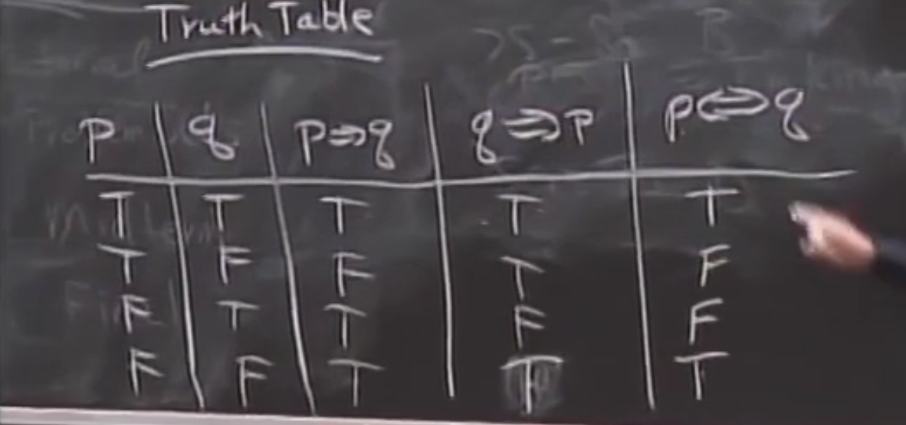
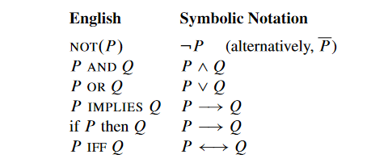
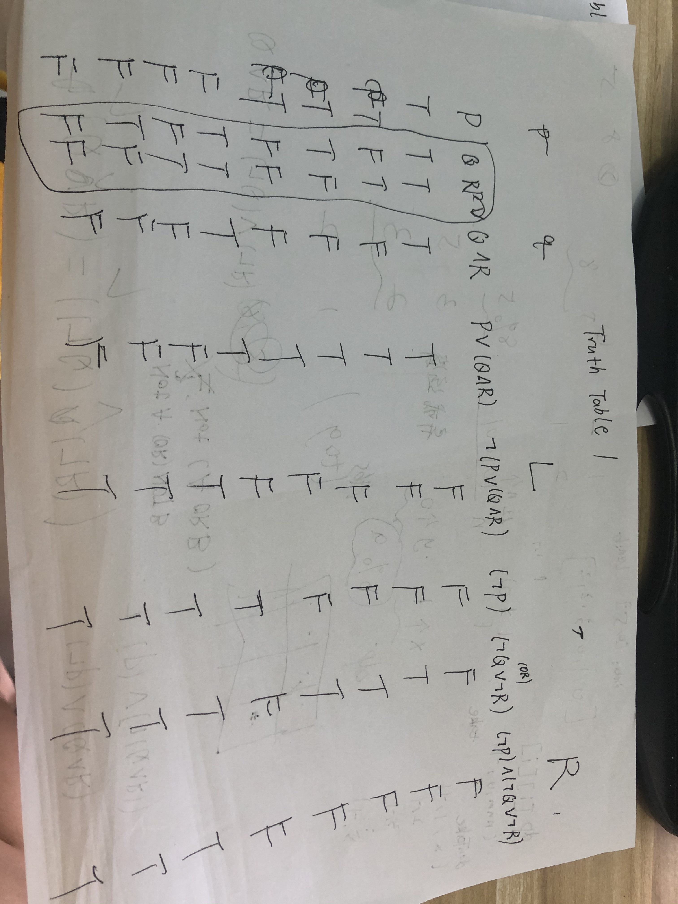
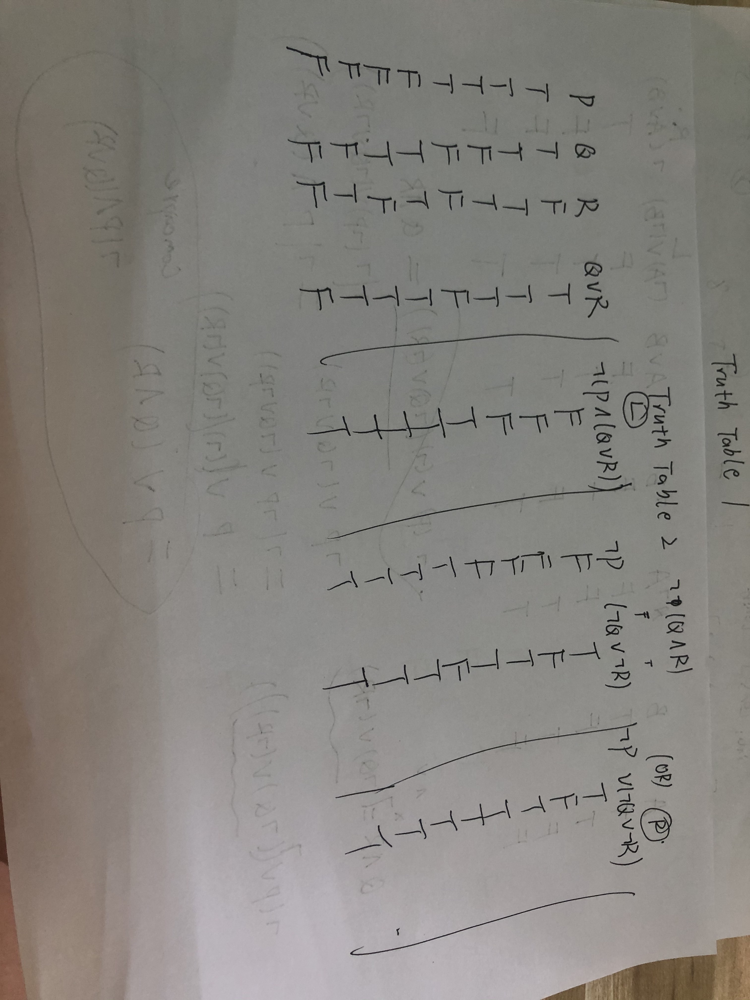

# MIT6.042J-Mathematics for Computer Science 

## Intro:

### **前缘：**

即将大四，目前打算做Java开发工作，很慌，但我不希望自己在没啃完基本大书或者做些lab就火急火燎草草水项目、背面试题，慌张地求一份工作，这样对当前的我来说，没有实质上学到东西，除了快速面向面试学习的能力。

数学基础不扎实，先从离散数学或者这门计算机实用数学开始吧

### 常用符号:

¬ ，∀，∃,∈, ⇒

### **资源网站：**

视频：

[Lec 2 | MIT 6.042J Mathematics for Computer Science, Fall 2010 - YouTube](https://www.youtube.com/watch?v=z8HKWUWS-lA&list=PLB7540DEDD482705B&index=2)

中英字幕： https://www.bilibili.com/video/BV1Kb411n7oa?from=search&seid=14315749058043000738

官方网站：

​	Reading: [Readings | Mathematics for Computer Science | Electrical Engineering and Computer Science | MIT OpenCourseWare](https://ocw.mit.edu/courses/electrical-engineering-and-computer-science/6-042j-mathematics-for-computer-science-fall-2010/readings/)

​	Assignment: [Assignments | Mathematics for Computer Science | Electrical Engineering and Computer Science | MIT OpenCourseWare](https://ocw.mit.edu/courses/electrical-engineering-and-computer-science/6-042j-mathematics-for-computer-science-fall-2010/assignments/)

​	作业答案参考: https://github.com/frevib/mit-cs-math-6042-fall-2010-problems/tree/3ccf851e0575c2e88974371fdb62a222709a489e

### 参考笔记:

​	暂无

## Lec01:(implication, proposition, truth table, nand, 数学的一些符号, proof)

​	核心内容是Propositions命题, 什么是命题，存在着真假关系的句子是命题，可以是真，可以是假，像是Who are you这样的不存在真假的不是命题

​	一个重点是"implies": 

​		implication的定义:  p -> q is true if p is F or q is true        我不知道这个是这里的定义是定义的还是一个公理

[如何理解数学里的「若 A 不真，则 A→B 总是真的」这种蕴含关系？ - 知乎 (zhihu.com)](https://www.zhihu.com/question/345295530)

​		推下去，我们能得到Truth Table

​	最后引申了 Axioms公理, 公理就是那些被人们所接受的命题，在已知条件下，我们默认其为真。(e.g. a = b, b = c, -> a = c)

​	一些案例和专有名词:		

​	 	∃a,b,c,d∈n+ , a^4 + b^ 4 + c^4 = d^4 正确吗？

​		公理有其适用范围和条件， Russell和 whitehead 试图建立统一的公理结果一辈子没证明出来，但是Kurl 证明了不存在统一的公理😅

​		偶数能拆成两个质数之和？

​		Bernard Riemann, number theory

​		更多例子感兴趣快速浏览： [Intro to Proofs: Chapter 1.1 – 1.6 (mit.edu)](https://ocw.mit.edu/courses/electrical-engineering-and-computer-science/6-042j-mathematics-for-computer-science-spring-2015/readings/MIT6_042JS15_Session1.pdf)

### Assignment1:

​	Problem1.: (a): S(x) ^ A(x) (b): T(x) -> A(x) (c): ¬T(x) -> ¬A(x) d(x): ∃ 3*T(x), ¬A(x)

​	阅读答案后尝试修改：

​	(a) ∃x∈X, S(x) ^ A(x)

​	(b) ∀x∈X, T(x) ^ S(x) ⇒ A(x). 小心漏了TA(同时也是加入6.042这门课的学生这种情况，因为不是所有TA都是学生的，学生会有成绩，需要做作业等，不加入门课的TA不需要做作业和考试，大概是这样的逻辑)

​	(c)¬∃x ∈X : T (x) ∧(¬A(x))   ¬∃x ∈X : T(x) ⇒ ¬A(x)

​	(d) ∃x, y, z∈X, ¬E(x,y) ^ ¬E(x, z) ^ ¬E(y, z) ^ T(x) ^ T(y) ^ T(z) ^ ¬S(x) ^ ¬ S(y) ^ ¬S(z)

​	Problem2: Two Turth table pic

​	Problem3: 

​		(a) (i) A ^ B = ¬ A nand B (ii) A ∨ B = (¬A) nand (¬B) (iii): A -> B  == A ∨  (¬B) == (¬A) nand (B)

​		(b): ¬A = A nand A

​		(c): True: [¬A ∨ A  -> (A nand A) ∨ A ->] ((¬(A nand A) nand (¬A))

​			  False: [¬A ^ A -> (A nand A) ^ A -> ] (¬(A nand A) nand A)

​	 (c)修改，思考方式需要改变，最好从nand入手

​			True: A nand (A nand A) 

​			False: 利用b结论 (A nand (A nand A)) nand (A nand (A nand A))

​	Problem4: 

​			The first time: pick up 10 coins and divide them into 2 piles.  Two situations: the rest of 2 coins have the fake one, and weigh anther time OR the fake in one of the 2 piles and we pick up 4 coins and divide them into 2 piles and weigh. Two situations: the lucky situation is that the rest of the coin is the fake one, and we don't need to weigh again OR the fake one is in one pile and we should weigh them again.

​			At most 3 times.

​	Problem5:

​		 r^(1/5) = a/b (a,b ∈ Z, b != 0)

​	Problem6:

​		两个偶数情况，将结果化简 w2 + x2 + y2 = (2i + 1)2 + (2j + 1)2 + (2k)2 = 4(i2 + j2 + k2 + i + j) + 2; z2 is a multiple of 4.不可能成立

Truth Table 就可以了。Truth Table更加直观，但是枚举后，也知道结果了。

## Lec02:

​	

​		