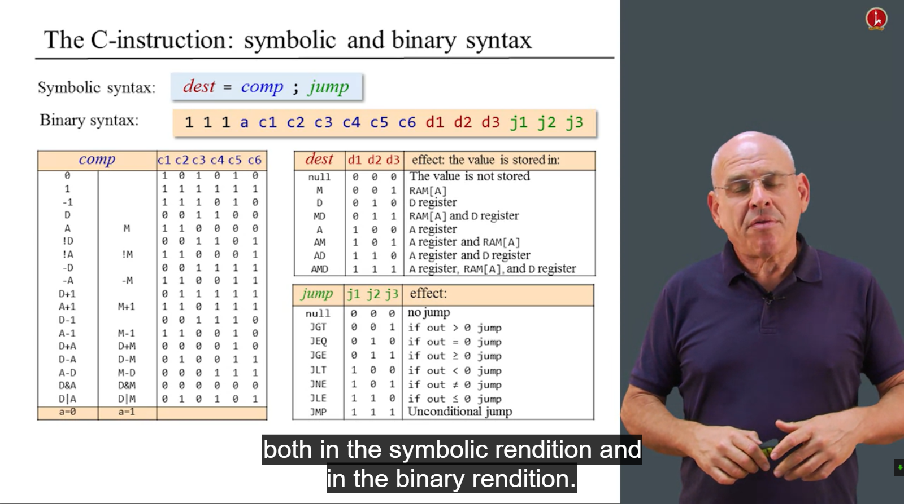
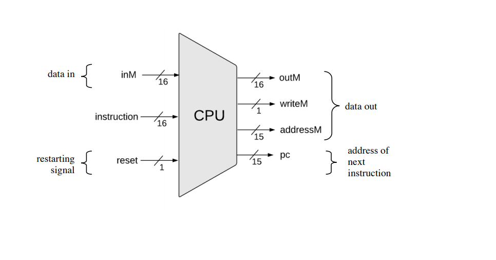

# Nand-To-Tetris

# Basic Logic

## Why I want to learn it

 一方面是因为自己不仅想学code还想真正接触计算机科学，学习CS的知识。另一方面是因为自己基础薄弱，觉得迟早要学，不如先开始。

 我的学习路线还是按照[Teach yourselfCS-CN](https://github.com/keithnull/TeachYourselfCS-CN/blob/master/TeachYourselfCS-CN.md)
来学的。

## What we will learn

 这里用中文快速写一遍吧。我们知道操作系统是连接软件和硬件的中间的一层，学习内容可想而知，不仅会涉及到硬件的知识，同时也会涉及到软件的代码，这门*Build a Modern from the first principle*
是来自希伯来大学（以色列）的两名教授Noam Nisan Shimon
Schocken经过很长时间探索打造的一门课，目的是帮助大家更好地了解计算机组成。这课最终目标能让大家自己打造一个操作系统（语言是类似Java的Jack语言，呃），然后在你设计的操作系统上写Tetris(俄罗斯方块这个游戏)
想想还是比较激动的，虽然我现在啥都不会啊。

 课程分为两大部分，第一部分是硬件篇，从数学逻辑开始，慢慢的过渡到逻辑符号的一些硬件设计然后再设计晶体管，再慢慢上升到CPU,RAM之类的，最后到集成电路（Hack
电脑）。这部分时间大概是7周45h，每天学习2h左右吧。第二部分是软件，时间也是7周，这部分就先放一下，目标时是用高级语言设计虚拟机鸭~。

 课程适合入门学习，教材阅读可以选择*The Elements of Computing System*

- 

- 

 课程里的一些注意事项的补充：

 Shimon在课程里将chip和gate理解成一个东西，都是执行逻辑功能的最小物理设备,以下为原书里的摘抄:

*Today, most gates are implemented as transistors etched in silicon, packaged as chips. In this book we use the words
chip and gate interchangeably, tending to use the term gates for simple chips*

## The content

### Boolean Functions and Gate Logic

这部分的内容简单来说从数学逻辑（逻辑符号，逻辑表达式，逻辑表达式计算准则）出发然后引申到Logic Gate(Xor,Nand之类的，重点是Nand，它会和后面的知识串起来)再到硬件语言（HDL）再到设计。

**一些必会的知识点：**

三个简单逻辑的hardware diagram的表示方法


**几个我当时犹豫思考后觉得有趣的地方：**

​    **逻辑表达式：**

对于一张带有x,y参数和最后运算结果的Table，我们如何得到它的逻辑表达式呢？方法是通过NOT,AND,OR进行连接，凑value是1的表达式然后用OR进行连接。

值得注意的地方还有逻辑表达式的计算准则，除了类似小学学的交换、结合、分配律之外，还有一个mogan法则(**De** Morgon's **Law**),不过也接触过,就是(x AND y) == NOT(NOT x OR (NOT y))
。

这是我在阅读The Element of Computer System时有一个概念没有看懂叫做Canonical Representation中文翻译规范表达。摘了一段进行加强理解.


Thus the canonical representation of the Boolean function shown in figure 1.1 is f(x,y,z)
= 

这里的Canonical representation有点像是最简表达式的韵味了。

### Gate Logic:

*A gate is a physical device that implements a Boolean function.*

*The simplest gates of all are made from tiny switching devices, called transistors, wired in a certain topology
designed to effect the overall gate functionality*.

Gate里的逻辑一般用diagram来表示。

**思考题**：Xor(a,b)的canonical representation是如何表示的？它的diagram怎么画？

​    **NAND:**

可以用NOT + AND进行理解。x NAND y = NOT(x AND y)

任何的逻辑函数都可以用NAND进行一个表示，有两个好玩的证明。

1) NOT(x) = (x NAND x)

2) (x AND y) = NOT(x NAND y)

​    **Hardware description languages(HDL):**

HDL(hardware description language)其实就是设计硬件的语言。

常见的HDLs:


### Hardware Simulation:

这里的Hardware Simulation的意思是硬件仿真，其实就是用软件去设计硬件啦，这里最基本的是设计最基本的chips。

下面的这张截图是对用Hardware Simulator仿真的一些内容。可以看出有几个部分内容是挺重要的丢，hdl语言部分，tst描述执行文件，.out文件,.cmp文件。


基本的概念得知道，现在的硬件设计者不需要再用手去设计硬件产品如芯片啦，设计过程自动化，他们是system architecht,写HDL项目用电脑软件Hardware simulator进行反复的仿真测试chip的正确性(
可能会有几个月甚至更久哦~)。那他们干嘛呢？计算速度，能量消耗，成本等是他们去注意的呦~。


### Mux & DMux:

Mux是一种Multiplexor，这里的意思是有多个输入，同时sel对输入会有影响。

Chip name: Mux Inputs: a, b, sel Outputs: out Function: If sel=0 then out=a else out=b.

Chip name: DMux Inputs: in, sel Outputs: a, b Function: If sel=0 then {a=in, b=0} else {a=0, b=in}.

DMux可以理解为对Mux的一种解码或者解密，具体看书会更清楚。

根据cmp文件来写hdl格式代码的一些推断技巧：

- 熟悉使用And, Not, Or三种基本逻辑的图来进行拼接，画出结果，有点，将抽象问题具体化，也更直观
- 逻辑推导和通过公式尝试，特点：抽象，锻炼思维能力，难度较高，容易绕晕
- Mux可以先尝试先忽略b列写sela,然后在忽略a列些selb，最后结合起来
- DMux的结果in，sel最后得出a,b。可以将先忽略a列、b列中的一列，然后集中力量推导出一个，同理推另外一个，最后逻辑串联。

### 15 particular gates:

 下面的这张图是15个最长使用的gates，也是作业里要做的内容，注意，作业里的HDL语言是经过简化过的，比起现在商业化用的VHDL等，简单很多。


 做这个作业最大的收获还是感受一下逻辑设计的过程，思考方式，当然可能会与实际有所不同。

一些做作业的时候需要注意的地方。


### 做作业过程中收获的地方:

总的来讲，有点层层递进的感觉，利用Nand可以构成一切的特性，首先写And,Not,Or，然后再慢慢利用构建的这些简单逻辑去构建多位的，多路的，Mux,DMux等。

# ALU

## 为什么学这章的内容及学习目标

围绕着电脑计算展开，现在的我们知道CPU是计算机大量计算的关键部分，而在CPU内最关键处理计算的Chip是一个叫ALU(Arithmetic Logic Unit)
中文名叫算术逻辑单元这样的一个东东，它的作用是处理字节运算和逻辑运算。Week2这章的内容目的是设计一个简单的ALU(属于From Nand to Tetris的一个ALU)，这个ALU是专门属于你的，也是From Nand to
Tetris这门课想要带给你,它被大量简化，只有加减法的计算功能。所以，难度适中，不用担心学不会的问题，但学习这个过程中带给你的爽感就像你真的设计了一个ALU，乃至未来的PC。

## 这章的内容以什么形式呈现

既然是计算，最简单的模型莫过于，两个分别为1个bit的信息进行相加计算了。这个模型抽象具体化为In a, b Out sum,carry

输出的结果分别为1bit的内容，carry代表的是进位，sum表示二进制相加的most significant的一位。我们将这个模型抽象为一个叫做HalfAdd的Chip。

计算不可能只计算一位吧，我们计算的内容可能是很多位进行相加。那么想想会遇到什么情况呢？当只有1位进行相加的时候，我们发现是HalfAdd的情况，But,wait.如果有很多位呢？我们将多位的情况先从最简单的方式进行思考，也就是两位的情况，会发生什么呢？我们发现如果carry为0的时候，就是HalfAdd的模型，但是当carry等于1的时候，那就相当于是有三个分别为1bit的内容进行加法计算了。

于是，有了FullAdd的模型Chip。In a,b,c Out sum, carry

有了FullAdd，你就可以进行设计多个bits的计算了。这里引入Add16，因为我们这门课最终目标是设计一个简单的16位的Hack computer.

以上都是加法运算，我们从小学就知道人手动计算的时候，我们经常将减法简化成加法进行计算，在这里，我们采用类似的思想，但是计算机的减法如何实现呢？难不成我还需要设计Subtract的Chip吗？

一个很有意思的技巧是我们将多个Bits的数的第一位作为符号位，0表示正数，1表示负数，这样对原先为n个Bits的Chip,它的取值范围为0~2^n-1。再引入符号位的概念后，它的取值范围就变成了-2^(n-1) ~ 2^(n-1)
-1这样的一个取值范围。不过呢，这样表示还是有一点问题，举个例子，对于4-bit binary system ,1 + (-2)
的结果该怎么表示呢？如果直接按照取负的思想，相加的结果为1011，对应的数为-3，不过我们都知道这个算术计算的结果应该为-1，也就是1001，问题出在了哪里？如何解决这个问题？

这里引入了一个2's complement method(补码)的一个思想方法，这里的补码可以理解为取负的意思，注意和Bitwise negation区别开来。


这样问题就迎刃而解了，具体为什么，如果你对着感兴趣的话，可以自行学习下。

之后再看一看ALU的功能


最后还有一个Inc16的chip(这里的Inc其实是Incrementor的缩写),其功能是在16bits输入的情况下，输出In+1的情况。

## ALU实现的思路：

zx,nx和zy,ny模块其实是类似等价的。nx模块用Not16 chip,zx module用 Mux16(a = , b = false,sel = zx,out =  )来实现；

f的条件选择如何实现呢？ 我想到了Mux16(a = x & y, b= x + y, sel = f, out= )

no module 用Not16 chip和 Mux16进行选择判断

最后根据out的结果再选择判断对zr , ng 进行输出

## 总结

这节最好玩的地方在于，构建的Logic gate难度加大了，HalfAdd, FullAdder, Adder16,Inc,ALU大概是这些了。难度加大，能不能不重复造轮子，利用第一次作业里的基本的chip很关键，比如说Mux,Xor等。

我自己在Bitwise negation这里卡了下，有时候我下意识地将Bitwise negation当作取负了，有时候没有，概念有点混乱。

还是挺有意思的，虽然一个人在图书馆啊~。今天科三过了，hahahaha~.据说，好运会传递的哦，如果你看到的话。

# Sequential Logic

## 这章学什么

之前两章节的内容都是直接的逻辑或者算术运算，这类的chips我们把它叫做Combinational
chip。但是它们也有局限，没有涉及到状态。什么意思呢，假设给某个chip一个input然后我们知道经过许多ALU的算术逻辑计算后，我们可以得到最终的结果，But，什么时候我们能够得到这个结果，在这个程序运行的1s时这个chip的状态是怎么样的？我们计算得到的value去了哪里？这些我们都不得而知。

学这章内容的目的就在于考虑到state的情况,能够设计简单的memory来储存这些state,也就对应我们熟知的计算机的RAM等，同时，也让我们设计chip或者考虑问题时能够从一个更广的角度进行相应的思考。

## 这章以怎么样的方式呈现

### DFF

与学习前面类似，从一个名叫DFF(data flip-flop)的chip出发，这门课里老师直接把这个给你了，你可以直接从DFF开始进行设计。什么是DFF呢？它的具体实现形式是怎么样的？


从功能的角度来看，out(t) = in(t-1),有意思的地方在于，这个chip将时间t进行关联。

如果你对DFF的实现形式感兴趣的话，我暂时用一句话先解释下，DFF的设计是用两个Nand来实现的,coursera上的perspective具体讲了下，不过我觉得perspective里讲得也还不是很清楚，如果你想了解更多，建议把perspective看完，然后感兴趣的话去自己学习，搜索相关资料，如果你觉得你的资料不错，不妨留言，告诉我你的学习过程，或者帮我完善这部分的学习笔记，让更多的人受益。

### Bit(1-bit register)

接下来是设计一个1-bit的register,设计这个register的功能大概是这样的，输入一个load(t)，和时间参数有关,实现两个输出:

 if(load(t-1)),out(t) = in(t-1)

 else out(t) = out(t-1)

如果load为1的情况下，out的结果是上一秒的输入，否则，out不变。

#### 如何实现


### Register(16bits register)

和Bit几乎一样，唯一不同的时in和out都为16位。

### 紧接着是设计RAM-8

何为RAM(Random Access Memory),后面的编号是啥意思呢？其实代表的是有几个寄存器，这里代表有8个。

RAM可以看作是多个Register的一个集成体，与Register不同的地方在于多了一个输入Address,目的是指定某个Register进行操作。

### RAM64

与RAM8类似，只不过这个是由64个寄存器组成的东东。

4.6补充

想要构造register4k时，脑袋里卡了下。简单回顾了下前三章的内容。对于RAM8的构造很明显，但延伸到RAM64的时候，对于它的DMux8Ways有点不理解，不明白在哪个register进行存储应用的。

对于多register的结构，以8个为一个单元，无论是64，512，还是4k,对于Hack computer（单线程的电脑？），一次只有一个register参与应用。

具体哪个位置，哪个寄存器，没有那么重要，和你内部实现代码的内部写法有关系。

### 最后是硬核的PC chip

下面是它的implementation的图


写的时候我卡了很久，思路也未完全理清。中间尝试使用Logisim的硬件模拟软件，还是有点糊涂，不过有机会再尝试。这里附上实现代码。

这个是有详细注解的github上的代码。
https://github.com/cmoylan/Elements-of-Computing-Systems/blob/master/project03/a/PC.hdl

```vhdl
// This file is part of the materials accompanying the book
// "The Elements of Computing Systems" by Nisan and Schocken,
// MIT Press. Book site: www.idc.ac.il/tecs
// File name: projects/03/a/PC.hdl

/**
 * A 16-bit counter with load and reset control bits.
 * if      (reset[t]==1) out[t+1] = 0
 * else if (load[t]==1)  out[t+1] = in[t]
 * else if (inc[t]==1)   out[t+1] = out[t] + 1  (integer addition)
 * else                  out[t+1] = out[t]
 */

CHIP PC {
    IN in[16],load,inc,reset;
    OUT out[16];

    PARTS:
    // Put your code here.

    // Pin priority: reset, load, inc

    // If inc bit is set, take the value from last cycle's Add16,
    // otherwise just take the Register's output from last cycle.
    Mux16(a=regOut, b=addOut, sel=inc, out=incrementOut);

    // If load bit is set, take the input, otherwise take the value
    // from the inc mux.
    Mux16(a=incrementOut, b=in, sel=load, out=loadOut);

    // If reset bit is set take 0, otherwise take the value
    // from the load mux.
    Mux16(a=loadOut, b=false, sel=reset, out=regIn);

    // NOTE: probably can do it like this, but i'm tired
    // Mux4Way16(a=regOut, b=addOut, c=in, d=false, sel=something, out=regIn);

    // Storage element for the counter
    // Note that load bit is always set because we want to update the
    // stored value every clock cycle. Also note that the out bus is sent
    // to out, and fed back into the chip for the next cycle.
    Register(in=regIn, load=true, out=regOut, out=out);

    // Add 1 to the output of the Register and feed the result back
    // for the next clock cycle.
    Add16(a=regOut, b[0]=true, out=addOut);

}
```

我的理解：

对于这块的逻辑，我个人比较晕，但从语法上看其实就是if,else if, else 的结构，再加上富有时间钟Register的寄存器。硬件系统里，要从最下面往上层层扒皮。

## 总结

暂时没有搞懂的pc.hdl的代码，其设计模式以及方法，更往前推，对于time cycle tick tock的理解不够到位。最开始的DFF,之后Bit.hdl的设计，关键是其形成的一个回路

    Mux16(a=in, b=false, sel=reset, out=out1); // 0 or in
    Register(in=out1, load=load, out=out2); //out1 or out
    Inc16(in=out2, out=out3); //out2 + 1
    Mux16(a=out2, b=out3, sel=inc, out=out); // get the output
    //这个是我写的代码.....

 Nand to Tetris

And the, the saying is that simple-minded people are impressed by sophisticated things, and sophisticated people are
impressed by simple things.

# Machine Language

## 1.What is the machine language

Machine language is a block of code consists of 0 and 1. It is very difficult for people to read but is kind for
computer.

To eliminate the difficulty of write code with machine language, there is a mediate language called symbolic language
which makes easy to read for human beings.

## 2.Understand how  hack computer works

The following below is picture that displays briefly how hack computer works or other computers with simplified model.


In particular, note that every operation involving a memory location requires two Hack commands: One for selecting the
address on which we want to operate, and one for specifying the desired operation.

## 3.Three registers and two instructions

### Three registers: A register, D register, M register

#### A register :

其实就是个寄存器呗，但为什么有个A呢？主要表明它是用来储存地址滴，地址有啥用呢，用来找东西呗，在我们的Hack computer当中，A寄存器是用来找data memory中具体用哪个寄存器的，现在不完全理解没关系，结合后面的The
A-instruction 以及作业代码，相信你能更好的感受到A寄存器的作用。

#### D register：

同A寄存器，为啥有个D呢？这里的D意思其实是data也就是数据的意思，意思就是D寄存器是暂时CPU里的一个暂时储存数据的一个寄存器。有啥用呢？同样得结合实战代码来加深理解。

#### M register:

这里的M，其实是Memory内存的意思，代表着M寄存器其实是data memory里的一个寄存器。也就是说，相当于和外部数据联系起来啦。

### Two instructions: The A-instruction, The C-instruction

在不具体讲指令前，我想先对这里的2个指令为什么是两个简单介绍一下。

无论是A指令还是C指令在Hack
computer里面都是16位语法所构成的，我们知道计算机里的1个bit可以是0也可以是1，有两种选择，你想到了吗？没错，这里就用了1个Bit来表示是A指令还是C指令，最左边如果是0的话，代表是A指令，最左边是1的话，代表是C指令。

#### The A-instruction:


A指令是由15位bit所组成的，对于16位的hack computer,当然第一位就取0了。

语法:@value

作用：

设置A寄存器的值为value

data memory中的RAM[value]被选中了

结合操作M寄存器时，可以理解为这是data memory中的RAM[value]被选中了

#### The C-instruction:

语法：

dest = comp ; jump     (both dest and jump are optional)

这里的dest是destination目的地的意思

comp是compute也就是计算的意思

jump是跳出的意思，可以理解为goto的意思，跳到哪了？做什么？需要具体结合应用场景。

上面()的东东是什么意思哩？说明了什么？潜在来讲，告诉我们，C操作指令可以没有dest, jump但一定有计算的东西。

comp, dest, jump具体有哪些？下图截取部分内容。


观察一下你会发现，为什么comp有这么多的东西，而相比较而言dest, jump 的种类会这么少？这就需要看C指令的二进制语法了。

我们可以看到C指令是由16位语法组成的，一般而言，前面讲过，第一位的1代表使用C指令，后面两位我们默认为1，之后截图的蓝色部分由七位构成，代表comp，红色的三个Bits代表dest,绿色的三个Bits代表jump。

其中蓝色部分的第一位的a，表示是取左边框框的东东呢，还是右边框框的东西呢。



## 4.Hack programming

在这个模块，你需要对三个寄存器和指令以及在给Hack computer传入指令后，hack computer是如何运行的进行一个理解甚至是分析它的运行过程。

### Working with registers and memory


### Branching


### Variables


### Iteration


### infinite loop

给定一个value，对应的是ROM里第几行的指令，让computer一直在一个特定的区域内进行活动。

例如:

@25

0;JMP

这里的意思是跳到ROM指令的第25行，执行下去，在跳到第25行。

#### Pointers

And as far as the machine language is concerned, the array is just a segment in

memory of which we know the base address of this segment and, and

the length of the array that the programmer has decided to declare.


### Input/output

对于output来讲，一般以屏幕也就是Screen的方式进行呈现，大概也知道screen上其实是由很多的小点点pixel组成的。

那pixel的实质又是什么哩？其实它对应的是Memory的寄存器里的一个bit。

Screen memory map就应用了这个原理。

从Memory的第16384个寄存器开始作为Screen的下标为0的寄存器，地址的起始点。后面8191个寄存器对应了下图右边256*512的Display Unit。

由下图是几个规律，稍微想一下应该不难。

但有几个容易绕进去的地方，

为什么Screen memory map是从16384开始的，这点可以理解为默认。


Input其实对应的就是我们的鼠标、键盘。

课上介绍的是键盘。

键盘上的每一个字母符号都对应着一个binary code,计算机读的就是这个binary code, 其实涉及到了ASCII的这张表。

## 5.Project4

一个作业是实现RAM[2] = RAM[0] * RAM[1]

另外一个是实现一个键盘输入，屏幕输出的一个功能。

资料上罗列了一些格式化设定的东西,这里就不细讲了，

# Computer Architecture（计算机架构）

## Von Neumann Architechture

### computer architechture


- 结构：input, hack box, output. Hack box 里面是计算机的核心组成部分，分别是Memory,CPU, CPU负责计算，有计算逻辑单元ALU,和接受指令的Registers.
  Memory内存，存data的同时也需要指令，所以有program。
- 冯诺依曼结构中只有一个memory但要负责两个功能，一个是指令的program,另一个是data，会不会有冲突的时候呢？答案是会的，所以，后面有了一个叫做Harvard
  Architecture，当然，这里只是一个引子，后面会详细介绍这种结构。

### Information Flows


- Sometimes all these three pieces of the, each one of these pieces of information is actually going to be implemented b
  y wires(电线), by a set of wires sometimes called a bus(计算机科学里的总线)
- 这张图展现了计算机黑盒子里是如何开始工作的，三条总线和各部分结构相互作用，相互联系。
- 这里的Memory有两个作用，存储电脑运行时的指令和存储数据。

## The Fetch-Execute Cycle（指令周期）

Fetch: Which instruction to fetch next is determined by the jump bits of the current instruction and by the ALU output.
Taken together, these values determine whether a jump should materialize. If so, the PC is set to the value of the
A-register; otherwise, the PC is incremented by 1. In the next clock cycle, the instruction that the program counter
points at emerges from the ROM’s output, and the cycle continues.

Execute: Various bit parts of the current instruction are simultaneously fed to various chips in the computer. If it’s
an address instruction (most significant bit = 0), the A-register is set to the 15-bit constant embedded in the
instruction. If it’s a compute instruction (MSB = 1), its underlying a-, c-, d- and j-bits are treated as control bits
that cause the ALU and the registers to execute the instruction.

This particular fetch-execute cycle implies that in the Hack platform, elementary operations involving memory access
usually require two instructions: an address instruction to set the A register to a particular address, and a subsequent
compute instruction that operates on this address (a read/write operation on the RAM or a jump operation into the ROM).

冲突时怎么办？改进后的Hardvard architecture。


几个需要注意的地方

- 用了一个Multiplexor进行选择program的指令还是data
- 从Memory中输出指令到Instruction register，然后再从Instruction register到Control bus中
- Fetch指的是得到指令，Execute的话是运行指令。

- Program Counter : The contents of the PC are then used as the address for fetching instructions from the instruction
  memory. Thus, in the process of executing the current instruction, the CPU updates the PC in one of two ways. If the
  current instruction contains no goto directive, the PC is incremented to point to the next instruction in the program(
  加1). If the current instruction includes a goto n directive that should be executed, the CPU loads n into the PC（去n那）
- The computer architecture is wired in such a way that the output of the program counter (PC) chip is connected to the
  address input of the ROM chip. This way, the ROM chip always emits the word ROM[PC], namely, the contents of the
  instruction memory location whose address is “pointed at” by the PC. This value is called the current instruction.

有些地方我并没有完全搞懂

整个周期实现的动态过程模拟。

## Central Processing Unit（这里作者直接给你具体构造）





## The Hack Computer


## Project5

### Memory chip

思路点拨：核心是思考如何利用address来实现Memory不同区块的选择。15位的address,值为多少时是选择RAM16区域，值为多少时是选择Screen和Keyboard. 哪一位很关键呢？

.png)

### [CircuitVerse - nand2tetrisPart1](https://circuitverse.org/users/23429/projects/73996)

写项目时搜索到的一个网站，把基本的逻辑门，chip都给用类似电路软件实例化了。

### 项目的注意点

- 计算机处理时，都是一个bit一个bit处理的，Hack computer的16bits，当然你要想办法拆开来，让每一个Bit放回它该在的地方。
- 先设计Memory，后CPU最后封装computer

### 我的盲点、前面学习不到位的地方

- instruction的组成问题

  第四章的内容讲Machine language的时候提到了instrcution的组成，A的1+15bits,C由3+7+3+3四部分组成。

  这一次写project的时候，对于Hack
  computer的instruction的每一个bit都需要明确知道对应的是哪个部分。不然会很懵逼，我在想做作业的时候，望着一个项目发呆，想却想不通，只好回去查漏补缺。最后的结果是之前CPU视频部分完全没有搞懂，就妄图做作业，无疑是做梦啊。

- C指令

  对于des部分的3个bits,分别是d1d2d3，这里d1、d2、d3都代表一个bit。

  d1——A register, d2——Memory[A], d3——D register。

  对于jump部分的3个Bits，j1j2j3，这里的j1、j2、j3分别代表一个bit

  j1——out < 0，j2——out = 0， j3——out > 0。

  有三种情况：

  000 No jump

  111 Jump

  Others Conditional jump

- c(control bit)的选择。

  第一个Mux16的control bit为什么需要绕一下，因为要考虑两种instruction的情况啊。第二个Mux16的control bit
  仍然从这两个方向去思考，这里对于C指令还是不熟悉，comp的部分，第一位的a为什么重要，仔细看的话，0的时候不涉及到M，1的时候都涉及到M

- PC的实现中比原本写其代码时少用了部分东西。

  

  考虑两种不同指令的情况，ALU后的ng和zr有什么用，怎么用？如何结合instruction？

# Assembler

## Assembly Languages and Assemblers

## The Hack Assembly Language

## The Assembly Process-Handling Instructions

## The Assembly Process-Handling Symbols

## Developing a Hack Assembler

## Programming Option

这个项目做的有点头大，自己用Java语言写的，参考了一些别人的做法。

但对于SymbolTable的实现代码我有一个地方没有弄明白。

SymbolTable的初始化过程就按照书上罗列的

第一次传入的时候，记录伪代码标记的ROM的地址，将其放到一个专门用于存放SymbolAddressTable的哈希表里

第二次传入的时候读取就是一个replace的过程。但是传递两次，思路是将L_COMMAND@后面的Xxx用replace进行替换，替换成新的字符串再按照和A_COMMAND一样的方式进行处理。也就是说前面的东西也要修改。

(Xxx)这个得改，和空格和注释并行的部分

