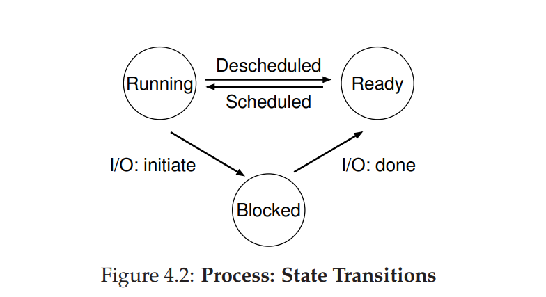
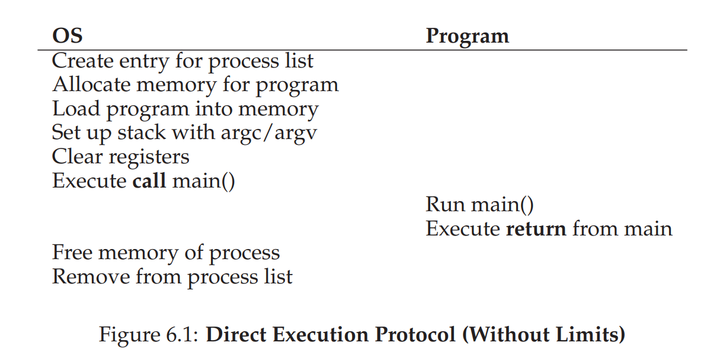
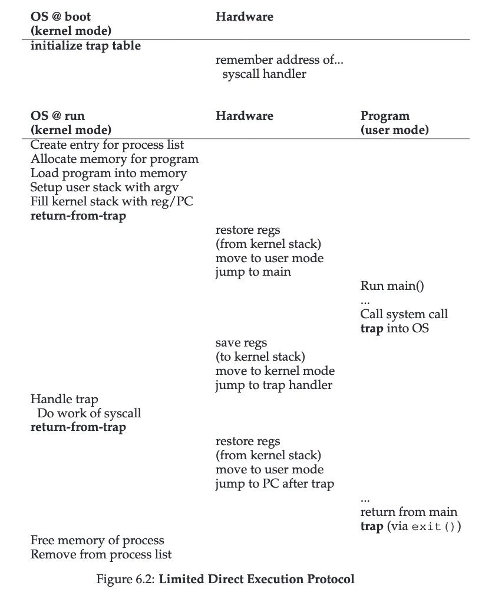
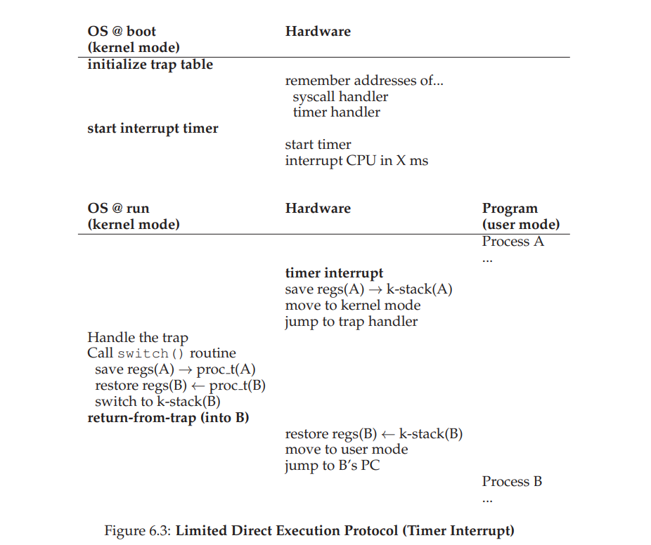

# OSTEP 

## Intro:

### 前缘：

本书英文版资源开源免费，同时豆瓣评分不错，教学资源丰富优美，有配套的一些练习有助于学习。

实习时看了一些，感觉还行。不过得加大输出写博客的力度。

### 学习资源网站:

[Operating Systems: Three Easy Pieces (wisc.edu)](https://pages.cs.wisc.edu/~remzi/OSTEP/)

[projects](https://github.com/remzi-arpacidusseau/ostep-projects)

[homework](https://github.com/remzi-arpacidusseau/ostep-homework/)

[Operating Systems Lecture 4: Process Execution Mechanisms - YouTube](https://www.youtube.com/watch?v=RxLJvh-nzQ8&list=PL0xjfw-F3f1R6wVpkGXAVmY2JyVIprJpQ&index=4)

[Lectures on Operating Systems (iitb.ac.in)](https://www.cse.iitb.ac.in/~mythili/os/)

博客参考：

[huangrt01](https://github.com/huangrt01/CS-Notes/blob/master/Notes/OSTEP-Operating-Systems-Three-Easy-Pieces.md)

[张慕晖]([张慕晖的博客 (zhanghuimeng.github.io)](https://zhanghuimeng.github.io/))

ps:看了下这俩家伙的博客，越看越吃惊。 huangrt01学习的知识和效率是我理解不了的，张的博客，发掘好像背景OI出身，对操作系统感兴趣就学了OSTEP? 同时关注了他的知乎号子，发现这哥们现在好像对德国文学感兴趣呢，自学德语。

把握时间，对不切实际的效率不要产生幻想，告诉自己，学一个东西，慢慢来。坚持下去。我不知道自己看这本书需要多长时间，有的人一个星期，好像豆瓣上还有三天的哥们，也有写博客1个多月的，甚至还有更久的。对自己来说，我天赋一般，补基础自学，本身是一件想做的事情，但是内心的焦躁会告诉自己，太菜啦。这能找到工作吗等等？久而久之就陷入不想学的一种怪圈里。

寻找自己想做的事情不容易，不过大方向，做信息智能化人才，基础扎实的人才我觉得踏实去做，还是对的。

### 环境：

​	windows10 + terminal (mircrofst store下搜索)+ wsl2 + Ubuntu20.04,配上VSCODE

### 目录：

[book (wisc.edu)](https://pages.cs.wisc.edu/~remzi/OSTEP/toc.pdf)

### Dialogue:

- 本书名称来源， *Operating System: Three Easy Pieces*。作者提到了费曼写的一本物理学的教材 *Six Easy Pieces*。作者开了个玩笑，提到OS只有物理的一半难

- 你将学到什么。

  ```
  virtualization, concurrency, and persistence. In learning about these ideas, we’ll learn all about how an operating system works, including how it decides what program to run next on a CPU, how it handles memory overload in a virtual memory system, how virtual machine monitors work, how to manage information on disks, and even a little about how to build a distributed system that works when parts have failed. That sort of stuff.
  ```

  OS如何工作，如何决定CPU执行项目，虚拟内存系统如何处理内存过载情况，虚拟机如何工作，如何管理在硬盘上的信息，一点关于如何构建分布式系统

- 学习方式：

  ```
  go to class, to hear the professor
  introduce the material. Then, at the end of every week, read these notes, to help
  the ideas sink into your head a bit better. Of course, some time later (hint: before
  the exam!), read the notes again to firm up your knowledge. Of course, your professor will no doubt assign some homeworks and projects, so you should do those;
  in particular, doing projects where you write real code to solve real problems is
  the best way to put the ideas within these notes into action. As Confucius said...
  ```

  听课，读Notes， 作业和项目， 实践中学习(最佳)。 孔夫子说了啥？

- dialogue作用是简单展示学些什么，让你自发进行部分的思考。

### Introduction to Operating Systems:

​	My questions: 什么是操作系统？ 有什么用？ 如何作用的？ 如何将硬件资源和软件进行一个结合的

Some questions and notes in this chapter that you can think about them by yourself to check if you really understand the knowledge.

8/5/2021 read again: 

​	脑袋里多了一个system call

Virtualization:

- What happens when a program runs?      keywords: Von Neumann  fetches decodes executes

- How does the operating system virtualize resources?   keywords: mechanisms and policies (more concrete)

  not concrete explanation: physical resources and transform them into virtual form/ virtual machine

- OS APIS --> run programs, access memory and devices and other actions. 

- Virtualization allows many program to run  -->  OS: resource manager

- Code examples:

  Spin(): a function that repeatedly checks the time and returns once it has run for a second. 

  ```c
  // cpu.c
  //argc != 2的理解 
  prompt> gcc -o cpu cpu.c -Wall
  prompt> ./cpu "A"
  一个参数这里argc = 2 ./cpu 0个参数 argc是1 
  
      //没操作出来
      ./cpu A & ; ./cpu B & ; ./cpu C & ; ./cpu D & [1] 7353 [2] 7354 [3] 7355 [4] 7356
      ./mem 同上
      //命令的 -Wall -pthread 不是很理解
      gcc -o thread thread.c -Wall -pthread  
       
  1 #include <stdio.h>
  2 #include <stdlib.h>
  3 #include <sys/time.h>
  4 #include <assert.h>
  5 #include "common.h"
  6
  7 int
  8 main(int argc, char *argv[])
  9 {
  10 if (argc != 2) {
  11 fprintf(stderr, "usage: cpu <string>\n");
  12 exit(1);
  13 }
  14 char *str = argv[1];
  15 while (1) {
  16 Spin(1);
  17 printf("%s\n", str);
  18 }
  19 r
  ```

  ​	

Concurrency:

- if two programs want to run at a particular time, which should run?

  policies are used later with mechanisms

- ```c
  //threads.c
  // gcc -o thread thread.c -Wall -pthread
  // ./thread 1000   --> Final value   : 2000
  // ./thread 100000  --> Final value   : 168224  Final value   : 160674  发生了问题， 为什么呢？
  
  
  
  HOW TO BUILD CORRECT CONCURRENT PROGRAMS?
  
  When there are many concurrently executing threads within the same memory space, how can we build a correctly working program? What primitives are needed from the OS? What mechanisms should be provided by the hardware? How can we use them to solve the problems of concurrency?
  
  #include <stdio.h>
  #include <stdlib.h>
  #include "common.h"
  #include "common_threads.h"
  
  volatile int counter = 0; 
  int loops;
  
  void *worker(void *arg) {
      int i;
      for (i = 0; i < loops; i++) {
  	counter++;
      }
      return NULL;
  }
  
  int main(int argc, char *argv[]) {
      if (argc != 2) { 
  	fprintf(stderr, "usage: threads <loops>\n"); 
  	exit(1); 
      } 
      loops = atoi(argv[1]);
      pthread_t p1, p2;
      printf("Initial value : %d\n", counter);
      Pthread_create(&p1, NULL, worker, NULL); 
      Pthread_create(&p2, NULL, worker, NULL);
      Pthread_join(p1, NULL);
      Pthread_join(p2, NULL);
      printf("Final value   : %d\n", counter);
      return 0;
  }
  ```

Persistence:

​	We hope store data persistently.

​	**CRUX: HOW TO STORE DATA PERSISTENTLY?**

- How file systems manage data persistently: 

  (performances) delay to batch them into larger groups 

  file systems incorporate intricate(complex) write protocol, journaling or copy-on-write 

  file systems employ many different data structures and access methods, lists to btrees

  If all of this doesn’t make sense yet, good! We’ll be talking about all of this quite a bit more in the third part of this book on persistence, where we’ll discuss devices and I/O in general, and then disks, RAIDs, and file systems in great detail.

Design Goals:

- build up some abstractions in order to make the system convenient and easy to use

- provide high performance

- provide protection between applications

- provide a high degree of reliability

- Other goals make sense:

  energy-efficiency

  security

  mobility

Some History:

- Early Operating Systems: Just Libraries

  make life easier for the developer 

  batch processing: The serial execution of computer programs

  expensive

  procedure call

- Beyond Libraries: Protection

  system call: add a special pair of hardware instructions and hardware state to make the transition into the OS a more formal, controlled process

  kernel mode

- The Era of Multiprogramming

  minicomputer UNIX operating system Aside (next page)

- The Modern Era: PC

## Virtualization:

### Dialogue:

 操作系统分配进程和很多人吃peach，peach的分配相关联

### The Process:

作者写书的思路： 什么是线程 ，线程是如何被创造出来的。

**CRUX: HOW TO PROVIDE THE ILLUSION OF MANY CPUS?**

- the most fundamental **abstractions** that the OS provides to users: the process

-  low-level machinery mechanisms are low-level methods or protocols that implement a needed piece of functionality

  e.g.**context switch**:

  which gives the OS the ability to stop running one program and start running another on a given CPU;

  **this time-sharing mechanism** 

  ​	 is employed by all modern OSes.

   	the potential cost is performance

  **space sharing**

   For example, disk space is naturally a space shared resource; once a block is assigned to a file, it is normally not assigned to another file until the user deletes the original file.

- high-level intelligence - policies: algorithms for making some kind of decision within the OS

  e.g.**scheduling policy**

  A **scheduling policy** in the OS will make this decision that which program will run first.

**What constitutes a process: machine state**

machine state:

​	(how)what a program can read or update when it is running. At any given time, what parts of the machine are important to the execution of this program?

​	components: memory, registers, some particularly special (e.g. registers PC, a stack pointer)

**SEPARATE POLICY AND MECHANISM**:

In many operating systems, a common design paradigm is to separate high-level policies from their low-level mechanisms [L+75].

mechanism: provide the answer to a how question about a system(e.g. how does an operating system perform a context switch)

The policy: provides the answer to a which question(e.g. which process should the operating system run right now)

Advantages:

​	Separating the two allows one easily to change policies without having to rethink the mechanism and is thus a form of modularity, a general software **design principle**.

**Process API:**

1. Create
2. Destroy
3.  Wait
4. Miscellaneous(mixed) Control: other controls(e.g. provide some kind of method to suspend a process)
5. Status

**Process Creation: A little more details**

​	Process 总体来看: OS reads the bytes of the program from disks in some executable format and place them into memory.

​	OS difference:

​		Early OS: read all bytes of the program **eagerly**.

​		Modern OS performs the process **lazily**. To understand it, key words: the machinery of **paging**分页 and **swapping**交换(later)

​		How OS set the stage for program execution: 

1. load code into memory

2. OS allocated and initialize some memory for the **run-time stack**. (e.g. C programs use the stack for local variables, function parameters, and return addresses &  fill in the parameters to the main() function, i.e., argc and the argv array)

3. OS allocated some memory for the program’s **heap**(e.g. C programs malloc() and free())

4. other work as related to I/O setup; default file descriptors; more later on persistence part		

5. last task: to start the program running at the entry point, namely main();

    联系后面(through a specialized mechanism that we will discuss next chapter), the OS transfers control of the CPU to the newly-created process, and thus the program begins its execution

**Process States:**

​	Running; Ready; Blocked

​	

**Data Structures**:

- OS is a program, has some key data structures that track various relevant pieces of information. 
  - process list: is the first data structure of OS;for all processes; check which process is running; PCB(Process Control Block, process descriptor) 

- The xv6 Proc Structure

```c
// the registers xv6 will save and restore
// to stop and subsequently restart a process
struct context {
    int eip;int esp;
    int ebx;int ecx;
    int edx;int esi;
    int edi;int ebp;
};
// the different states a process can be in
enum proc_state { UNUSED, EMBRYO, SLEEPING,RUNNABLE, RUNNING, ZOMBIE };
// the information xv6 tracks about each process
// including its register context and state
struct proc {
    char*mem;                  // Start of process memory
    uint sz;                    // Size of process memory
    char*kstack;               // Bottom of kernel stack
                               // for this process
    enum proc_state state;      // Process state
    int pid;                    // Process ID
    struct proc*parent;        // Parent process
    void*chan;                 // If !zero, sleeping on chan
    int killed;                 // If !zero, has been killed
    struct file*ofile[NOFILE]; // Open files
    struct inode*cwd;          // Current directory
    struct context context;     // Switch here to run process
    struct trapframe*tf;       // Trap frame for the
                                // current interrupt
};

```

​	(这段的理解)

​	registers: 用于process间的切换， context switch

​	Six states: UNUSED;EMBRYO初始态;ZOMBIE僵尸态（张的博客里提到这可能体现了抽象策略和底层机制的区别）

**the nitty-gritty**(center, core, essence):

the low-level mechanisms needed to implement processes, and the higher-level policies required to schedule them in an intelligent way. By combining mechanisms and policies, we will build up our understanding of how an operating system virtualizes the CPU.

**Homework**:

主要是对help下的几个命令进行一个操作的熟悉

1. ​	

   - 操作不顺利，README上看看有惊喜。不过README上也有点小瑕疵吧，命令行结果图用Typora打开有点错位。
   - 第一遍做的时候小懵逼，后来隔了几天（其实快10天了）发现很好理解了。还是那句话，遇到不会的，不用急，想想那几个问题？文章真的看懂了吗？README案例读懂了吗？如果没有，不知道作者写的思路和意图，确实很懵逼啊。

2. `./process-run.py -l 4:100,1:0`

   `1:0`IO段不是很理解，为什么会有5个WAITING,花费5个时间片进行处理，我以为是1个。

3. Process 0 WAITING for the IO requests while Process 1 can 处理请求指令。

4.  加入了-S SWITCH_ON_END，Process0 结束后 才能进行进程切换

5. 换成了 SWITCH_ON_IO

6. `./process-run.py -l 3:0,5:100,5:100,5:100 -S SWITCH_ON_IO -I IO RUN_LATER -c -p`

   别的进程进行完，它才会进行，比较慢和低效。

   - 奇怪的地方，`PID: 2` `RUN：cpu`只有4个。其实是Time 9 被吞掉了，重新进行一次正常了
   - WAITING有5个，张的博客里是只有4个的。难道是我和他电脑CPU不同的缘故？ 

   ```sh
   Time        PID: 0        PID: 1        PID: 2        PID: 3           CPU           IOs
     1         RUN:io         READY         READY         READY             1
     2        WAITING       RUN:cpu         READY         READY             1             1
     3        WAITING       RUN:cpu         READY         READY             1             1
     4        WAITING       RUN:cpu         READY         READY             1             1
     5        WAITING       RUN:cpu         READY         READY             1             1
     6        WAITING       RUN:cpu         READY         READY             1             1
     7*         READY          DONE       RUN:cpu         READY             1
     8          READY          DONE       RUN:cpu         READY             1
    10          READY          DONE       RUN:cpu         READY             1
    11          READY          DONE       RUN:cpu         READY             1
    12          READY          DONE          DONE       RUN:cpu             1
    13          READY          DONE          DONE       RUN:cpu             1
    14          READY          DONE          DONE       RUN:cpu             1
    15          READY          DONE          DONE       RUN:cpu             1
    16          READY          DONE          DONE       RUN:cpu             1
    17    RUN:io_done          DONE          DONE          DONE             1
    18         RUN:io          DONE          DONE          DONE             1
    19        WAITING          DONE          DONE          DONE                           1
    20        WAITING          DONE          DONE          DONE                           1
    21        WAITING          DONE          DONE          DONE                           1
    22        WAITING          DONE          DONE          DONE                           1
    23        WAITING          DONE          DONE          DONE                           1
    24*   RUN:io_done          DONE          DONE          DONE             1
    25         RUN:io          DONE          DONE          DONE             1
    26        WAITING          DONE          DONE          DONE                           1
    27        WAITING          DONE          DONE          DONE                           1
    28        WAITING          DONE          DONE          DONE                           1
    29        WAITING          DONE          DONE          DONE                           1
    30        WAITING          DONE          DONE          DONE                           1
    31*   RUN:io_done          DONE          DONE          DONE             1
   
   Stats: Total Time 31
   Stats: CPU Busy 21 (67.74%)
   Stats: IO Busy  15 (48.39%)
   ```

   

7. 换成了`-I IO_RUN_IMMEDIATE`，立即切换进程

   ```sh
   Time        PID: 0        PID: 1        PID: 2        PID: 3           CPU           IOs
     1         RUN:io         READY         READY         READY             1
     2        WAITING       RUN:cpu         READY         READY             1             1
     3        WAITING       RUN:cpu         READY         READY             1             1
     4        WAITING       RUN:cpu         READY         READY             1             1
     5        WAITING       RUN:cpu         READY         READY             1             1
     6        WAITING       RUN:cpu         READY         READY             1             1
     7*   RUN:io_done          DONE         READY         READY             1
     8         RUN:io          DONE         READY         READY             1
     9        WAITING          DONE       RUN:cpu         READY             1             1
    10        WAITING          DONE       RUN:cpu         READY             1             1
    11        WAITING          DONE       RUN:cpu         READY             1             1
    12        WAITING          DONE       RUN:cpu         READY             1             1
    13        WAITING          DONE       RUN:cpu         READY             1             1
    14*   RUN:io_done          DONE          DONE         READY             1
    15         RUN:io          DONE          DONE         READY             1
    16        WAITING          DONE          DONE       RUN:cpu             1             1
    17        WAITING          DONE          DONE       RUN:cpu             1             1
    18        WAITING          DONE          DONE       RUN:cpu             1             1
    19        WAITING          DONE          DONE       RUN:cpu             1             1
    20        WAITING          DONE          DONE       RUN:cpu             1             1
    21*   RUN:io_done          DONE          DONE          DONE             1
   
   Stats: Total Time 21
   Stats: CPU Busy 21 (100.00%)
   Stats: IO Busy  15 (71.43%)
   ```

   为什么让刚刚执行完I/O的进程立刻开始运行可能是个好主意？(这里我了解不多，之后再回来看)

   ​	就像上一题所分析的那样，如果把I/O请求分散开来，则可以提高设备的利用率。在设计调度策略的时候应当考虑到进程的I/O密集程度，这个思路见于多级反馈队列调度算法中——如果进程用完了时间片则下移一个队列；否则，如果在时间片结束之前就发出了I/O请求，则保留在当前队列中。此时花费的总时间就是3条I/O指令加上15条CPU指令的时间。

   来源：[张的博客]([OSTEP第04章作业：Simulation: process-run.py | 张慕晖的博客 (zhanghuimeng.github.io)](https://zhanghuimeng.github.io/post/ostep-ch-04-homework-simulation-process-run-py/))

8. `python .\process-run.py -s 2 -l 3:50,3:50 -c -p`的结果 

   ```sh
   Time        PID: 0        PID: 1           CPU           IOs
     1         RUN:io         READY             1
     2        WAITING       RUN:cpu             1             1
     3        WAITING        RUN:io             1             1
     4        WAITING       WAITING                           2
     5        WAITING       WAITING                           2
     6        WAITING       WAITING                           2
     7*   RUN:io_done       WAITING             1             1
     8         RUN:io       WAITING             1             1
     9*       WAITING   RUN:io_done             1             1
    10        WAITING        RUN:io             1             1
    11        WAITING       WAITING                           2
    12        WAITING       WAITING                           2
    13        WAITING       WAITING                           2
    14*   RUN:io_done       WAITING             1             1
    15        RUN:cpu       WAITING             1             1
    16*          DONE   RUN:io_done             1
   
   Stats: Total Time 16
   Stats: CPU Busy 10 (62.50%)
   Stats: IO Busy  14 (87.50%)
   ```

   思考这几个指令的作用

   `-I IO_RUN_IMMEDIATE`, `-I IO_RUN_LATER`: 作用一样，另一个process处于WAITING状态

   `-S SWITCH_ON_IO`: 默认，效率高

   `-S SWITCH_ON_END`

### **Interlude: Process API**:

Interludes will cover more practical aspects of systems, including a particular focus on operating system APIs and how to use them.

**学完的体会**:

我的状态：

这一章，我花了快1个星期时间才弄完，当然我有很严重的拖延症。有效的时间我觉得还是花了超过10个小时的。一些作业的概念弄懂，需要查阅大量课外资料。大概3天多时间里啥也没干。很多时候是因为焦虑影响到了我的行动严重变形。不过这几天的感受还是踏踏实实去做，当有要做的事情后，虽然还是会焦虑，但焦虑感没有这么强了。

焦虑动作变形的因素包括，遇到难题放弃去打游戏，看小电影，搜索劝退信息，看很多游戏视频，花很多时间到所谓的新闻上面。

在家里的独处习惯养成无疑对于每个个体来说都是一件非常重要的事情！认识自己，安排自己的时间，不虚度，不妄想，享受自由，享受和家人在一起的时间，享受大学里难得的独处时间。Treasure it.

我的体会：

这一章节放了很多实践的内容，涉及的主题是`Process API`, 什么意思呢？其实是很多系统调用，英文名叫做`system call`。 从标题我们可以看到，主要包括了，`fork()`, `wait()`, `exec()`系列(包括`execl()`, `execlp`, `execv()`, `execve()`等)，pipe()这些系统调用。

Ok, 如果你之前像我一样没有怎么接触过系统的东西的话，这里你需要大概建立一个概念，用户层和系统层。什么意思。这个用户层是针对市场上广大的消费者，使用者吗？非也，其实这里的用户层针对的是像你我一样的编程学习者或者未来的开发者等，我们这里拿C语言来举个栗子，C语言中`printf()`这个`API`，如果你稍微学一点的话，你一定知道，这是向标准输出输出内容的一个API，我们要输出内容，就要使用它对吧？那么更具体的呢？我们大概会想到，这个`API`应该是涉及到`OS`调用的一个`API`，在这门课中，我们知道了`OS`负责通过软件对硬件进行分配和使用。

其实呢，在本章学习之后，你会发现，无论是C语言`printf()`还是Java的`system.out.println()`等其实在设计的时候最后都做了系统调用，调用了一个名叫`write()`的system call，这里好像针对的操作系统是`Unix-liked`的。不过并不是所有情况下，`printf()`这种函数都会调用`write()`。

Remember, system call is costly.

摘录stackoverflow的一段话

```h
One thing to know (important) is that such a system call is costly! It is not a simple function call because you need to call something that is outside of your own code and the system must ensure that you are not trying to do nasty things, etc. So it is very common in higher print-like function that some buffering is built-in; such that write is not always called, but your data are kept into some hidden structure and written only when it is really needed or necessary (buffer is full or you really want to see the result of your print).
```

Note:

- Practice后的延申内容或者技巧：

  Linux Programmer's Manual， 搜到的一本很好的书

  terminal下输入 man --help 可直接查看文档; man+command(e.g. man fork查看fork的NAME,SYNOPSIS,DESCRIPTION,EXAMPLE等相关信息)

  glib, 阅读.h库文件的一些源码

- fork():  creates a new process.   `#include <sys/types.h>` `#include <unistd.h>`  `(int) getpid()`

  process identifier: PID

  p1.c  result is not deterministic. 引入wait()

  CPU scheduler: determines who will run the first, more in concurrency

- wait():

- exec():调用新的program, 内存、堆、堆栈等全部清除，重新分配

  exec(): execl, execlp(), execle(), execv(), execvp(), and execvpe()

- Getting IT RIGHT: 简单提了下，意思是抽象和简化都不能替代正确。

- fork() + exec()分离设计：好像很奇怪，为什么这样做呢？

  两个应用进行体会：

  ​	Unix shell:

  ​			分离后的命令： `wc p3.c > newfile.txt` 想一想不分离的结果会怎么样。

  ```c
  // p4.c对上述命令的一个实现代码，如果不分离，能进行close&open的操作吗？
  #include <stdio.h>
  #include <stdlib.h>
  #include <unistd.h>
  #include <string.h>
  #include <fcntl.h>
  #include <sys/wait.h>
  
  int
  main(int argc, char *argv[])
  {
      int rc = fork();
      if (rc < 0) { // fork failed; exit
          fprintf(stderr, "fork failed\n");
          exit(1);
      } else if (rc == 0) { // child: redirect standard output to a file
          close(STDOUT_FILENO);
          open("./p4.output", O_CREAT|O_WRONLY|O_TRUNC, S_IRWXU);
  
          // now exec "wc"...
          char *myargs[3];
          myargs[0] = strdup("wc"); // program: "wc" (word count)
          myargs[1] = strdup("p4.c"); // argument: file to count
          myargs[2] = NULL; // marks end of array
          execvp(myargs[0], myargs); // runs word count
      } else { // parent goes down this path (main)
          int wc = wait(NULL);
      }
      return 0;
  }
  ```

  ​	Pipe:

  ​	

  ​	`grep -o foo file | wc -l`， 一个结果的输出成为另一个的输入。

  - RTFM — READ THE MAN PAGES

**Homework(Simulation)**:

​	主要是对process tree的一个了解和熟悉，具体不展开了。自己动手玩玩吧。

**Homework(Code):**

​	很好的作业，不做作业真的不知道自己是否明白概念。Learn something and code it!

 1. 父进程和子进程对`x`的修改是互相独立的

 2. 如何做到同时？我代码结果是只有一个进程的值。 和张慕晖博客得出结论不同，测试他的代码是和他结论一致。

 3. wait(), 不能使用`wait`， 可以使用后面的`waitpid()` 或者 `vfork()`:create a child process and block parent

 4.   感觉最难懂的一个，张博客的提到的文章[linux系统编程之进程（五）：exec系列函数（execl,execlp,execle,execv,execvp)使用 - mickole - 博客园 (cnblogs.com)](https://www.cnblogs.com/mickole/p/3187409.html) 配上系统上使用 `man exec`查询

    `int execl(const char *path, const char *arg, ...);`

    `int execlp(const char *file, const char *arg, ...);`

    `int execle(const char *path, const char *arg, ..., char * const envp[]);`

    `int execv(const char *path, char *const argv[]);`

    `int execvp(const char *file, char *const argv[]);`

    v: vector

    l: variable-length

    p: path, 这里带p的不需要详细路径了，系统会在Path中找，直接file名字

    e: environ

 5. 没有子进程使用wait结果是-1

 6. `int wc = waitpid(-1, NULL,0);` 等价于wait

    `man waitpid` 下的原型

    `pid_t wait(int *wstatus);`

    `pid_t waitpid(pid_t pid, int *wstatus, int options);`

 7. 关闭后的`printf()`未打印，之前的打印了；但我测试张的代码，他的结果就像他博客里的结果一样。我不知道为什么

 8. 把`man pipe`下的example代码拿了过来，改了下，多个子进程，`cpid`用数组表示,两个子进程就是`cpid[2]`

    `pipefd[0]: the read  end  of  the pipe;` 

    `pipefd[1]:  the write end of the pipe`

    `ssize_t read(int fd, void *buf, size_t count); read up to count bytes from file descriptor fd into the buffer starting at buf`

    `write();`

    我的代码里主要思路是，write到`pipefd[1]`，通过管道传到`pipefd[0]`,就可以直接从`pipefd[0]`写给`buf`了。
    
    

### Mechanism: Limited Direct Execution(LDE)

- two challenges about virtualizing the physical CPU: performance and control

  performance: how can we implement virtualization without adding excessive overhead?

  control: how can we run processes efficiently while retaining control over the CPU?

**The CRUX: HOW TO EFFICIENTLY VIRTULIZE THE CPU WITH CONTROL**

hardware and OS required; OS use a bit of hardware

**Limited Direct Execution**:(LDE)

- Direct Execution: just run the program directly on the CPU.

  

  problems: efficiency and how to control

- **(Problem 1)The CRUX: HOW TO PERFORM RESTRICTED OPERATIONS**

  **New concepts**: restricted operations; procedure call; trap; user mode; kernel mode;return from trap; trap table; system call number;

  ​	privileged operation; trap handler;

  **vocabulary**: in terms of

  **Aside**: why system calls look like procedure calls

  ​	reason: It is a procedure call but inside of it is trap instruction.

  ​	(e.g. 执行write() | read() 时候 其实会调用C library 中的 procedure calls，于是system call就像是 procedure call了;

  ​	具体过程：

  ​		把write()参数放到stack or specific registers; 

  ​		把system call number放到 stack or specific registers中, 执行 trap instruction;

  ​		trap instruction 返回的values and control 到 program里, program 执行 system call;

  ​		部分 C library 中把system call 给手动编译成汇编代码,(所以不需要你写汇编到trap里了)；前人帮你造好轮子了2333

  ​	)

  **Approach:**

  ​	最简单的想法，让每个进程都能做想做的事情，显然不行！

  ​	改进: 两种模式， user mode 和 kernel mode（我称之为上帝模式）

  ​			user mode执行越过权限的命令后，OS会进行判断，超过权限，抛出exception, kill process.

  ​	还是有问题？如果想让user mode下process 执行一些 privileged operation(e,g, read from a disk)，咋办呢？

  ​		现代的hardware 提供让program执行一些system call: accessing the file system, creating and destroying processes, communicating with other processes, and allocating more memory（POSIX standard）

  ​		trap instruction能让processor mode变成kernel mode

  ​		return from trap --> user mode

  ​		trap table: 启动的时候，hardware里存了一些trap handler的地址，在trap handler里有对应的instruction

  ​		e.g.  x86, a per-process kernel stack

  ​		trap 如何知道该执行OS内的哪个代码呢？ 使用 trap table, OS boots up kernel mode

  ​		

  ​	事实上，对于用户的输入，OS should be wary(suspicious),想一想用户输入的参数涉及到边界问题等，都可能会让OS变得不安全。

  system call number 是一种保护手段

- **Problem#2: Switching Between Processes**

  （我加一个假设，CPU只能运行一个进程或者OS）进程中的交换看似简单，OS负责进程间的交换即可。不过问题来了，进程占用CPU的时候，如何让OS切换到另外一个线程呢？

  1. A Cooperative approach: wait for the system call

     - 这一种方式理论上假设进程间是友好的，进程占用CPU的时间是均匀的;

     - 有哪些应用呢？ early versions of the Macintosh operating system; the old Xerox Alto system

     - 不过，已经占用CPU资源的process是如何放弃对CPU占用切换到另一个的呢？ -By 一种特定的 system call, which does nothing except to transfer control to the OS to run other tasks.

     - 相似的，对于应用(application)来说, do something illegal(访问了不该访问的内存，除以0等)，将会产生trap,自动让OS control CPU;

     - 思考：如果没有硬件的支持, 不能调用system call, 遇到了死循环的问题，这种方式下，该怎么办呢？

       ​	Only one way, reboot the machine! 

     - 衍生阅读： REBOOT IS USEFUL

       ​	using a time-tested approach to improving the behavior of a computer system.

       ​	back to a tested state.

  2. A No-cooperative approach: The OS Takes Control

     **THE CRUX**: 

     ​	HOW TO GAIN CONTROL WITHOUT COOPERATION? 

     ​	How can the OS gain control of the CPU even if processes are not being cooperative? 

     ​	What can the OS do to ensure a rogue process does not take over the machine?

     - a timer interrupt, raise an interrupt every so many milliseconds; At this point, the OS has regained control of the CPU.

     - OS informs hardware of which code to run. At boot time, OS does that. Also, OS starts the timer which is previleged operation

     - The hardware saves enough states of the program.

     - TIP: DEALING WITH APPLICATION MISBEHAVIOR
     
       terminate the offender.
     
     - Limited Directed Execution Protocol(Timer Interrupt)
     
       

  注意有两种register saves/restores:

  - timer interrupt: 用hardware，kernel stack，implicitly，存user registers

  - OS switch：用software，process structure，explicitly，存kernel registers

  - e.g. xv6 context switch code(没看特别明白)

    ```assembly
    # void swtch(struct context **old, struct context *new); 
    #
    # Save current register context in old
    # and then load register context from new. 
    .globl swtch
    swtch: 
        # Save old registers
        movl 4(%esp), %eax  # put old ptr into eax 
        popl 0(%eax)        # save the old IP
        movl %esp, 4(%eax)  # and stack
        movl %ebx, 8(%eax)  # and other registers 
        movl %ecx, 12(%eax) 
        movl %edx, 16(%eax) 
        movl %esi, 20(%eax) 
        movl %edi, 24(%eax) 
        movl %ebp, 28(%eax)
    
        # Load new registers
        movl 4(%esp), %eax  # put new ptr into eax 
        movl 28(%eax), %ebp # restore other registers 
        movl 24(%eax), %edi 
        movl 20(%eax), %esi 
        movl 16(%eax), %edx 
        movl 12(%eax), %ecx 
        movl 8(%eax), %ebx 
        movl 4(%eax), %esp  # stack is switched here
        pushl 0(%eax)       # return addr put in place
        ret                 # f
        inally return into new ctxt
    ```

  - 发生interrupt同时又发生了另一个interrupt怎么办？ OS disable one interrupt（不能一直做，更多放到concurrency）; locking schemes(later on concurrency): This enables multiple activities to be on-going within the kernel at the same time, particularly useful on multiprocessors.

  - How long? lmbench测时间

    in 1996 Linux 1.3.37 200MHz P6 CPU, system call 4 microseconds, context switch 6 microseconds;

    Modern systems: sub-microseconds 2- or 3-GHz processors.

  - OS速度没有显著提升，不能很好跟上CPU发展速度原因： OS memory intensive, 受限于memory bandwidth
  - baby-proofing( analogous 类比思考)

**Homework: Measurement**

​	


## Concurrency:

​	

## Persistence:


## Security: