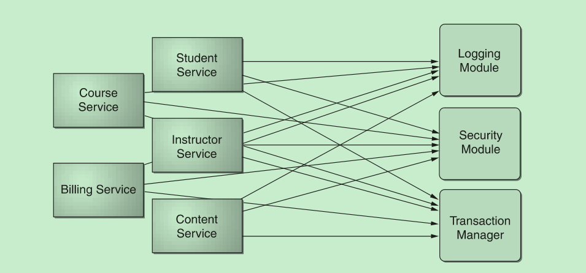
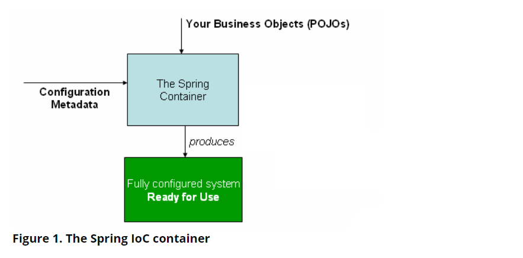
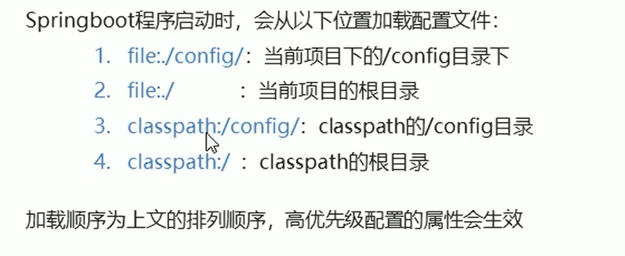
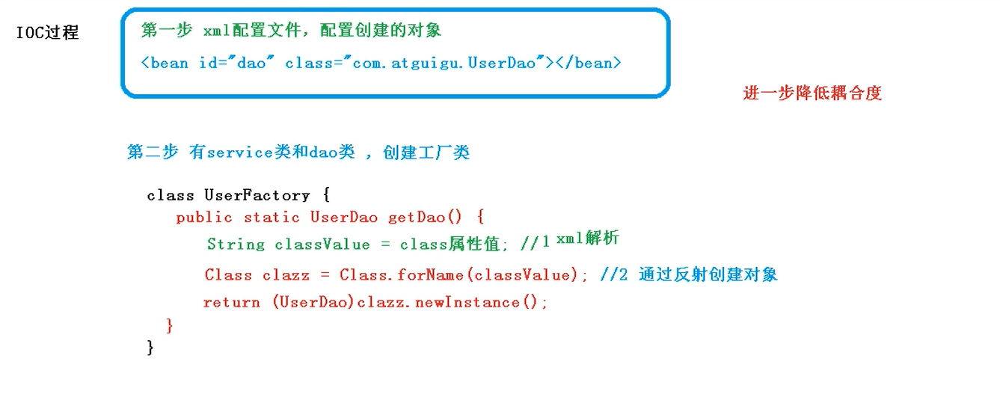

SpringBoot2

## Spring In Action

**一些自考题**

- bean:

- DI: 让相互协作的软件组件保持松散耦合

- AOP: 把遍布应用各处的功能分离出来形成可重用的组件

  

  使服务模块化，以声明方式将它们应用到需要影响的组件中去

- 
- 

## Spring Framework Overview

What We Mean by "Spring":

- easy to create Java EE applications

- support for Groovy and Kotlin

-  supports a wide range of application scenarios

- open source. It has a large and active community 

- is divided into modules. Applications can choose which modules they need.

  Spring框架分为几个模块。应用程序可以选择他们需要的模块。核心是核心容器的模块，包括配置模型和依赖注入机制。除此之外，Spring框架还为不同的应用程序体系结构提供了基础支持，包括消息传递、事务数据和持久性以及web服务。它还包括基于Servlet的springmvcweb框架和springwebflux反应式web框架。

- Spring’s framework jars allow for deployment to JDK 9’s module path ("Jigsaw").

History of Spring and the Spring Framework

- came into being in 2003 as a response to the complexity of the early [J2EE](https://en.wikipedia.org/wiki/Java_Platform,_Enterprise_Edition) specifications
- Spring is, in fact, complementary to Java EE
  - Servlet API ([JSR 340](https://jcp.org/en/jsr/detail?id=340))
  - WebSocket API ([JSR 356](https://www.jcp.org/en/jsr/detail?id=356))
  - Concurrency Utilities ([JSR 236](https://www.jcp.org/en/jsr/detail?id=236))
  - JSON Binding API ([JSR 367](https://jcp.org/en/jsr/detail?id=367))
  - Bean Validation ([JSR 303](https://jcp.org/en/jsr/detail?id=303))
  - JPA ([JSR 338](https://jcp.org/en/jsr/detail?id=338))
  - JMS ([JSR 914](https://jcp.org/en/jsr/detail?id=914))

- supports the Dependency Injection ([JSR 330](https://www.jcp.org/en/jsr/detail?id=330)) and Common Annotations ([JSR 250](https://jcp.org/en/jsr/detail?id=250)) specifications,

- Spring Framework 5.0, Spring requires the Java EE 7 level (e.g. Servlet 3.1+, JPA 2.1+) as a minimum

  at the same time providing out-of-the-box integration with newer APIs at the Java EE 8 level (e.g. Servlet 4.0, JSON Binding API) when encountered at runtime

  keeps Spring fully compatible with e.g. Tomcat 8 and 9, WebSphere 9, and JBoss EAP 7.

- with the help of Spring Boot, applications are created in a devops- and cloud-friendly way, with the Servlet container embedded and trivial to change. As of Spring Framework 5, a WebFlux application does not even use the Servlet API directly and can run on servers (such as Netty) that are not Servlet containers.

- Spring continues to innovate and to evolve. Beyond the Spring Framework, there are other projects, such as Spring Boot, Spring Security, Spring Data, Spring Cloud, Spring Batch, among others. It’s important to remember that each project has its own source code repository, issue tracker, and release cadence. See [spring.io/projects](https://spring.io/projects) for the complete list of Spring projects.

Design Philosophy

- Provide choice at every level --> switch persistence providers through configuration without changing your code
- Accommodate diverse perspectives --> supports a wide range of application needs with different perspectives
- Maintain strong backward compatibility.
- Care about API design
- Set high standards for code quality

Feedback and Contributions

- use the [GitHub Issues](https://github.com/spring-projects/spring-framework/issues).
-  Stack Overflow. Click [here](https://stackoverflow.com/questions/tagged/spring+or+spring-mvc+or+spring-aop+or+spring-jdbc+or+spring-r2dbc+or+spring-transactions+or+spring-annotations+or+spring-jms+or+spring-el+or+spring-test+or+spring+or+spring-remoting+or+spring-orm+or+spring-jmx+or+spring-cache+or+spring-webflux+or+spring-rsocket?tab=Newest) 

## Core Technologies

1. ### The loC Container

   - covers all the technologies that are absolutely integral to the Spring Framework.
   -  Spring Framework’s Inversion of Control (IoC) container
   - Spring’s Aspect-Oriented Programming (AOP) technologies. 
   - Coverage of Spring’s integration with AspectJ  is also provided

   1.1. Introduction to the Spring IoC(Inversion of Control ) Container and Beans

   - also known as dependency injection (DI).

   - 它是这样一个过程：对象仅通过构造函数参数、工厂方法的参数或在对象实例构造或从工厂方法返回后在对象实例上设置的属性来定义它们的依赖关系（即它们使用的其他对象）。然后容器在创建bean时注入这些依赖项。这个过程基本上是bean本身的逆过程（因此称为控制反转），通过使用类的直接构造或服务定位器模式等机制来控制其依赖项的实例化或位置

   - The `org.springframework.beans` and `org.springframework.context` packages are the basis for Spring Framework’s IoC container. The [`BeanFactory`](https://docs.spring.io/spring-framework/docs/5.3.7/javadoc-api/org/springframework/beans/factory/BeanFactory.html) interface provides an advanced configuration mechanism capable of managing any type of object. [`ApplicationContext`](https://docs.spring.io/spring-framework/docs/5.3.7/javadoc-api/org/springframework/context/ApplicationContext.html) is a sub-interface of `BeanFactory`.

   - In short, the `BeanFactory` provides the configuration framework and basic functionality, and the `ApplicationContext` adds more enterprise-specific functionality. 

     For more information on using the `BeanFactory` instead of the `ApplicationContext,` see [The `BeanFactory`](https://docs.spring.io/spring-framework/docs/current/reference/html/core.html#beans-beanfactory).

   -  beans: form the backbone of your application,  are instantiated, assembled, and managed by a Spring IoC container

   1.2 Container Overview

   i. `org.springframework.context.ApplicationContext` interface represents the Spring IoC container and is responsible for instantiating, configuring, and assembling the beans.

   ii. The container gets its instructions on what objects to instantiate, configure, and assemble by reading configuration metadata.

   iii. The configuration metadata is represented in XML, Java annotations, or Java code.

   iv. create an instance of [`ClassPathXmlApplicationContext`](https://docs.spring.io/spring-framework/docs/5.3.7/javadoc-api/org/springframework/context/support/ClassPathXmlApplicationContext.html) or [FileSystemXmlApplicationContext](https://docs.spring.io/spring-framework/docs/5.3.7/javadoc-api/org/springframework/context/support/FileSystemXmlApplicationContext.html)

   

   

   

   - Configuration Metadata

     i. traditionally supplied in a simple and intuitive XML format

     这些bean定义对应于构成应用程序的实际对象。通常，您定义服务层对象、数据访问对象（dao）、表示对象（如Struts操作实例）、基础结构对象（如Hibernate SessionFactories）、JMS队列等。通常，不在容器中配置细粒度域对象，因为创建和加载域对象通常是dao和业务逻辑的责任。但是，您可以使用Spring与AspectJ的集成来配置在IoC容器控制之外创建的对象。请参见使用AspectJ使用Spring注入依赖域对象。

     ```xml
     <?xml version="1.0" encoding="UTF-8"?>
     <beans xmlns="http://www.springframework.org/schema/beans"
         xmlns:xsi="http://www.w3.org/2001/XMLSchema-instance"
         xsi:schemaLocation="http://www.springframework.org/schema/beans
             https://www.springframework.org/schema/beans/spring-beans.xsd">
     
         <bean id="..." class="...">  
             <!-- collaborators and configuration for this bean go here -->
         </bean>
     
         <bean id="..." class="...">
             <!-- collaborators and configuration for this bean go here -->
         </bean>
     
         <!-- more bean definitions go here -->
     
     </beans>
     ```

     ii. [Annotation-based configuration](https://docs.spring.io/spring-framework/docs/current/reference/html/core.html#beans-annotation-config)

     iii. [Java-based configuration](https://docs.spring.io/spring-framework/docs/current/reference/html/core.html#beans-java)

   - Instantiating a Container

     resource strings that let the container load configuration metadata from a variety of external resources, such as the local file system, the Java `CLASSPATH`, and so on.

     `ApplicationContext context = new ClassPathXmlApplicationContext("services.xml", "daos.xml");`

     `val context = ClassPathXmlApplicationContext("services.xml", "daos.xml")`

     #####  Composing XML-based Configuration Metadata

     ```xml
     <beans>
         <import resource="services.xml"/>
         <import resource="resources/messageSource.xml"/>
         <import resource="/resources/themeSource.xml"/>
     
         <bean id="bean1" class="..."/>
         <bean id="bean2" class="..."/>
     </beans>
     ```

     It is generally preferable to keep an indirection for such absolute locations [classpath:/config/services.xml] — for example, through "${…}" placeholders that are resolved against JVM system properties at runtime.

     这块不是很理解，原文档文字如下:

     You can use the application context constructor to load bean definitions from all these XML fragments. This constructor takes multiple `Resource` locations, as was shown in the [previous section](https://docs.spring.io/spring-framework/docs/current/reference/html/core.html#beans-factory-instantiation). Alternatively, use one or more occurrences of the `<import/>` element to load bean definitions from another file or files. The following example shows how to do so:

     

     ##### The Groovy Bean Definition DSL(Don't really understand)

     ```java
     beans {
         dataSource(BasicDataSource) {
             driverClassName = "org.hsqldb.jdbcDriver"
             url = "jdbc:hsqldb:mem:grailsDB"
             username = "sa"
             password = ""
             settings = [mynew:"setting"]
         }
         sessionFactory(SessionFactory) {
             dataSource = dataSource
         }
         myService(MyService) {
             nestedBean = { AnotherBean bean ->
                 dataSource = dataSource
             }
         }
     }
     ```

     

   - Using the Container

     Four ways to use the container (don't really understand with code)

      The `ApplicationContext` lets you read bean definitions and access them, as the following example shows

      The following example shows Groovy configuration:

     `GenericApplicationContext` in combination with reader delegates — for example, with `XmlBeanDefinitionReader` for XML files

     `GroovyBeanDefinitionReader` for Groovy files

   1.3 Bean Overview

   ​	Naming Beans（简单来讲，给beans命名，可以1个或者多个，多个的时候用`alias`标签）

   ​	Instantiating Beans:三种方式(具体实践还不太懂)

   ​		Instantiation with a Constructor

   ​		Instantiation with a Static Factory Method

   ​		Instantiation by Using an Instance Factory Method

   ​	

   1.4 Dependencies

   **Dependency Injection**

   ​	through constructor arguments, arguments to a factory method, or properties

   ​	The object does not look up its dependencies and does not know the location or class of the dependencies. As a result, your classes become easier to test, particularly when the dependencies are on interfaces or abstract base classes, which allow for stub or mock implementations to be used in unit tests.(具体怎么解耦的)

   ​	DI exists in two major variants: [Constructor-based dependency injection](https://docs.spring.io/spring-framework/docs/current/reference/html/core.html#beans-constructor-injection) and [Setter-based dependency injection](https://docs.spring.io/spring-framework/docs/current/reference/html/core.html#beans-setter-injection).

   - Constructor-based Dependency Injection

     The following example shows a class that can only be dependency-injected with constructor injection:

     ```java
     // a constructor so that the Spring container can inject a MovieFinder
     class SimpleMovieLister(private val movieFinder: MovieFinder) {
         // business logic that actually uses the injected MovieFinder is omitted...
     }
     ```

     

   The `ApplicationContext` supports constructor-based and setter-based DI for the beans it manages. It also supports setter-based DI after some dependencies have already been injected through the constructor approach. You configure the dependencies in the form of a `BeanDefinition`, which you use in conjunction with `PropertyEditor` instances to convert properties from one format to another. However, most Spring users do not work with these classes directly (that is, programmatically) but rather with XML `bean` definitions, annotated components (that is, classes annotated with `@Component`, `@Controller`, and so forth), or `@Bean` methods in Java-based `@Configuration` classes. These sources are then converted internally into instances of `BeanDefinition` and used to load an entire Spring IoC container instance.（不是很懂）

    ApplicationContext为其管理的bean支持基于构造函数和基于setter的DI。在一些依赖项已经通过构造函数方法注入之后，它还支持基于setter的DI。您可以以BeanDefinition的形式配置依赖项，将其与PropertyEditor实例结合使用，以将属性从一种格式转换为另一种格式。然而，大多数Spring用户并不直接使用这些类（即编程），而是使用xmlbean定义、带注释的组件（即用@Component、@Controller等注释的类）或基于Java的@Configuration类中的@bean方法。然后，这些源在内部转换为BeanDefinition的实例，并用于加载整个Spring IoC容器实例。 

   

   1.5 Bean Scopes

   1.6 Customizing the Nature of a Bean

   1.7 Bean Definition Inheritance

   1.8 Container Extension Points

   1.9Annotation-based Container Configuration
   
   

## Building REST 

- **nonrest** — Simple Spring MVC app with no hypermedia
- **rest** — Spring MVC + Spring HATEOAS app with HAL representations of each resource
- **evolution** — REST app where a field is evolved but old data is retained for backward compatibility
- **links** — REST app where conditional links are used to signal valid state changes to clients

(Representational State Transfer)services with Spring（广泛应用在微服务领域）

- REST

  [表现层状态转换 - 维基百科，自由的百科全书 (wikipedia.org)](https://zh.wikipedia.org/wiki/表现层状态转换)

  

  表现层状态转换是根基于[超文本传输协议（HTTP）](https://zh.wikipedia.org/wiki/超文本传输协议)之上而确定的一组约束和属性，是一种设计提供万维网络服务的[软件构建风格](https://zh.wikipedia.org/wiki/軟件架構)。符合或兼容于这种架构风格（简称为 REST 或 RESTful）的网络服务，允许客户端发出以[统一资源标识符](https://zh.wikipedia.org/wiki/统一资源标志符)访问和操作网络资源的请求，而与预先定义好的无状态操作集一致化。因此表现层状态转换提供了在互联网络的计算系统之间，彼此资源可交互使用的协作性质（interoperability）。相对于其它种类的网络服务，例如SOAP服务，则是以本身所定义的操作集，来访问网络上的资源。

  

  目前在三种主流的[Web服务](https://zh.wikipedia.org/wiki/Web服务)实现方案中，因为REST模式与复杂的[SOAP](https://zh.wikipedia.org/wiki/SOAP)和[XML-RPC](https://zh.wikipedia.org/wiki/XML-RPC)相比更加简洁，越来越多的Web服务开始采用REST风格设计和实现。例如，[Amazon.com](https://zh.wikipedia.org/wiki/Amazon.com)提供接近REST风格的Web服务运行图书查询；[雅虎](https://zh.wikipedia.org/wiki/雅虎)提供的Web服务也是REST风格的。

  

  REST是设计风格而**不是**标准。REST通常基于[HTTP](https://zh.wikipedia.org/wiki/HTTP)、[URI](https://zh.wikipedia.org/wiki/URI)、[XML](https://zh.wikipedia.org/wiki/XML)以及[HTML](https://zh.wikipedia.org/wiki/HTML)这些现有的广泛流行的协议和标准。

  - 资源是由URI来指定。
  - 对资源的操作包括获取、创建、修改和删除，这些操作正好对应HTTP协议提供的GET、POST、PUT和DELETE方法。
  - 通过操作资源的表现形式来操作资源。
  - 资源的表现形式则是XML或者HTML，取决于读者是机器还是人、是消费Web服务的客户软件还是Web浏览器。当然也可以是任何其他的格式，例如JSON。

- 微服务

  **微服务**（英语：Microservices）是一种[软件架构风格](https://zh.wikipedia.org/wiki/软件架构)，它是以专注于单一责任与功能的小型功能区块 (Small Building Blocks) 为基础，利用模块化的方式组合出复杂的大型应用程序，各功能区块使用与语言无关 (Language-Independent/Language agnostic）的[API](https://zh.wikipedia.org/wiki/应用程序接口)集相互通信。

- aim

  use the Spring portfolio to build a RESTful service while leveraging the stackless features of REST.

- REST: the de-facto standard for building web services on the web

    - Pros: easy to build and easy to consume.

    - Why REST?

      embraces the precepts of the web, including its architecture, benefits, and everything else

    - By building on top of HTTP, REST APIs provide the means to build:

        - Backwards compatible APIs
        - Evolvable APIs
        - Scaleable services
        - Securable services
        - A spectrum of stateless to stateful services   

- Big picture

  We’re going to create **a simple payroll service** that manages the employees of a company. We’ll **store employee objects in a (H2 in-memory) database**, and **access them (via something called JPA)**. Then we’ll **wrap that with something** that will allow access over the internet (called the **Spring MVC layer**).

  - New keyword:

    microservices RESTful services: a software architecture, a style not a standard, independent small module for small building blocks

    建立Employee实例对象(Bean)新见到的东西

    ```java
    @Entity
    class Employee {
    
      private @Id @GeneratedValue Long id;
        
    //@Entity is a JPA annotation to make this object ready for storage in a JPA-based data store.
    
    //id, name, and role are attributes of our Employee domain object. id is marked with more JPA annotations to indicate it’s the primary key and automatically populated by the JPA provider.
        
    //引申到 Spring Data JPA to handle the tedious database interactions.
        地址 https://spring.io/guides/gs/accessing-data-jpa/
    ```

    #### Spring Date JPA

    - Spring Data JPA repositories

      Spring Data JPA repositories are interfaces with methods supporting creating, reading, updating, and deleting records against a back end data store. 

    - You need not write an implementation of the repository interface. Spring Data JPA creates an implementation when you run the application

    - Create an Application Class

      ```java
      package com.example.accessingdatajpa;
      
      import org.springframework.boot.SpringApplication;
      import org.springframework.boot.autoconfigure.SpringBootApplication;
      
      @SpringBootApplication
      public class AccessingDataJpaApplication {
      
        public static void main(String[] args) {
          SpringApplication.run(AccessingDataJpaApplication.class, args);
        }
      
      }
      ```

      `@SpringBootApplication` is a convenience annotation that adds all of the following:

      - `@Configuration`: Tags the class as a source of bean definitions for the application context.

      - `@EnableAutoConfiguration`: Tells Spring Boot to start adding beans based on classpath settings, other beans, and various property settings. For example, if `spring-webmvc` is on the classpath, this annotation flags the application as a web application and activates key behaviors, such as setting up a `DispatcherServlet`.

      - `@ComponentScan`: Tells Spring to look for other components, configurations, and services in the `com/example` package, letting it find the controllers.

      - 执行代码问题

        `No plugin found for prefix 'spring-boot' in the current project and in the plugin groups`

        原因：未在`pom.xml`文件所在位置执行命令

    - Build an executable JAR

      build the JAR file with `./mvnw clean package` and then run the JAR file, as follows:

      `java -jar target/gs-accessing-data-jpa-0.1.0.jar` 执行jar   

      注：和官方文档不太一样，没找到`gs-accessing-data-jpa-0.1.0.jar`

      `java -jar target/accessing-data-jpa-0.0.1-SNAPSHOT.jar`我改的命令运行成功

      

      进阶阅读**Converting a Spring Boot JAR Application to a WAR**

      这里粗略补充war和jar区别：

      war是JavaWeb可执行文件，通常在项目部署后转成war

      [Getting Started | Converting a Spring Boot JAR Application to a WAR](https://spring.io/guides/gs/convert-jar-to-war/)

    - 衍生阅读

      Accessing JPA Data with REST

      [Getting Started | Accessing JPA Data with REST (spring.io)](https://spring.io/guides/gs/accessing-data-rest/)

  - `EmployeeRepository`

      `interface EmployeeRepository extends JpaRepository<Employee, Long>`

      Spring makes accessing data easy. By simply declaring the following `EmployeeRepository` interface we automatically will be able to

      - Create new Employees

      - Update existing ones

      - Delete Employees

      - Find Employees (one, all, or search by simple or complex properties)

        ```java
        //Application执行代码
        //@SpringBootApplication is a meta-annotation that pulls in component scanning, autoconfiguration, and property support. 
        @SpringBootApplication
        public class PayrollApplication {
        
          public static void main(String... args) {
            SpringApplication.run(PayrollApplication.class, args);
          }
        }
        ```

  - `LoadDatabase`

      ```java
      @Configuration
      class LoadDatabase {
      
        private static final Logger log = LoggerFactory.getLogger(LoadDatabase.class);
      
        @Bean
        CommandLineRunner initDatabase(EmployeeRepository repository) {
      
          return args -> {
            log.info("Preloading " + repository.save(new Employee("Bilbo Baggins", "burglar")));
            log.info("Preloading " + repository.save(new Employee("Frodo Baggins", "thief")));
          };
        }
      }
      ```

      - Spring Boot will run ALL `CommandLineRunner` beans once the application context is loaded.
      - This runner will request a copy of the `EmployeeRepository` you just created.
      - Using it, it will create two entities and store them.

**HTTP is the Platform**

To wrap your repository with a web layer, you must turn to Spring MVC. 

- EmployeeController.java

  ```java
  @RestController
  class EmployeeController {
  
    private final EmployeeRepository repository;
  
    EmployeeController(EmployeeRepository repository) {
      this.repository = repository;
    }
  
  
    // Aggregate root
    // tag::get-aggregate-root[]
    @GetMapping("/employees")
    List<Employee> all() {
      return repository.findAll();
    }
    // end::get-aggregate-root[]
  
    @PostMapping("/employees")
    Employee newEmployee(@RequestBody Employee newEmployee) {
      return repository.save(newEmployee);
    }
  
    // Single item
    
    @GetMapping("/employees/{id}")
    Employee one(@PathVariable Long id) {
      
      return repository.findById(id)
        .orElseThrow(() -> new EmployeeNotFoundException(id));
    }
  
    @PutMapping("/employees/{id}")
    Employee replaceEmployee(@RequestBody Employee newEmployee, @PathVariable Long id) {
      
      return repository.findById(id)
        .map(employee -> {
          employee.setName(newEmployee.getName());
          employee.setRole(newEmployee.getRole());
          return repository.save(employee);
        })
        .orElseGet(() -> {
          newEmployee.setId(id);
          return repository.save(newEmployee);
        });
    }
  
    @DeleteMapping("/employees/{id}")
    void deleteEmployee(@PathVariable Long id) {
      repository.deleteById(id);
    }
  }
  ```

  - `@RestController` indicates that the data returned by each method will be written straight into the response body instead of rendering a template.

  - An `EmployeeRepository` is injected by constructor into the controller.

  - We have routes for each operation (`@GetMapping`, `@PostMapping`, `@PutMapping` and `@DeleteMapping`, corresponding to HTTP `GET`, `POST`, `PUT`, and `DELETE` calls). (NOTE: It’s useful to read each method and understand what they do.)

  - `EmployeeNotFoundException` is an exception used to indicate when an employee is looked up but not found.

    ```java
    class EmployeeNotFoundException extends RuntimeException {
    
      EmployeeNotFoundException(Long id) {
        super("Could not find employee " + id);
      }
    }
    ```

  - `EmployeeNotFoundAdvice.java`

    ```java
    @ControllerAdvice
    class EmployeeNotFoundAdvice {
    
      @ResponseBody
      @ExceptionHandler(EmployeeNotFoundException.class)
      @ResponseStatus(HttpStatus.NOT_FOUND)
      String employeeNotFoundHandler(EmployeeNotFoundException ex) {
        return ex.getMessage();
      }
    }
    ```

    - `@ResponseBody` signals that this advice is rendered straight into the response body.
    - `@ExceptionHandler` configures the advice to only respond if an `EmployeeNotFoundException` is thrown.
    - `@ResponseStatus` says to issue an `HttpStatus.NOT_FOUND`, i.e. an **HTTP 404**.
    - The body of the advice generates the content. In this case, it gives the message of the exception.

  -  curl -v localhost:8080/employees

    curl is used in command lines or scripts to transfer data. curl is also used in cars, television sets, routers, printers, audio equipment, mobile phones, tablets, settop boxes, media players and is the Internet transfer engine for thousands of software applications in over *ten billion installations*.
    
    curl is used daily by virtually every Internet-using human on the globe.
    
    命令行工具，用来请求 Web 服务器。
    
    具体没太搞懂，大概是可以得到http请求的一些东西(更熟悉的是httpget)
    
    ```java
    *   Trying ::1...
    * TCP_NODELAY set
    * Connected to localhost (::1) port 8080 (#0)
    > GET /employees HTTP/1.1
    > Host: localhost:8080
    > User-Agent: curl/7.54.0
    > Accept: */*
    >
    < HTTP/1.1 200
    < Content-Type: application/json;charset=UTF-8
    < Transfer-Encoding: chunked
    < Date: Thu, 09 Aug 2018 17:58:00 GMT
    <
    * Connection #0 to host localhost left intact
    [{"id":1,"name":"Bilbo Baggins","role":"burglar"},{"id":2,"name":"Frodo Baggins","role":"thief"}]
    ```
    
    ```java
    //Add update delete
    curl -X POST localhost:8080/employees -H 'Content-type:application/json' -d '{"name": "Samwise Gamgee", "role": "gardener"}'
    curl -X PUT localhost:8080/employees/3 -H 'Content-type:application/json' -d '{"name": "Samwise Gamgee", "role": "ring bearer"}'
    curl -X DELETE localhost:8080/employees/3
    ```
    
    In fact, what we have built so far is better described as  **RPC** (**Remote Procedure Call**). That’s because there is no way to know how to interact with this service. If you published this today, you’d also have to write a document or host a developer’s portal somewhere with all the details.
    
  - What makes something RESTful?

    So far, you have a web-based service that handles the core operations involving employee data. But that’s not enough to make things "RESTful".

    - Pretty URLs like `/employees/3` aren’t REST.
    - Merely using `GET`, `POST`, etc. isn’t REST.
    - Having all the CRUD operations laid out isn’t REST.

    This statement of Roy Fielding’s may further lend a clue to the difference between **REST** and **RPC**:

    > I am getting frustrated by the number of people calling any HTTP-based interface a REST API. Today’s example is the SocialSite REST API. That is RPC. It screams RPC. There is so much coupling on display that it should be given an X rating.
    >
    > What needs to be done to make the REST architectural style clear on the notion that hypertext is a constraint? In other words, if the engine of application state (and hence the API) is not being driven by hypertext, then it cannot be RESTful and cannot be a REST API. Period. Is there some broken manual somewhere that needs to be fixed?

    — Roy Fielding
    https://roy.gbiv.com/untangled/2008/rest-apis-must-be-hypertext-driven

  The side effect of NOT including hypermedia in our representations is that clients MUST hard code URIs to navigate the API. This leads to the same brittle nature that predated the rise of e-commerce on the web. It’s a signal that our JSON output needs a little help.（JSON需要一点帮助的信号？预示了电子商务的兴起？）

**Spring HATEOAS**

a Spring project aimed at helping you write hypermedia-driven outputs.

 A key design goal of Spring HATEOAS is to make it easier to do The Right Thing™. In this scenario: adding hypermedia to your service without hard coding a thing.

Adding Spring HATEOAS to `dependencies` section of `pom.xml`

```xml
<dependency>
	<groupId>org.springframework.boot</groupId>
	<artifactId>spring-boot-starter-hateoas</artifactId>
</dependency>
```

```java
@GetMapping("/employees/{id}")
EntityModel<Employee> one(@PathVariable Long id) {

  Employee employee = repository.findById(id) //
      .orElseThrow(() -> new EmployeeNotFoundException(id));

  return EntityModel.of(employee, //
      linkTo(methodOn(EmployeeController.class).one(id)).withSelfRel(),
      linkTo(methodOn(EmployeeController.class).all()).withRel("employees"));
}
```

- `EntityModel<T>` is a generic container from Spring HATEOAS that includes not only the data but a collection of links.

- `linkTo(methodOn(EmployeeController.class).one(id)).withSelfRel()` asks that Spring HATEOAS build a link to the `EmployeeController` 's `one()` method, and flag it as a [self](https://www.iana.org/assignments/link-relations/link-relations.xhtml) link.
- `linkTo(methodOn(EmployeeController.class).all()).withRel("employees")` asks Spring HATEOAS to build a link to the aggregate root, `all()`, and call it "employees".

One of Spring HATEOAS’s core types is `Link`. It includes a **URI** and a **rel** (relation). Links are what empower the web. Before the World Wide Web, other document systems would render information or links, but it was the linking of documents WITH this kind of relationship metadata that stitched the web together.

Roy Fielding encourages building APIs with the same techniques that made the web successful, and links are one of them.

```java
{
  "id": 1,
  "name": "Bilbo Baggins",
  "role": "burglar",
  "_links": {
    "self": {
      "href": "http://localhost:8080/employees/1"
    },
    "employees": {
      "href": "http://localhost:8080/employees"
    }
  }
}
```

This decompressed output shows not only the data elements you saw earlier (`id`, `name` and `role`), but also a `_links` entry containing two URIs. This entire document is formatted using [HAL](http://stateless.co/hal_specification.html).

HAL is a lightweight [mediatype](https://tools.ietf.org/html/draft-kelly-json-hal-08) that allows encoding not just data but also hypermedia controls, alerting consumers to other parts of the API they can navigate toward. In this case, there is a "self" link (kind of like a `this` statement in code) along with a link back to the **[aggregate root](https://www.google.com/search?q=What+is+an+aggregate+root)**.

To make the aggregate root ALSO more RESTful, you want to include top level links while ALSO including any RESTful components within.


```java
@GetMapping("/employees")
CollectionModel<EntityModel<Employee>> all() {

  List<EntityModel<Employee>> employees = repository.findAll().stream()
      .map(employee -> EntityModel.of(employee,
          linkTo(methodOn(EmployeeController.class).one(employee.getId())).withSelfRel(),
          linkTo(methodOn(EmployeeController.class).all()).withRel("employees")))
      .collect(Collectors.toList());

  return CollectionModel.of(employees, linkTo(methodOn(EmployeeController.class).all()).withSelfRel());
}
```

`CollectionModel<>` is another Spring HATEOAS container; it’s aimed at encapsulating collections of resources—instead of a single resource entity, like `EntityModel<>` from earlier. 

`CollectionModel<>`, too, lets you include links.

- Simplifying Link Creation

  ```java
  @Component
  class EmployeeModelAssembler implements RepresentationModelAssembler<Employee, EntityModel<Employee>> {
  
    @Override
    public EntityModel<Employee> toModel(Employee employee) {
  
      return EntityModel.of(employee, //
          linkTo(methodOn(EmployeeController.class).one(employee.getId())).withSelfRel(),
          linkTo(methodOn(EmployeeController.class).all()).withRel("employees"));
    }
  }
  ```

This simple interface has one method: `toModel()`. It is based on converting a non-model object (`Employee`) into a model-based object (`EntityModel<Employee>`).

All the code you saw earlier in the controller can be moved into this class. And by applying Spring Framework’s `@Component` annotation, the assembler will be automatically created when the app starts.

**Getting single item resource using the assembler**

```java
@GetMapping("/employees/{id}")
EntityModel<Employee> one(@PathVariable Long id) {

  Employee employee = repository.findById(id) //
      .orElseThrow(() -> new EmployeeNotFoundException(id));

  return assembler.toModel(employee);
}
```

**Getting aggregate root resource using the assembler**

```java
//这块可以对比下，运用了流
/*.map(employee -> EntityModel.of(employee,
          linkTo(methodOn(EmployeeController.class).one(employee.getId())).withSelfRel(),
          linkTo(methodOn(EmployeeController.class).all()).withRel("employees")))
          */
@GetMapping("/employees")
CollectionModel<EntityModel<Employee>> all() {

  List<EntityModel<Employee>> employees = repository.findAll().stream() //
      .map(assembler::toModel) //
      .collect(Collectors.toList());

  return CollectionModel.of(employees, linkTo(methodOn(EmployeeController.class).all()).withSelfRel());
}
```

At this stage, you’ve created a **Spring MVC REST controller** that actually produces **hypermedia-powered content**! Clients that don’t speak HAL can ignore the extra bits while consuming the pure data. Clients that DO speak HAL can navigate your empowered API.

But that is not the only thing needed to build a truly RESTful service with Spring.

**Evolving REST APIs**

An important facet of REST is the fact that it’s neither a technology stack nor a single standard.

REST is a collection of architectural constraints that when adopted make your application much more resilient. A key factor of resilience is that when you make upgrades to your services, your clients don’t suffer from downtime.

With REST-based practices, it’s much easier. Especially using the Spring stack.

- Supporting changes to the API

  Imagine this design problem: You’ve rolled out a system with this `Employee`-based record. The system is a major hit. You’ve sold your system to countless enterprises. Suddenly, the need for an employee’s name to be split into `firstName` and `lastName` arises.

  You can always add columns (fields) to a database table. But don’t take one away. The principle in RESTful services is the same.

Add new fields to your JSON representations, but don’t take any away. Like this:

JSON that supports multiple clients

```json
//没搞懂在哪里加
{
  "id": 1,
  "firstName": "Bilbo",
  "lastName": "Baggins",
  "role": "burglar",
  "name": "Bilbo Baggins",
  "_links": {
    "self": {
      "href": "http://localhost:8080/employees/1"
    },
    "employees": {
      "href": "http://localhost:8080/employees"
    }
  }
}
```

You can always add columns (fields) to a database table. But don’t take one away. The principle in RESTful services is the same.

```java
private String firstName;
private String lastName;
private String role;

Employee() {}

Employee(String firstName, String lastName, String role) {
this.firstName = firstName;
this.lastName = lastName;
this.role = role;
public String getName() {
   return this.firstName + " " + this.lastName;
}

public void setName(String name) {
   String[] parts = name.split(" ");
   this.firstName = parts[0];
   this.lastName = parts[1];
}
//还是可以使用getName和setName的方法名
```
- Proper Responses(不是很懂)

  大意是将name 改为`firstName` 和 `lastName`后，进行以下的`PostMapping`然后使用curl命令进行请求web服务器，相应的http相应的结果回传回来，供直接观察。

  ```java
  @PostMapping("/employees")
  ResponseEntity<?> newEmployee(@RequestBody Employee newEmployee) {
  
    EntityModel<Employee> entityModel = assembler.toModel(repository.save(newEmployee));
  
    return ResponseEntity //
        .created(entityModel.getRequiredLink(IanaLinkRelations.SELF).toUri()) //
        .body(entityModel);
  }
  ```

  - The new `Employee` object is saved as before. But the resulting object is wrapped using the `EmployeeModelAssembler`.
  - Spring MVC’s `ResponseEntity` is used to create an **HTTP 201 Created** status message. This type of response typically includes a **Location** response header, and we use the URI derived from the model’s self-related link.


**Building links into your REST API**

**Summary**


**一些概念**

- RPC(Remote Procedure Call)

- Hypermedia

    **Hypermedia**, an extension of the term [hypertext](https://en.wikipedia.org/wiki/Hypertext), is a [nonlinear medium](https://en.wikipedia.org/wiki/Nonlinear_medium) of information that includes graphics, audio, video, plain text and [hyperlinks](https://en.wikipedia.org/wiki/Hyperlink). 

    

    The [World Wide Web](https://en.wikipedia.org/wiki/World_Wide_Web) is a classic example of hypermedia, whereas a non-interactive [cinema](https://en.wikipedia.org/wiki/Movie_theatre) presentation is an example of standard multimedia due to the absence of hyperlinks.

- Hypermedia as the Engine of Application State (**HATEOAS**)

## Spring Boot（官方文档）

[GitHub - spring-projects/spring-boot: Spring Boot](https://github.com/spring-projects/spring-boot)

1. Introducing Spring Boot

   -  create stand-alone, production-grade Spring-based applications .

2. Developing Your First Spring Boot Application

   `@RestController`:  *stereotype* （刻板印象）annotation. 告诉你或者别的程序员our class is a web `@Controller`, so Spring considers it when handling incoming web requests.

   

   `@RequestMapping`:  provides “routing” information; The `@RestController("/")` annotation tells Spring ( any HTTP request with the `/` path) to render the resulting string(annotation下面的方法) directly back to the caller.

   

   `@EnableAutoConfiguration`. tells Spring Boot to “guess” how you want to configure Spring, based on the jar dependencies that you have added. 

   (e.g.)Since `spring-boot-starter-web` added Tomcat and Spring MVC, the auto-configuration assumes that you are developing a web application and sets up Spring accordingly.

   - 要在`pom.xml`下执行 `mvn spring-boot:run`

   - 执行`mvn spring-boot:run` `出现cannot find symbol   symbol: class "RestController"`错误。解决办法：在`Intellij`里导入项目，然后根据自动提示，`import`所需的类，IDEA里成功运行，换到命令行，运行成功。

     
     
     **main** method: SpringApplication.run(MyApplication.class, args);

   ### Creating an Executable Jar

   To create an executable jar, we need to add the `spring-boot-maven-plugin` to our `pom.xml`. 

   ```xml
   <build>
       <plugins>
           <plugin>
               <groupId>org.springframework.boot</groupId>
               <artifactId>spring-boot-maven-plugin</artifactId>
           </plugin>
       </plugins>
   </build>
   ```

   peek inside, "jar tvf"

   `$ jar tvf target/myproject-0.0.1-SNAPSHOT.jar`

   `java -jar target/myproject-0.0.1-SNAPSHOT.jar`

3. 进阶学习

   task-oriented type of developer: jump over to [spring.io](https://spring.io/) and check out some of the [getting started](https://spring.io/guides/) guides that solve specific “How do I do that with Spring?” problems. We also have Spring Boot-specific “[How-to](https://docs.spring.io/spring-boot/docs/current/reference/html/howto.html#howto)” reference documentation

   Otherwise, the next logical step is to read *[using.html](https://docs.spring.io/spring-boot/docs/current/reference/html/using.html#using)*.  impatient,  jump ahead and read about *[Spring Boot features](https://docs.spring.io/spring-boot/docs/current/reference/html/features.html#features)*.

4. Developing with Spring Boot

   - site: [Developing with Spring Boot](https://docs.spring.io/spring-boot/docs/current/reference/html/using.html#using)

   - Builder Systems, dependency management: 

     ​	**Maven**:	

     - Reference ([HTML](https://docs.spring.io/spring-boot/docs/2.5.4/maven-plugin/reference/htmlsingle/) and [PDF](https://docs.spring.io/spring-boot/docs/2.5.4/maven-plugin/reference/pdf/spring-boot-maven-plugin-reference.pdf))

     - [API](https://docs.spring.io/spring-boot/docs/2.5.4/maven-plugin/api/)

     - ###      Gradle

       - Reference ([HTML](https://docs.spring.io/spring-boot/docs/2.5.4/gradle-plugin/reference/htmlsingle/) and [PDF](https://docs.spring.io/spring-boot/docs/2.5.4/gradle-plugin/reference/pdf/spring-boot-gradle-plugin-reference.pdf))

       - [API](https://docs.spring.io/spring-boot/docs/2.5.4/gradle-plugin/api/)

         **Ant**:Apache Ant+Ivy

   - Starters

     Starters are a set of convenient dependency descriptors that you can include in your application. 

     one-stop shop for all the Spring and relative technologies.(e.g. Spring and JPA to access the database, `spring-boot-starter-data-jpa`)

     starters: application starters, production starters, technical starters

     More details about the starters([Developing with Spring Boot](https://docs.spring.io/spring-boot/docs/current/reference/html/using.html#using))

   - Structuring your code

     A class which does not have a `package` declaration is "default package". But, it is not recommended. It will cause problems when use the `@ComponentScan`, `@ConfigurationPropertiesScan`, `@EntityScan`.

     `@SpringBootApplication` annotation locates your main application class in a root package above other classes.

     

   - Configuration Classes

     primary source be a single `@Configuration` class

     Spring配置： `SpringApplication` with XML

     The `@Import` annotation can be used to import additional configuration classes.

     `@ComponentScan`：pick up all Spring components

     **must** (如果一定要使用)use XML based configuration：start with a `@Configuration` class

     use an `@ImportResource` annotation to load XML configuration files

   - Auto-configuration

     automatically configure your Spring application based on the jar dependencies

     opt-in to auto-configuration: adding the `@EnableAutoConfiguration` or `@SpringBootApplication` annotations to one of your `@Configuration` classes

     - ### Gradually Replacing Auto-configuration: define your own configuration,  `--debug` switch to see the current configuration 

     - ### Disabling Specific Auto-configuration Classes

       ```java
       @SpringBootApplication(exclude = { DataSourceAutoConfiguration.class }) public class MyApplication { }
       ```

       

   - Spring Beans and Dependency Injection

     - Sprign Beans: 简单来讲就是被Ioc(Inversion of control)所管理的对象,具体需要通过案例理解：[What is a Spring Bean? | Baeldung](https://www.baeldung.com/spring-bean)

     -  Recommend using constructor injection to wire up dependencies and `@ComponentScan` to find beans.

       ​	constructor injection: [Constructor Dependency Injection in Spring | Baeldung](https://www.baeldung.com/constructor-injection-in-spring)

     - If you use the recommended way: add `@ComponentScan` without any arguments or use the `@SpringBootApplication` annotation which implicitly includes it. 

       application components (`@Component`, `@Service`, `@Repository`, `@Controller` etc.) are automatically registered as Spring Beans

       (e.g. `@Service` Bean that uses constructor injection to obtain a required `RiskAssessor` bean:

       ​	

       ```java
       @Service
       public class MyAccountService implements AccountService {
       
           private final RiskAssessor riskAssessor;
       
           public MyAccountService(RiskAssessor riskAssessor) {
               this.riskAssessor = riskAssessor;
           }
       
           // ...
       
       }
       ```

       

       ```java
       @Service
       public class MyAccountService implements AccountService {
       
           private final RiskAssessor riskAssessor;
       
           private final PrintStream out;
       
           @Autowired  //use to mark which one you want Spring to use with @Autowired
           public MyAccountService(RiskAssessor riskAssessor) {
               this.riskAssessor = riskAssessor;
               this.out = System.out;
           }
       
           public MyAccountService(RiskAssessor riskAssessor, PrintStream out) {
               this.riskAssessor = riskAssessor;
               this.out = out;
           }
       
           // ...
       
       }
       ```

       

       )

     - Using the @SpringBootApplication Annotation

       `@SpringBootApplication` annotation enable three features: @SpringBootConfiguration, @ComponentScan, @EnableAutoConfiguration

       

       

     - Running Your Application

       - IDE

       - as a Packaged Application

       - Using the Maven Plugin

       - Using the Gradle Plugin

       - Hot Swapping: 

         ​	Hot swapping is the term given to **the process of replacing a key component of a computer system while it's still running**

         

     - Developer Tools

       make the application development experience a little more pleasant

       To include devtools support, add the module dependency to your build

       Maven:

       ```xml
       <dependencies>
           <dependency>
               <groupId>org.springframework.boot</groupId>
               <artifactId>spring-boot-devtools</artifactId>
               <optional>true</optional>
           </dependency>
       </dependencies>
       ```

       Gradle:

       ```groovy
       dependencies {
           developmentOnly("org.springframework.boot:spring-boot-devtools")
       }
       ```

        	

     - Developer Tools

       1. Spring Boot use caches to improve performance

          ​	it can be counter-productive during development, preventing you from seeing the changes you just made in your application. For this reason, spring-boot-devtools disables the caching options by default

          ​	For a complete list of the properties that are applied by the devtools:

          ​		[DevToolsPropertyDefaultsPostProcessor](https://github.com/spring-projects/spring-boot/tree/v2.5.4/spring-boot-project/spring-boot-devtools/src/main/java/org/springframework/boot/devtools/env/DevToolsPropertyDefaultsPostProcessor.java).

       2. Property Defaults

          - Automatic Restart
          - LiveReload
          - Global Settings
          - Remote Applications

       3. 

       4. 

   

   - Spring Boot Features

     dives into the details of Spring Boot;the key features that you may want to use and customize.

     [Spring Boot Features](https://docs.spring.io/spring-boot/docs/current/reference/html/features.html#features.spring-application)

     - Spring Application

       The `SpringApplication` class provides a convenient way to bootstrap a Spring application that is started from a `main()` method

       

     - 1
     - 2

   - Spring Boot Actuator: Production-ready Features

5. 

   

## **SpringBoot一些博客阅读**

[GitHub - ityouknow/spring-boot-examples: about learning Spring Boot via examples. Spring Boot 教程、技术栈示例代码，快速简单上手教程。](https://github.com/ityouknow/spring-boot-examples)

[Spring Boot 2(一)：【重磅】Spring Boot 2.0权威发布 - 纯洁的微笑博客 (ityouknow.com)](http://www.ityouknow.com/springboot/2018/03/01/spring-boot-2.0.html)

微笑看得博客：池建强

SpringBoot2

响应式编程：使用 Spring WebFlux/WebFlux.fn提供响应式 Web 编程支持， Webflux 是一个全新的非堵塞的函数式 Reactive Web 框架，可以用来构建异步的、非堵塞的、事件驱动的服务，在伸缩性方面表现非常好，此功能来源于Spring5.0。

Spring Boot2.0也提供对响应式编程的自动化配置，如：Reactive Spring Data、Reactive Spring Security 等


## **SpringBoot(黑马6h入门Java微服务架构)**

1. 入门第一个应用程序

   Spring Initializr快速构建

   maven pom.xml文件解析，自动构建整个应用

   main

   resources 里面有一个 application.properties(我按照Spring官方文档上写的没有resources)

   test

   

2. 起步依赖原理

   starter 视频里称之为坐标

   可以追到其最上面的父依赖

   技术版本选择做的很好，拿来即用，如果自己配，容易出问题

3. 配置文件分类

   xml

   properties: 格式： server.port=8080

   yaml/yml

   优先级: application.properties > yml > yaml

   yaml优点：层次分明，计算机读取容易

   **语法**

   对象

   ​	server:

   ​		port: 8080(有一个空格, 大小写敏感)

   对象行内写法：

   ​	server: {port: 8080}

   数组：

   ​	address:

   ​		- beijing         （注意空格，不能用Tab,各个系统缩进不同）

   ​		- shanghai

   数组内行

   纯量

   **读取配置内容**

   ​	1 @Value   "${}"

   ​	2 Environment  @Autowired env.getProperty("")

   ​	3 @ConfigurationProperties  @Component  @ConfigurationProperties(prefix = "")

4. profile(完成不同环境下，配置动态切换功能的)

   程序被安装到不同环境（开发，测试，生产），服务器端口，数据库地址等配置不同。
   
   1)profile配置方式
   
   ​	多profile文件方式:
   
   ​		application.properties:
   
   ​		application-dev.properties
   
   ​		application-pro.properties
   
   ​		application-test.properties
   
   ​		如何激活：在application.properties中写 spring.profiles.active=
   
   ​	yml多文档方式:
   
   ​		server: 
   
   ​			port: 8081
   
   ​		spring:
   
   ​			profiles: dev
   
   
   
   ​		server:
   
   ​			port: 8082
   
   ​		spring:
   
   ​			profiles: test
   
   2)profile激活方式
   
   ​	配置文件
   
   ​	虚拟机参数:
   
   ​		VM options:
   
   ​		-Dspring.profiles.active=test
   
   ​	命令行参数:
   
   ​		maven工具打包成jar包，运行， 最后面加入 --spring.profiles.active=pro
   
   ​		Program arguments:
   
   ​		--spring.profiles.active=pro
   
      优点： 不用改原有配置文件
   
   
   
5. SpringBoot配置-项目内部配置文件加载顺序

   内部配置加载顺序：

   

   

   外部配置加载顺序：

6. 

   

## Spring尚硅谷

### IOC容器

- 底层原理

  什么是IOC：

  ​	i. 控制反转， 对象创建和控制交给spring管理

  ​	ii. 使用目的： 降低耦合度

  ​	iii. 入门案例是ioc实现

  底层原理：

  ​	i. xml解析、工厂模式、反射

  原始方案——工厂模式——IOC容器 逐渐降低耦合度

  

  

- IOC接口(`BeanFactory`)

  i. IOC思想基于IOC容器完成，	IOC容器底层就是对象工厂

  ii. Spring提供IOC容器实现的两种方式：（两种方式）

  ​	加载配置文件获取bean对象

   1. `BeanFactory`

      IOC容器基本实现方式： Spring里面内部使用，不提供开发人员使用

      *加载配置文件不会创建对象，使用对象采取创建对象

   2. `ApplicationContext`：`BeanFactory`的子接口，提供更多等强大功能，一般是开发人员使用

      *加载配置文件时会把配置文件对象进行创建

   3. `ApplicationContext`接口有实现类

      ```
      FileSystemXmlApplicationContext
      ClassPathXmlApplicationContext
      ```

      

- IOC操作Bean管理（基于xml）(基于注解)

  1、什么是Bean管理

  ​	Bean管理包括两个操作

  ​	i. Spring创建对象

  ​	ii. Spring注入属性

  2、Bean管理操作有两种方式

  (1)基于xml配置文件方式

  `<bean id="user"class="com.rshstone.spring5.User"></bean>`

  i. 在spring配置文件中，使用bean标签，标签里面添加对应属性，可以实现对象创建

  ii. 在bean标签中有很多属性，介绍常见的属性

  *id属性：唯一标识

  *class属性：类全路径(包类路径)

  ii. 创建类对象时，默认无参数构造方s法

  (2)基于xml方式注释方式

  i.  DI：依赖注入，就是注入属性 ，需要在创建对象时完成

  ​	DI和ioc的关系：DI时IOC中具体实现，

  ​	第一种使用set方法注入

  ​		<bean id = "" class = "">

  ​				<property name = "" value = "">

  ​				</property> 

  ​		</bean>

  ​	第二种使用有参数构造注入

  ​	i. 类里面创建有参构造

  ​	ii. 配置xml <bean id = "" class = "">

  ​				<constructor-arg name = "" value = "">

  ​				</constructor-arg> 

  ​				</bean>

  ​	第三种p名称空间注入(了解一下)

### AOP操作

### Jdbc Template

事务操作

Spring5新功能-Webflux


```java
F:\Java\JDK\jdk-version\jdk-8\bin\java.exe -ea -Didea.test.cyclic.buffer.size=1048576 -javaagent:C:\Users\ASUS\AppData\Local\JetBrains\Toolbox\apps\IDEA-U\ch-0\203.7148.57\lib\idea_rt.jar=3862:C:\Users\ASUS\AppData\Local\JetBrains\Toolbox\apps\IDEA-U\ch-0\203.7148.57\bin -Dfile.encoding=UTF-8 -classpath C:\Users\ASUS\AppData\Local\JetBrains\Toolbox\apps\IDEA-U\ch-0\203.7148.57\lib\idea_rt.jar;C:\Users\ASUS\AppData\Local\JetBrains\Toolbox\apps\IDEA-U\ch-0\203.7148.57\plugins\junit\lib\junit5-rt.jar;C:\Users\ASUS\AppData\Local\JetBrains\Toolbox\apps\IDEA-U\ch-0\203.7148.57\plugins\junit\lib\junit-rt.jar;F:\Java\JDK\jdk-version\jdk-8\jre\lib\charsets.jar;F:\Java\JDK\jdk-version\jdk-8\jre\lib\deploy.jar;F:\Java\JDK\jdk-version\jdk-8\jre\lib\ext\access-bridge.jar;F:\Java\JDK\jdk-version\jdk-8\jre\lib\ext\cldrdata.jar;F:\Java\JDK\jdk-version\jdk-8\jre\lib\ext\dnsns.jar;F:\Java\JDK\jdk-version\jdk-8\jre\lib\ext\jaccess.jar;F:\Java\JDK\jdk-version\jdk-8\jre\lib\ext\jfxrt.jar;F:\Java\JDK\jdk-version\jdk-8\jre\lib\ext\localedata.jar;F:\Java\JDK\jdk-version\jdk-8\jre\lib\ext\nashorn.jar;F:\Java\JDK\jdk-version\jdk-8\jre\lib\ext\sunec.jar;F:\Java\JDK\jdk-version\jdk-8\jre\lib\ext\sunjce_provider.jar;F:\Java\JDK\jdk-version\jdk-8\jre\lib\ext\sunmscapi.jar;F:\Java\JDK\jdk-version\jdk-8\jre\lib\ext\sunpkcs11.jar;F:\Java\JDK\jdk-version\jdk-8\jre\lib\ext\zipfs.jar;F:\Java\JDK\jdk-version\jdk-8\jre\lib\javaws.jar;F:\Java\JDK\jdk-version\jdk-8\jre\lib\jce.jar;F:\Java\JDK\jdk-version\jdk-8\jre\lib\jfr.jar;F:\Java\JDK\jdk-version\jdk-8\jre\lib\jfxswt.jar;F:\Java\JDK\jdk-version\jdk-8\jre\lib\jsse.jar;F:\Java\JDK\jdk-version\jdk-8\jre\lib\management-agent.jar;F:\Java\JDK\jdk-version\jdk-8\jre\lib\plugin.jar;F:\Java\JDK\jdk-version\jdk-8\jre\lib\resources.jar;F:\Java\JDK\jdk-version\jdk-8\jre\lib\rt.jar;D:\Downloads\SpringiA4_SourceCode\Chapter_02\stereo-autoconfig\out\test\classes;D:\Downloads\SpringiA4_SourceCode\Chapter_02\stereo-autoconfig\out\test\resources;D:\Downloads\SpringiA4_SourceCode\Chapter_02\stereo-autoconfig\out\production\classes;D:\Downloads\SpringiA4_SourceCode\Chapter_02\stereo-autoconfig\out\production\resources;C:\Users\ASUS\.gradle\caches\modules-2\files-2.1\org.springframework\spring-context\4.0.7.RELEASE\8a4aa735f3691a1985381b3c6c69d32b835f51b4\spring-context-4.0.7.RELEASE.jar;C:\Users\ASUS\.gradle\caches\modules-2\files-2.1\org.springframework\spring-test\4.0.7.RELEASE\148c20e5170e6081dfcc5afefa613e27a7b1b814\spring-test-4.0.7.RELEASE.jar;C:\Users\ASUS\.gradle\caches\modules-2\files-2.1\com.github.stefanbirkner\system-rules\1.5.0\a98ed9e2775d57586a420d52b9bf8b2384edc58b\system-rules-1.5.0.jar;C:\Users\ASUS\.gradle\caches\modules-2\files-2.1\org.springframework\spring-aop\4.0.7.RELEASE\caadec5dc4ea4899d89004ff46053f8e391e0343\spring-aop-4.0.7.RELEASE.jar;C:\Users\ASUS\.gradle\caches\modules-2\files-2.1\org.springframework\spring-beans\4.0.7.RELEASE\fdd041f086972cc16f9b09ee420a98604cd0bc07\spring-beans-4.0.7.RELEASE.jar;C:\Users\ASUS\.gradle\caches\modules-2\files-2.1\org.springframework\spring-core\4.0.7.RELEASE\777e9502c4c2de150918a746fa22734d3eff81e0\spring-core-4.0.7.RELEASE.jar;C:\Users\ASUS\.gradle\caches\modules-2\files-2.1\org.springframework\spring-expression\4.0.7.RELEASE\46a4cfe181b1f15940b5ea7530fcad1f8b98c561\spring-expression-4.0.7.RELEASE.jar;C:\Users\ASUS\.gradle\caches\modules-2\files-2.1\commons-io\commons-io\2.10.0\79384da84646660c57b89aa86a5a1eb98af50e00\commons-io-2.10.0.jar;C:\Users\ASUS\.m2\repository\aopalliance\aopalliance\1.0\aopalliance-1.0.jar;C:\Users\ASUS\.gradle\caches\modules-2\files-2.1\commons-logging\commons-logging\1.1.3\f6f66e966c70a83ffbdb6f17a0919eaf7c8aca7f\commons-logging-1.1.3.jar;C:\Users\ASUS\.m2\repository\junit\junit\4.11\junit-4.11.jar;C:\Users\ASUS\.m2\repository\org\hamcrest\hamcrest-core\1.3\hamcrest-core-1.3.jar com.intellij.rt.junit.JUnitStarter -ideVersion5 -junit4 soundsystem.CDPlayerXMLConfigTest,play
Jun 21, 2021 4:05:59 PM org.springframework.test.context.TestContextManager retrieveTestExecutionListeners
INFO: Could not instantiate TestExecutionListener [org.springframework.test.context.web.ServletTestExecutionListener]. Specify custom listener classes or make the default listener classes (and their required dependencies) available. Offending class: [javax/servlet/ServletContext]
Jun 21, 2021 4:05:59 PM org.springframework.test.context.TestContextManager retrieveTestExecutionListeners
INFO: Could not instantiate TestExecutionListener [org.springframework.test.context.transaction.TransactionalTestExecutionListener]. Specify custom listener classes or make the default listener classes (and their required dependencies) available. Offending class: [org/springframework/transaction/interceptor/TransactionAttributeSource]
Jun 21, 2021 4:05:59 PM org.springframework.beans.factory.xml.XmlBeanDefinitionReader loadBeanDefinitions
INFO: Loading XML bean definitions from class path resource [META-INF/spring/soundsystem.xml]
Jun 21, 2021 4:06:00 PM org.springframework.context.support.GenericApplicationContext prepareRefresh
INFO: Refreshing org.springframework.context.support.GenericApplicationContext@17b1517: startup date [Mon Jun 21 16:06:00 CST 2021]; root of context hierarchy
Playing Sgt. Pepper's Lonely Hearts Club Band by The Beatles

org.junit.ComparisonFailure: 
<Click to see difference>


	at org.junit.Assert.assertEquals(Assert.java:115)
	at org.junit.Assert.assertEquals(Assert.java:144)
	at soundsystem.CDPlayerXMLConfigTest.play(CDPlayerXMLConfigTest.java:34)
	at sun.reflect.NativeMethodAccessorImpl.invoke0(Native Method)
	at sun.reflect.NativeMethodAccessorImpl.invoke(NativeMethodAccessorImpl.java:62)
	at sun.reflect.DelegatingMethodAccessorImpl.invoke(DelegatingMethodAccessorImpl.java:43)
	at java.lang.reflect.Method.invoke(Method.java:497)
	at org.junit.runners.model.FrameworkMethod$1.runReflectiveCall(FrameworkMethod.java:47)
	at org.junit.internal.runners.model.ReflectiveCallable.run(ReflectiveCallable.java:12)
	at org.junit.runners.model.FrameworkMethod.invokeExplosively(FrameworkMethod.java:44)
	at org.junit.internal.runners.statements.InvokeMethod.evaluate(InvokeMethod.java:17)
	at org.springframework.test.context.junit4.statements.RunBeforeTestMethodCallbacks.evaluate(RunBeforeTestMethodCallbacks.java:74)
	at org.springframework.test.context.junit4.statements.RunAfterTestMethodCallbacks.evaluate(RunAfterTestMethodCallbacks.java:83)
	at org.junit.rules.ExternalResource$1.evaluate(ExternalResource.java:48)
	at org.junit.rules.RunRules.evaluate(RunRules.java:20)
	at org.springframework.test.context.junit4.statements.SpringRepeat.evaluate(SpringRepeat.java:72)
	at org.springframework.test.context.junit4.SpringJUnit4ClassRunner.runChild(SpringJUnit4ClassRunner.java:233)
	at org.springframework.test.context.junit4.SpringJUnit4ClassRunner.runChild(SpringJUnit4ClassRunner.java:87)
	at org.junit.runners.ParentRunner$3.run(ParentRunner.java:238)
	at org.junit.runners.ParentRunner$1.schedule(ParentRunner.java:63)
	at org.junit.runners.ParentRunner.runChildren(ParentRunner.java:236)
	at org.junit.runners.ParentRunner.access$000(ParentRunner.java:53)
	at org.junit.runners.ParentRunner$2.evaluate(ParentRunner.java:229)
	at org.springframework.test.context.junit4.statements.RunBeforeTestClassCallbacks.evaluate(RunBeforeTestClassCallbacks.java:61)
	at org.springframework.test.context.junit4.statements.RunAfterTestClassCallbacks.evaluate(RunAfterTestClassCallbacks.java:71)
	at org.junit.runners.ParentRunner.run(ParentRunner.java:309)
	at org.springframework.test.context.junit4.SpringJUnit4ClassRunner.run(SpringJUnit4ClassRunner.java:176)
	at org.junit.runner.JUnitCore.run(JUnitCore.java:160)
	at com.intellij.junit4.JUnit4IdeaTestRunner.startRunnerWithArgs(JUnit4IdeaTestRunner.java:69)
	at com.intellij.rt.junit.IdeaTestRunner$Repeater.startRunnerWithArgs(IdeaTestRunner.java:33)
	at com.intellij.rt.junit.JUnitStarter.prepareStreamsAndStart(JUnitStarter.java:220)
	at com.intellij.rt.junit.JUnitStarter.main(JUnitStarter.java:53)


Process finished with exit code -1
```

```java
:compileJava UP-TO-DATE
:processResources UP-TO-DATE
:classes UP-TO-DATE
:compileTestJava UP-TO-DATE
:processTestResources UP-TO-DATE
:testClasses UP-TO-DATE
:test
Jun 21, 2021 4:12:31 PM org.springframework.test.context.support.AbstractContextLoader generateDefaultLocations
INFO: Detected default resource location "classpath:/soundsystem/CNamespaceReferenceTest-context.xml" for test class [soundsystem.CNamespaceReferenceTest]
Jun 21, 2021 4:12:31 PM org.springframework.test.context.support.AbstractDelegatingSmartContextLoader processContextConfiguration
INFO: GenericXmlContextLoader detected default locations for context configuration [ContextConfigurationAttributes@bc6a271 declaringClass = 'soundsystem.CNamespaceReferenceTest', classes = '{}', locations = '{classpath:/soundsystem/CNamespaceReferenceTest-context.xml}', inheritLocations = true, initializers = '{}', inheritInitializers = true, name = [null], contextLoaderClass = 'org.springframework.test.context.ContextLoader'].
Jun 21, 2021 4:12:31 PM org.springframework.test.context.support.AnnotationConfigContextLoaderUtils detectDefaultConfigurationClasses
INFO: Could not detect default configuration classes for test class [soundsystem.CNamespaceReferenceTest]: CNamespaceReferenceTest does not declare any static, non-private, non-final, inner classes annotated with @Configuration.
Jun 21, 2021 4:12:31 PM org.springframework.test.context.TestContextManager retrieveTestExecutionListeners
INFO: Could not instantiate TestExecutionListener [org.springframework.test.context.web.ServletTestExecutionListener]. Specify custom listener classes or make the default listener classes (and their required dependencies) available. Offending class: [javax/servlet/ServletContext]
Jun 21, 2021 4:12:31 PM org.springframework.test.context.TestContextManager retrieveTestExecutionListeners
INFO: Could not instantiate TestExecutionListener [org.springframework.test.context.transaction.TransactionalTestExecutionListener]. Specify custom listener classes or make the default listener classes (and their required dependencies) available. Offending class: [org/springframework/transaction/interceptor/TransactionAttributeSource]
Jun 21, 2021 4:12:31 PM org.springframework.beans.factory.xml.XmlBeanDefinitionReader loadBeanDefinitions
INFO: Loading XML bean definitions from class path resource [soundsystem/CNamespaceReferenceTest-context.xml]
Jun 21, 2021 4:12:31 PM org.springframework.context.support.GenericApplicationContext prepareRefresh
INFO: Refreshing org.springframework.context.support.GenericApplicationContext@5e0e6a05: startup date [Mon Jun 21 16:12:31 CST 2021]; root of context hierarchy
Playing Sgt. Pepper's Lonely Hearts Club Band by The Beatles

expected:<... Band by The Beatles[]
]
>
<Click to see difference>

org.junit.ComparisonFailure: expected:<... Band by The Beatles[]
]
>
	at org.junit.Assert.assertEquals(Assert.java:115)
	at org.junit.Assert.assertEquals(Assert.java:144)
	at soundsystem.CNamespaceReferenceTest.play(CNamespaceReferenceTest.java:26)
	at sun.reflect.NativeMethodAccessorImpl.invoke0(Native Method)
	at sun.reflect.NativeMethodAccessorImpl.invoke(NativeMethodAccessorImpl.java:62)
	at sun.reflect.DelegatingMethodAccessorImpl.invoke(DelegatingMethodAccessorImpl.java:43)
	at java.lang.reflect.Method.invoke(Method.java:498)
	at org.junit.runners.model.FrameworkMethod$1.runReflectiveCall(FrameworkMethod.java:47)
	at org.junit.internal.runners.model.ReflectiveCallable.run(ReflectiveCallable.java:12)
	at org.junit.runners.model.FrameworkMethod.invokeExplosively(FrameworkMethod.java:44)
	at org.junit.internal.runners.statements.InvokeMethod.evaluate(InvokeMethod.java:17)
	at org.springframework.test.context.junit4.statements.RunBeforeTestMethodCallbacks.evaluate(RunBeforeTestMethodCallbacks.java:74)
	at org.springframework.test.context.junit4.statements.RunAfterTestMethodCallbacks.evaluate(RunAfterTestMethodCallbacks.java:83)
	at org.junit.rules.ExternalResource$1.evaluate(ExternalResource.java:48)
	at org.junit.rules.RunRules.evaluate(RunRules.java:20)
	at org.springframework.test.context.junit4.statements.SpringRepeat.evaluate(SpringRepeat.java:72)
	at org.springframework.test.context.junit4.SpringJUnit4ClassRunner.runChild(SpringJUnit4ClassRunner.java:233)
	at org.springframework.test.context.junit4.SpringJUnit4ClassRunner.runChild(SpringJUnit4ClassRunner.java:87)
	at org.junit.runners.ParentRunner$3.run(ParentRunner.java:238)
	at org.junit.runners.ParentRunner$1.schedule(ParentRunner.java:63)
	at org.junit.runners.ParentRunner.runChildren(ParentRunner.java:236)
	at org.junit.runners.ParentRunner.access$000(ParentRunner.java:53)
	at org.junit.runners.ParentRunner$2.evaluate(ParentRunner.java:229)
	at org.springframework.test.context.junit4.statements.RunBeforeTestClassCallbacks.evaluate(RunBeforeTestClassCallbacks.java:61)
	at org.springframework.test.context.junit4.statements.RunAfterTestClassCallbacks.evaluate(RunAfterTestClassCallbacks.java:71)
	at org.junit.runners.ParentRunner.run(ParentRunner.java:309)
	at org.springframework.test.context.junit4.SpringJUnit4ClassRunner.run(SpringJUnit4ClassRunner.java:176)
	at org.gradle.api.internal.tasks.testing.junit.JUnitTestClassExecuter.runTestClass(JUnitTestClassExecuter.java:114)
	at org.gradle.api.internal.tasks.testing.junit.JUnitTestClassExecuter.execute(JUnitTestClassExecuter.java:57)
	at org.gradle.api.internal.tasks.testing.junit.JUnitTestClassProcessor.processTestClass(JUnitTestClassProcessor.java:66)
	at org.gradle.api.internal.tasks.testing.SuiteTestClassProcessor.processTestClass(SuiteTestClassProcessor.java:51)
	at sun.reflect.NativeMethodAccessorImpl.invoke0(Native Method)
	at sun.reflect.NativeMethodAccessorImpl.invoke(NativeMethodAccessorImpl.java:62)
	at sun.reflect.DelegatingMethodAccessorImpl.invoke(DelegatingMethodAccessorImpl.java:43)
	at java.lang.reflect.Method.invoke(Method.java:498)
	at org.gradle.internal.dispatch.ReflectionDispatch.dispatch(ReflectionDispatch.java:35)
	at org.gradle.internal.dispatch.ReflectionDispatch.dispatch(ReflectionDispatch.java:24)
	at org.gradle.internal.dispatch.ContextClassLoaderDispatch.dispatch(ContextClassLoaderDispatch.java:32)
	at org.gradle.internal.dispatch.ProxyDispatchAdapter$DispatchingInvocationHandler.invoke(ProxyDispatchAdapter.java:93)
	at com.sun.proxy.$Proxy2.processTestClass(Unknown Source)
	at org.gradle.api.internal.tasks.testing.worker.TestWorker.processTestClass(TestWorker.java:109)
	at sun.reflect.NativeMethodAccessorImpl.invoke0(Native Method)
	at sun.reflect.NativeMethodAccessorImpl.invoke(NativeMethodAccessorImpl.java:62)
	at sun.reflect.DelegatingMethodAccessorImpl.invoke(DelegatingMethodAccessorImpl.java:43)
	at java.lang.reflect.Method.invoke(Method.java:498)
	at org.gradle.internal.dispatch.ReflectionDispatch.dispatch(ReflectionDispatch.java:35)
	at org.gradle.internal.dispatch.ReflectionDispatch.dispatch(ReflectionDispatch.java:24)
	at org.gradle.internal.remote.internal.hub.MessageHub$Handler.run(MessageHub.java:377)
	at org.gradle.internal.concurrent.ExecutorPolicy$CatchAndRecordFailures.onExecute(ExecutorPolicy.java:54)
	at org.gradle.internal.concurrent.StoppableExecutorImpl$1.run(StoppableExecutorImpl.java:40)
	at java.util.concurrent.ThreadPoolExecutor.runWorker(ThreadPoolExecutor.java:1149)
	at java.util.concurrent.ThreadPoolExecutor$Worker.run(ThreadPoolExecutor.java:624)
	at java.lang.Thread.run(Thread.java:748)


soundsystem.CNamespaceReferenceTest > play FAILED
    org.junit.ComparisonFailure at CNamespaceReferenceTest.java:26
1 test completed, 1 failed
:test FAILED
FAILURE: Build failed with an exception.
* What went wrong:
Execution failed for task ':test'.
> There were failing tests. See the report at: file:///D:/Downloads/SpringiA4_SourceCode/Chapter_02/stereo-xmlconfig/build/reports/tests/test/index.html
* Try:
Run with --stacktrace option to get the stack trace. Run with --info or --debug option to get more log output.
BUILD FAILED
Total time: 3.984 secs
```


