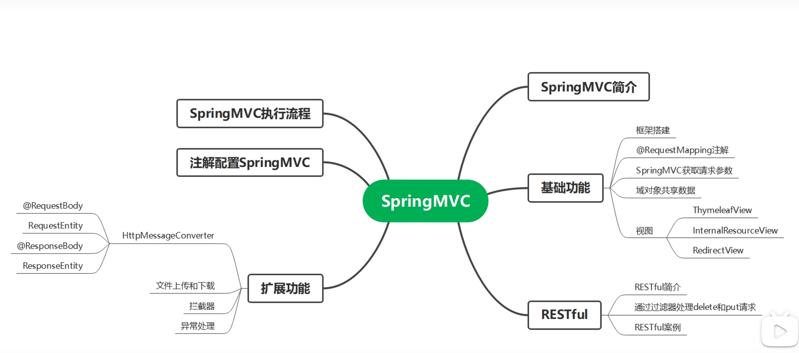

# Spring Web MVC

## Spring Web MVC

**Spring Web MVC:** the original web framework built on the Servlet API and has been included in the Spring Framework from the very beginning 

**Spring WebFlux:** a reactive-stack web framework

## DispatcherServlet

1. #### Context Hierarchy

   `DispatcherServlet servlet = new DispatcherServlet(context);`

   `DispatcherServlet` expects a `WebApplicationContext` (an extension of a plain `ApplicationContext`) for its own configuration.

   1. [ Context Hierarchy](https://docs.spring.io/spring-framework/docs/current/reference/html/web.html#mvc-servlet-context-hierarchy)
   2. [1.1.2. Special Bean Types](https://docs.spring.io/spring-framework/docs/current/reference/html/web.html#mvc-servlet-special-bean-types)
   3. [1.1.3. Web MVC Config](https://docs.spring.io/spring-framework/docs/current/reference/html/web.html#mvc-servlet-config)
   4. [1.1.4. Servlet Config](https://docs.spring.io/spring-framework/docs/current/reference/html/web.html#mvc-container-config)
   5. [1.1.5. Processing](https://docs.spring.io/spring-framework/docs/current/reference/html/web.html#mvc-servlet-sequence)
   6. [1.1.6. Path Matching](https://docs.spring.io/spring-framework/docs/current/reference/html/web.html#mvc-handlermapping-path)
   7. [1.1.7. Interception](https://docs.spring.io/spring-framework/docs/current/reference/html/web.html#mvc-handlermapping-interceptor)
   8. 1.1.8. Exceptions
   9. 1.1.9. View Resolution
   10. 1.1.10. Locale
   11. 1.1.11. Themes
   12. 1.1.12. Multipart Resolver
   13. [1.1.13. Logging](https://docs.spring.io/spring-framework/docs/current/reference/html/web.html#mvc-logging)

   

   

   **The hierarchy**

   

   

   The root `WebApplicationContext` typically contains infrastructure beans, such as data repositories and business services that need to be shared across multiple `Servlet` instances.

   **Special Bean Types:**

   - delegated by dispatcherServlet to process requests and render the appropriate responses
   - Spring-managed `Object` instances that implement built-in framework contracts
   - you can customize their properties and extend or replace them

   

   **Web MVC Config:**

   

   - declares the required beans in either Java or XML
   - provides a higher-level configuration callback API to customize it.

   

   **Servlet Config**

   The following example registers a `DispatcherServlet`

   ```java
   import org.springframework.web.WebApplicationInitializer;
   
   public class MyWebApplicationInitializer implements WebApplicationInitializer {
   
       @Override
       public void onStartup(ServletContext container) {
           XmlWebApplicationContext appContext = new XmlWebApplicationContext();
           appContext.setConfigLocation("/WEB-INF/spring/dispatcher-config.xml");
   
           ServletRegistration.Dynamic registration = container.addServlet("dispatcher", new DispatcherServlet(appContext));
           registration.setLoadOnStartup(1);
           registration.addMapping("/");
       }
   }
   ```

   `WebApplicationInitializer` is an interface provided by Spring MVC that ensures your implementation is detected and automatically used to initialize any Servlet 3 container.

   

   `AbstractDispatcherServletInitializer` makes it even easier to register the `DispatcherServlet` by overriding methods to specify the servlet mapping and the location of the `DispatcherServlet` configuration.

   ```java
   public class MyWebAppInitializer extends AbstractAnnotationConfigDispatcherServletInitializer {
   
       @Override
       protected Class<?>[] getRootConfigClasses() {
           return null;
       }
   
       @Override
       protected Class<?>[] getServletConfigClasses() {
           return new Class<?>[] { MyWebConfig.class };
       }
   
       @Override
       protected String[] getServletMappings() {
           return new String[] { "/" };
       }
   }
   ```

   

   XML-based Spring configuration, you should extend directly from `AbstractDispatcherServletInitializer`

   ```java
   public class MyWebAppInitializer extends AbstractDispatcherServletInitializer {
   
       @Override
       protected WebApplicationContext createRootApplicationContext() {
           return null;
       }
   
       @Override
       protected WebApplicationContext createServletApplicationContext() {
           XmlWebApplicationContext cxt = new XmlWebApplicationContext();
           cxt.setConfigLocation("/WEB-INF/spring/dispatcher-config.xml");
           return cxt;
       }
   
       @Override
       protected String[] getServletMappings() {
           return new String[] { "/" };
       }
   }
   ```

   

   ```java
   public class MyWebAppInitializer extends AbstractDispatcherServletInitializer {
   
       // ...
   
       @Override
       protected Filter[] getServletFilters() {
           return new Filter[] {
               new HiddenHttpMethodFilter(), new CharacterEncodingFilter() };
       }
   }
   ```

   

   **Proocessing**

   

   The `DispatcherServlet` processes requests as follows:

   

   **Path Matching**

   ​	**Basics**

   The servlet API --> requestURI --> sub-divides it into *contextPath, servletPath, and pathinfo*

   Spring MVC needs to determine the lookup path to use for handler mapping. The path is within the mapping of the DispatcherServlet itself.

   ​	**Problems**

   The servletPath and pathInfo are decoded and that makes them impossible to compare directly to the full requestURI.

   In order to derive the lookupPath and that makes it necessary to decode the requestURI. 

   Because the path may contain encoded reserved characters such as "/" or ";" that can in turn alter the structure of the path after they are decoded which can also lead to security issues.

   ​	**How servlet do**

   This is why it is best to avoid reliance on the servletPath which comes with the prefix-based servletPath mapping type.

   The DispatcherServlet is mapped as the default Servlet with "/" or otherwise without a prefix with "/*" .

   The Servlet container is 4.0+ then Spring MVC is able to detect the Servlet mapping type and avoid use of the servletPath and pathInfo altogether.

   ​	**Futher questions**

   Fortunately the default Servlet mapping "/" is a good choice. However, there is still an issue in that the requestURI needs to be decoded to make it possible to compare to controller mappings. 

   The above issues can be addressed more comprehensively by switching from PathMatcher to the parsed PathPattern available in 5.3 or higher, see Pattern Comparison

   

   **Interception**

   All `HandlerMapping` implementations support handler interceptors that are useful when you want to apply specific functionality to certain requests — for example, checking for a principal. Interceptors must implement `HandlerInterceptor` which has three methods:

   - `preHandle(..)`: Before the actual handler is run; 

     ​	returns a boolean value; 

     ​	return true then the handler execution chain continues; 

     ​	return false, the `DispatcherServlet` assumes the interceptor itself has taken care of requests (and, for example, rendered an appropriate view) and does not continue executing the other interceptors and the actual handler in the execution chain.

   - `postHandle(..)`: After the handler is run

   - `afterCompletion(..)`: After the complete request has finished

   

   **Exceptions**

   `DispatcherServlet` delegates to a chain of `HandlerExceptionResolver` beans to resolve the exception and provide alternative handling, which is typically an error response.

   `HandlerExceptionResolver`

   

   

   **View Resolution**

   Spring MVC defines the `ViewResolver` and `View` interfaces that let you render models in a browser without tying you to a specific view technology. `ViewResolver` provides a mapping between view names and actual views. `View` addresses the preparation of data before handing over to a specific view technology.

   1. Handling

      You can chain view resolvers by declaring more than one resolver bean and, if necessary, by setting the `order` property to specify ordering.

      The contract of a `ViewResolver` specifies that it can return null to indicate that the view could not be found.

   2. Redirecting

      The special `redirect:` prefix in a view name lets you perform a redirect. The `UrlBasedViewResolver` (and its subclasses) recognize this as an instruction that a redirect is needed. The rest of the view name is the redirect URL.

   3. Forwarding

      You can also use a special `forward:` prefix for view names that are ultimately resolved by `UrlBasedViewResolver` and subclasses. This creates an `InternalResourceView`, which does a `RequestDispatcher.forward()`.

   4. Content Negotiation

      [`ContentNegotiatingViewResolver`](https://docs.spring.io/spring-framework/docs/5.3.16/javadoc-api/org/springframework/web/servlet/view/ContentNegotiatingViewResolver.html) does not resolve views itself but rather delegates to other view resolvers and selects the view that resembles the representation requested by the client.

   

   **Locale**

   Locale resolvers and interceptors are defined in the `org.springframework.web.servlet.i18n` package and are configured in your application context in the normal way.

   1. [Time Zone](https://docs.spring.io/spring-framework/docs/current/reference/html/web.html#mvc-timezone)

      

   2. [Header Resolver](https://docs.spring.io/spring-framework/docs/current/reference/html/web.html#mvc-localeresolver-acceptheader)

      

   3. [Cookie Resolver](https://docs.spring.io/spring-framework/docs/current/reference/html/web.html#mvc-localeresolver-cookie)

      

   4. [Session Resolver](https://docs.spring.io/spring-framework/docs/current/reference/html/web.html#mvc-localeresolver-session)

      

   5. [Locale Interceptor](https://docs.spring.io/spring-framework/docs/current/reference/html/web.html#mvc-localeresolver-interceptor)

   **Themes**

   set the overall look-and-feel of your application, thereby enhancing user experience.

   A theme is a collection of static resources, typically style sheets and images, that affect the visual style of the application.

   **Multipart Resolver**

   ​	`MultipartResolver` from the `org.springframework.web.multipart` package is a strategy for parsing multipart requests including file uploads.

   **Logging**

   ​	DEBUG-level logging in Spring MVC is designed to be compact, minimal, and human-friendly. It focuses on high-value bits of information that are useful over and over again versus others that are useful only when debugging a specific issue.

   

## Filters

​	**Form Data**

​	Browsers can submit form data only through HTTP GET or HTTP POST but non-browser clients can also use HTTP PUT, PATCH, and DELETE. The Servlet API requires `ServletRequest.getParameter*()` methods to support form field access only for HTTP POST.

​	**Forwarded Headers**

​	**Shallow ETag**

​	**CORS**

​	CORS (Cross-Origin Resource Sharing)

​	Spring MVC provides fine-grained support for CORS configuration through annotations on controllers.

​	[Cross-Origin Resource Sharing (CORS) - HTTP | MDN (mozilla.org)](https://developer.mozilla.org/en-US/docs/Web/HTTP/CORS)

## Annotated Controllers

Spring MVC provides an annotation-based programming model where `@Controller` and `@RestController` components use annotations to express request mappings, request input, exception handling, and more.

```java
@Controller
public class HelloController {

    @GetMapping("/hello")
    public String handle(Model model) {
        model.addAttribute("message", "Hello World!");
        return "index";
    }
}
```

​	1.3.1. Declaration

​		To enable auto-detection of such `@Controller` beans, you can add component scanning to your Java configuration, as the following example shows:

```java
@Configuration
@ComponentScan("org.example.web")
public class WebConfig {

    // ...
}
```

​	The following example shows the XML configuration equivalent of the preceding example:

```xml
<?xml version="1.0" encoding="UTF-8"?>
<beans xmlns="http://www.springframework.org/schema/beans"
    xmlns:xsi="http://www.w3.org/2001/XMLSchema-instance"
    xmlns:p="http://www.springframework.org/schema/p"
    xmlns:context="http://www.springframework.org/schema/context"
    xsi:schemaLocation="
        http://www.springframework.org/schema/beans
        https://www.springframework.org/schema/beans/spring-beans.xsd
        http://www.springframework.org/schema/context
        https://www.springframework.org/schema/context/spring-context.xsd">

    <context:component-scan base-package="org.example.web"/>

    <!-- ... -->

</beans>
```

​		**AOP Proxies**

​		In some cases, you may need to decorate a controller with an AOP proxy at runtime.

​	1.3.2. Request Mapping

```java
@RestController
@RequestMapping("/persons")
class PersonController {

    @GetMapping("/{id}")
    public Person getPerson(@PathVariable Long id) {
        // ...
    }

    @PostMapping
    @ResponseStatus(HttpStatus.CREATED)
    public void add(@RequestBody Person person) {
        // ...
    }
}
```

​	**URL patterns**

​		`@RequestMapping` methods can be mapped using URL patterns. There are two alternatives:

​	**Pattern Comparison**

​		When multiple patterns match a URL, the best match must be selected. This is done with one of the following depending on whether use of parsed `PathPattern` is enabled for use or not:

​	**Suffix Match**

​	**Suffix Match and RFD**

 **Consumable Media Types**

  **Producible Media Types**

**Parameters, headers**

**HTTP HEAD, OPTIONS**

**Custom Annotations**

**Explicit Registrations****

​	1.3.3. Handler Methods

1. [Method Arguments](https://docs.spring.io/spring-framework/docs/current/reference/html/web.html#mvc-ann-arguments)

   

2. [Return Values](https://docs.spring.io/spring-framework/docs/current/reference/html/web.html#mvc-ann-return-types)

   

3. [Type Conversion](https://docs.spring.io/spring-framework/docs/current/reference/html/web.html#mvc-ann-typeconversion)

   

4. [Matrix Variables](https://docs.spring.io/spring-framework/docs/current/reference/html/web.html#mvc-ann-matrix-variables)

   

5. [@RequestParam](https://docs.spring.io/spring-framework/docs/current/reference/html/web.html#mvc-ann-requestparam)

   

6. [@RequestHeader](https://docs.spring.io/spring-framework/docs/current/reference/html/web.html#mvc-ann-requestheader)

   

7. [@CookieValue](https://docs.spring.io/spring-framework/docs/current/reference/html/web.html#mvc-ann-cookievalue)

   

8. [@ModelAttribute](https://docs.spring.io/spring-framework/docs/current/reference/html/web.html#mvc-ann-modelattrib-method-args)

   

9. [@SessionAttributes](https://docs.spring.io/spring-framework/docs/current/reference/html/web.html#mvc-ann-sessionattributes)

   

10. [@SessionAttribute](https://docs.spring.io/spring-framework/docs/current/reference/html/web.html#mvc-ann-sessionattribute)

    

11. [@RequestAttribute](https://docs.spring.io/spring-framework/docs/current/reference/html/web.html#mvc-ann-requestattrib)

    

12. [Redirect Attributes](https://docs.spring.io/spring-framework/docs/current/reference/html/web.html#mvc-redirecting-passing-data)

    

13. [Flash Attributes](https://docs.spring.io/spring-framework/docs/current/reference/html/web.html#mvc-flash-attributes)

    

14. [Multipart](https://docs.spring.io/spring-framework/docs/current/reference/html/web.html#mvc-multipart-forms)

15. [@RequestBody](https://docs.spring.io/spring-framework/docs/current/reference/html/web.html#mvc-ann-requestbody)

16. [HttpEntity](https://docs.spring.io/spring-framework/docs/current/reference/html/web.html#mvc-ann-httpentity)

17. [@ResponseBody](https://docs.spring.io/spring-framework/docs/current/reference/html/web.html#mvc-ann-responsebody)

18. [ResponseEntity](https://docs.spring.io/spring-framework/docs/current/reference/html/web.html#mvc-ann-responseentity)

19. [Jackson JSON](https://docs.spring.io/spring-framework/docs/current/reference/html/web.html#mvc-ann-jackson)

​	[1.3.4. Model](https://docs.spring.io/spring-framework/docs/current/reference/html/web.html#mvc-ann-modelattrib-methods)

​	[1.3.5. DataBinder](https://docs.spring.io/spring-framework/docs/current/reference/html/web.html#mvc-ann-initbinder)

​	1.3.6. Exceptions

​	[1.3.7. Controller Advice](https://docs.spring.io/spring-framework/docs/current/reference/html/web.html#mvc-ann-controller-advice)

