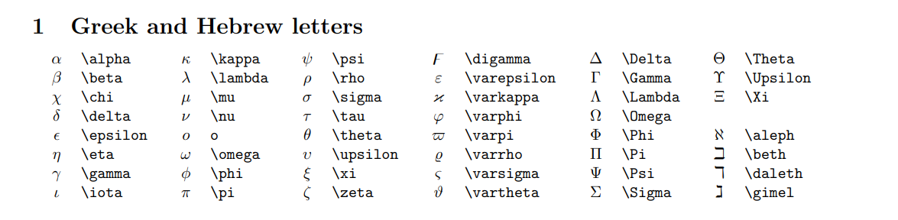

# leetcode

## Resources

参考复习的前人仓库： 

[GitHub - ustcyyw/yyw_algorithm: 💻我的leetcode算法题解，详细的java版本。包括分类题解/周赛题解/剑指OFFER题解](https://github.com/ustcyyw/yyw_algorithm)

[CS-Notes/leetcode题目简评.md at master · huangrt01/CS-Notes · GitHub](https://github.com/huangrt01/CS-Notes/blob/master/Notes/Output/leetcode题目简评.md)

## 一些刷题的小tips

面对 `[["A","B","C","E"],["S","F","E","S"],["A","D","E","E"]]`形式的数组，在 `debug`的时候如何快速的调整形式附和编译器的形式呢？

设想一下数据量很大的情况，如果将 `[]` 一个一个手动更改 `{}` 这巨大的重复劳动让人真的很难受。

几种解决思路：

1. sublime text editor  批量修改的功能
2. c11新特性 赋值很方便
3. 手动将 `[]` 改成 `{}`
4. Vscode plugins  `vscode除了不能生孩子啥都可以`  `vscode有插件可以直接刷力扣`

# Goals

主要目的是为了给自己快速复习和查漏补缺进行食用。

这类笔记的要点就是要精简，不够精简的详细（说明大概率不会做），精简完了的可能会遗忘，需要时长巩固与复习，就是无聊的时候写一些，不会分析为什么再写。

采用的是小时间+高频词的复习方法

换个角度思考

学不下去的时候。

探索人类的智慧，这是我学习的一个动力。无论是以前对杨振宁、爱因斯坦等人的崇拜。

计算机科学的初衷。丰富的学习资源，先进的开源理念，让教育资源尽可能平等。

我这样的普通人也可以沉浸其中，自得其乐。Has

当然，经济上很重要，一份还算不错的收获，对个人来说就是这样子啊。


## Array

单纯的数组是没什么好提的，不过数组和链表作为最基础的数据结构，它们可以和很多东东结合，来变得有趣。比如，数组是以什么顺序排的？降序、无序或者升序？

我做过的题的一个简单预览：

1.Two Sum array + hashtable

| 4    | [Median of Two Sorted Arrays](https://leetcode.com/problems/median-of-two-sorted-arrays) hard | Array+BinarySearch                  |
| ---- | ------------------------------------------------------------ | ----------------------------------- |
| 1    | [Two Sum](https://leetcode.com/problems/two-sum) easy        | Array+HashTable                     |
| 26   | [Remove Duplicates from Sorted Array](https://leetcode.com/problems/remove-duplicates-from-sorted-array)easy | Array+TwoPointers                   |
| 34   | [Find First and Last Position of Element in Sorted Array](https://leetcode.com/problems/find-first-and-last-position-of-element-in-sorted-array)medium | Array+BinarySearch                  |
| 53   | [Maximum Subarray](https://leetcode.com/problems/maximum-subarray)easy | Array在线处理/DP                    |
| 56   | [Merge Intervals](https://leetcode.com/problems/merge-intervals)medium | Array+sort(Arrays.sort()的调用方法) |
| 80   | [Remove Duplicates from Sorted Array II](https://leetcode.com/problems/remove-duplicates-from-sorted-array-ii)Medium | Array+TwoPointers                   |
| 88   | [Merge Sorted Array](https://leetcode.com/problems/merge-sorted-array)Easy | Array+TwoPointers                   |
| 121  | [Best Time to Buy and Sell Stock](https://leetcode.com/problems/best-time-to-buy-and-sell-stock)Easy | Array+Dp                            |
| 122  | [Best Time to Buy and Sell Stock II](https://leetcode.com/problems/best-time-to-buy-and-sell-stock-ii)Easy | Array+Dp                            |
| 289  | [Game of Life](https://leetcode.com/problems/game-of-life)Medium | 纯Array(有难度)                     |
| 581  | [Shortest Unsorted Continuous Subarray](https://leetcode.com/problems/shortest-unsorted-continuous-subarray)Medium | Array+TwoPointers(感觉这道题不错)   |
| 674  | [Longest Continuous Increasing Subsequence](https://leetcode.com/problems/longest-continuous-increasing-subsequence)Easy | Array+sliding window Or dp          |
| 941  | [Valid Mountain Array](https://leetcode.com/problems/valid-mountain-array)Easy | Array                               |
| 977  | [Squares of a Sorted Array](https://leetcode.com/problems/squares-of-a-sorted-array) | Array+Sort(要你自己写)              |
| 1010 | [Pairs of Songs With Total Durations Divisible by 60](https://leetcode.com/problems/pairs-of-songs-with-total-durations-divisible-by-60)Medium | Array                               |

| 1437 | [Check If All 1's Are at Least Length K Places Away](https://leetcode.com/problems/check-if-all-1s-are-at-least-length-k-places-away)easy | Array                 |
| ---- | ------------------------------------------------------------ | --------------------- |
| 1539 | [Kth Missing Positive Number](https://leetcode.com/problems/kth-missing-positive-number)Easy | Array+Hash Table      |
| 1640 | [Check Array Formation Through Concatenation](https://leetcode.com/problems/check-array-formation-through-concatenation)Easy | Array Hash Table Sort |
| 1758 | [Minimum Changes To Make Alternating Binary String](https://leetcode.com/problems/minimum-changes-to-make-alternating-binary-string)Easy | Array Greedy          |
|      |                                                              |                       |

40min；回忆了几道题和列出了所做过的题的标签

4

```java
class Solution {
    public double findMedianSortedArrays(int[] nums1, int[] nums2) {
        int length1 = nums1.length, length2 = nums2.length;
        int totalLength = length1 + length2;
        if (totalLength % 2 == 1) {
            int midIndex = totalLength / 2;
            double median = getKthElement(nums1, nums2, midIndex + 1);
            return median;
        } else {
            int midIndex1 = totalLength / 2 - 1, midIndex2 = totalLength / 2;
            double median = (getKthElement(nums1, nums2, midIndex1 + 1) + getKthElement(nums1, nums2, midIndex2 + 1)) / 2.0;
            return median;
        }
    }

    public int getKthElement(int[] nums1, int[] nums2, int k) {
        /* 主要思路：要找到第 k (k>1) 小的元素，那么就取 pivot1 = nums1[k/2-1] 和 pivot2 = nums2[k/2-1] 进行比较
         * 这里的 "/" 表示整除
         * nums1 中小于等于 pivot1 的元素有 nums1[0 .. k/2-2] 共计 k/2-1 个
         * nums2 中小于等于 pivot2 的元素有 nums2[0 .. k/2-2] 共计 k/2-1 个
         * 取 pivot = min(pivot1, pivot2)，两个数组中小于等于 pivot 的元素共计不会超过 (k/2-1) + (k/2-1) <= k-2 个
         * 这样 pivot 本身最大也只能是第 k-1 小的元素
         * 如果 pivot = pivot1，那么 nums1[0 .. k/2-1] 都不可能是第 k 小的元素。把这些元素全部 "删除"，剩下的作为新的 nums1 数组
         * 如果 pivot = pivot2，那么 nums2[0 .. k/2-1] 都不可能是第 k 小的元素。把这些元素全部 "删除"，剩下的作为新的 nums2 数组
         * 由于我们 "删除" 了一些元素（这些元素都比第 k 小的元素要小），因此需要修改 k 的值，减去删除的数的个数
         */

        int length1 = nums1.length, length2 = nums2.length;
        int index1 = 0, index2 = 0;
        int kthElement = 0;

        while (true) {
            // 边界情况
            if (index1 == length1) {
                return nums2[index2 + k - 1];
            }
            if (index2 == length2) {
                return nums1[index1 + k - 1];
            }
            if (k == 1) {
                return Math.min(nums1[index1], nums2[index2]);
            }
            
            // 正常情况
            int half = k / 2;
            int newIndex1 = Math.min(index1 + half, length1) - 1;
            int newIndex2 = Math.min(index2 + half, length2) - 1;
            int pivot1 = nums1[newIndex1], pivot2 = nums2[newIndex2];
            if (pivot1 <= pivot2) {
                k -= (newIndex1 - index1 + 1);
                index1 = newIndex1 + 1;
            } else {
                k -= (newIndex2 - index2 + 1);
                index2 = newIndex2 + 1;
            }
        }
    }
}

```


## Tree

### 初学者建议

先打好基础，对树基本知识有个大致了解，根节点，子节点，兄弟节点等概念，二叉树，二叉搜索树，AVL树等等，需要了解概念，对树有一个宏观的大体认识。

之后是上手写代码，基本的遍历方式，递归实现，迭代。

去leetcode上完成 `Tree Explore`探索的卡片, 目的是建立一些概念。 

完成之后你可能对Tree的基本遍历方式，递归和迭代实现有了基本了解，同时对 `top-down` 和 `bottom-up`两种思维有一定概念。

一些题目可以反复去做，争取写出 `bug-free`的代码。 做的过程可能可以举一反三，思考为什么这么做，不这么做会怎么样。这个过程其实就是思考的过程，会有思考的乐趣。

刚开始的这个过程可能很难坚持，万事开头难。但坚持下去，你的收获会超过你的想象。

### 思考方式

- 基础:

  基本的遍历方式，递归实现，迭代

  `top-down` 和 `bottom-up`两种思维方式，大概的适用情况，能不能用非递归方式实现？

- 对树遍历空间的优化

  Morris Traversal， 颜色标记法  （强记记不住，关键是弄清楚，弄明白）

- 树的基本框架的构建，是用BFS还是DFS，BFS怎么用，DFS的话是pre,in,post中的哪一个或者只是要对树进行单纯的遍历。结合树的类型一般的树，二叉树，二叉搜索树等。方案的时间复杂度和空间复杂度是怎么样的。

  难点：想清楚递归，递归终止条件，是否是大问题转化为小问题，每个小问题是否独立。

  （非递归语言的实现，cpp,Java,go等等）

- 后序遍历为什么有两种方式：双Stack和一个Stack和lastNode遍历    left right in     in right left  


### 涉及到的题目

[leetcode110](#110)平衡二叉树 涉及到高度 *(很好的一道简单题，深入思考你会发现很不一样的东西)

[剑指Offer 32](#从上到下打印二叉树系列)从上到下打印二叉树 层序遍历+一些变形

[剑指Offer 07](#重建二叉树)重建二叉树 利用不同dfs结果的特点逆向进行思考

[剑指Offer 34](#二叉树中和为某一值的路径)二叉树中和为某一值的路径

[leetcode449](#449. Serialize and Deserialize BST)Serialize and Deserialize BST

[leetcode98](#98)Validate Binary Search Tree 中序遍历

[leetcode124](#124)Binary Tree Maximum Path Sum

[leetcode173](#173)Binary Search Tree Iterator

### 具体的题解

- leetcode<a name="110">110</a> Balanced Binary Tree

  平衡二叉树 两种方法

  自顶而下暴力解

  自底而上（How: 后序遍历）+ 剪枝思想

  **思考点在于如何利用最简单的模型一步一步地向上去推，得到想要的结果，也就是这个剪枝思想的核心**

- leetcode104 Maximum Depth of Binary Tree

  4.8 again 写辅助函数的时候，采用DFS中的哪种模式？返回值为int的时候，终止条件，递归函数，返回值等如何思考。

  11.23 again and again

  所有的recurision都可以用非递归来实现的话，那么自底向上的这种方式该如何用非递归来实现呢？假设我一定要使用DFS解法。

  自底向上的解法之中，你会发现对每一个堆栈，它的leftHegiht和rightHeight都是在改变的，哦！对的！都是继承了上一层的结果，所以要pair啊，pair什么，pair一个高度，是当前节点的左节点还是右节点，还有当前节点的左子树高度和右子树高度。这个和自定向下有点类似，但思路不同。

  自顶向下传递一个参数，参考这篇题解。[[Java\] Several Solutions (recursive and iterative) - LeetCode Discuss](https://leetcode.com/problems/maximum-depth-of-binary-tree/discuss/1121435/Java-Several-Solutions-(recursive-and-iterative))

  思考过程放到了提交记录里面[Maximum Depth of Binary Tree - LeetCode](https://leetcode.com/problems/maximum-depth-of-binary-tree/submissions/)

  **Mirror traverse**

  核心思想在于用一个临时指向当前左侧的临时指针，看临时指针的右侧是否为null或者p1,null的情况让其指向p1指针，压入元素，p1左移循环

  

  *新建临时节点，令该节点为 root；*

  *如果当前节点的左子节点为空，将当前节点加入答案，并遍历当前节点的右子节点；*

  *如果当前节点的左子节点不为空，在当前节点的左子树中找到当前节点在中序遍历下的前驱节点：*

  *如果前驱节点的右子节点为空，将前驱节点的右子节点设置为当前节点。然后将当前节点加入答案，并将前驱节点的右子节点更新为当前节点。当前节点更新为当前节点的左子节点。*

  *如果前驱节点的右子节点为当前节点，将它的右子节点重新设为空。当前节点更新为当前节点的右子节点。*

  *重复步骤 2 和步骤 3，直到遍历结束。*

  ```c++
  class Solution {
  public:
      vector<int> preorderTraversal(TreeNode *root) {
          vector<int> res;
          if (root == nullptr) {
              return res;
          }
  
          TreeNode *p1 = root, *p2 = nullptr;
  
          while (p1 != nullptr) {
              p2 = p1->left;
              if (p2 != nullptr) {
                  while (p2->right != nullptr && p2->right != p1) {
                      p2 = p2->right;
                  }
                  if (p2->right == nullptr) {
                      res.emplace_back(p1->val);
                      p2->right = p1;
                      p1 = p1->left;
                      continue;
                  } else {
                      p2->right = nullptr;
                  }
              } else {
                  res.emplace_back(p1->val);
              }
              p1 = p1->right;
          }
          return res;
      }
  };
  
  作者：LeetCode-Solution
  链接：https://leetcode-cn.com/problems/binary-tree-preorder-traversal/solution/er-cha-shu-de-qian-xu-bian-li-by-leetcode-solution/
  来源：力扣（LeetCode）
  著作权归作者所有。商业转载请联系作者获得授权，非商业转载请注明出处。
  ```

  

- [剑指 Offer 32 - I. 从上到下打印二叉树 - 力扣（LeetCode） (leetcode-cn.com)](https://leetcode-cn.com/problems/cong-shang-dao-xia-da-yin-er-cha-shu-lcof/)  后面还有II，III题目

  基本框架是层序遍历 --> Queue数据结构 --> 实现形式 `Array` Or `LinkedList` --> if `LinkedList` 注意 `LinkedList Interface`
  API `addFirst` `addLast`

  API调用 一般`Queue` `FIFO` 注意 `PriorityQueue` 和 `LIFO` `Queue` --> `Stack` --> Java `Deque`

|         | Throws exception          | Returns special value   |
| ------- | ------------------------- | ----------------------- |
| Insert  | [`add(e)`](#add(E))       | [`offer(e)`](#offer(E)) |
| Remove  | [`remove()`](#remove())   | [`poll()`](#poll())     |
| Examine | [`element()`](#element()) | [`peek()`](#peek())     |

​	分别的要求

​	一层的节点按照从左到右的顺序打印 简单层序遍历

​	同一层的节点按从左到右的顺序打印，每一层打印到一行 层序遍历中加一个for语句

​	第一行按照从左到右的顺序打印，第二层按照从右到左的顺序打印，第三行再按照从左到右的顺序打印，其他行以此类推 Deque + 分类处理。    **快速观察： 正常的queue offer和poll的操作对应双端队列的情况，是First还是last，以此为思考点，同时观察新建List<Integer>的顺序，将未知量的方式以一种形式进行固定**


- [剑指Offer 07]<a name = "重建二叉树"> 重建二叉树</a>(https://leetcode-cn.com/problems/zhong-jian-er-cha-shu-lcof)

  不会的：看题解 重构二叉树 编号07 思维：首先想清楚一个整理步骤 然后递进 分治思想进来啦， 最后的难点在于应用分治的边界选择问题

  **3.23再刷不会****

  **7.3再刷用递归解决如何用递归没有思考出来** 根节点索引的root+i-left+1是怎么来的，好像有点明白了
  
  [105. 从前序与中序遍历序列构造二叉树 - 力扣（LeetCode） (leetcode-cn.com)](https://leetcode-cn.com/problems/construct-binary-tree-from-preorder-and-inorder-traversal/)
  
  相似题目练习巩固
  
  （**难点还在于递归边界条件的选取**）
  
  分治思想下的树的边界条件，左子树，右子树，从那开始，在哪结束，用什么方法能够让inorder和preorder两个数组进行联动起来？
  
  分治思想下的辅助方法怎么写，递归结束条件是什么，递归的实际含义是什么？子问题是怎么样的。</a>

```java
//7.3重写的代码，注释代表了部分思考过程    
int preorder[];
    HashMap<Integer, Integer> hp = new HashMap();
    public TreeNode buildTree(int[] preorder, int[] inorder) {
        this.preorder = preorder;
        for(int i = 0; i < inorder.length; i++){
            hp.put(inorder[i],i);   //hashMap put() not add hashSet add 
        }
        return recur(0,0,inorder.length - 1);
    }
    //Three parameters
    //root: add node with index root
    //left and right: the boundary condition of inorder
    public TreeNode recur(int root, int left, int right){
        //terminal condition test
        // why not >=  image the situation pre[3] in[3] the res will be null
        if(left > right)return null;
        TreeNode res = new TreeNode(preorder[root]);
        int index = hp.get(preorder[root]);
        res.left = recur(root + 1, left, index - 1 );
        res.right = recur(root + index - left + 1 , index + 1, right );
        //root 0 index 1 left 0  boundary test  (confused root + index - left + 1)
        // index - left + 1 根+左有多少个节点 + root 表示从root 开始 数起到右子树的根节点
        return res;
    }


    //结果问题
    int[] postorder;
    HashMap<Integer, Integer> hp = new HashMap();
    public TreeNode buildTree(int[] inorder, int[] postorder) {
        this.postorder = postorder;
        for(int i = 0; i < inorder.length; i++){
            hp.put(inorder[i],i);
        }
        return recur(inorder.length - 1, 0, inorder.length - 1);
    }
    public TreeNode recur(int root, int left , int right){
        if(left > right || root < 0)return null;
        TreeNode res = new TreeNode(postorder[root]);
        int index = hp.get(postorder[root]);
        res.left = recur( root - right + left,left, index - 1);
        //root 4 left 0 right 4 index 1
        //index - left + 1  l到index有多少个节点（包括index）
        //r - l 子树有多少个节点 
        res.right = recur(root - 1, index + 1, right);
        return res;
    }
//root - right + index - 1 wrong -- > right  index = hp.get(postorder[right])wrong
[15,13,20,7]
[15,13,7,20]
		20 
	13  	7
15
```

- [剑指Offer 34]<a name = "二叉树中和为某一值的路径"> 二叉树中和为某一值的路径</a>(https://leetcode-cn.com/problems/zhong-jian-er-cha-shu-lcof)

  回溯思想 : 先序遍历+记录

- [leetcode449]<a name = "449. Serialize and Deserialize BST">449. Serialize and Deserialize
  BST</a>(https://leetcode.com/problems/serialize-and-deserialize-bst/)

  serialize & deserialize

  ```java
  public class Codec {
  
      // Encodes a tree to a single string.
      StringBuilder sb = new StringBuilder();
      public String serialize(TreeNode root) {
          inorder(root);
          if(!sb.toString().equals("")){sb.deleteCharAt(sb.length()-1);}
          return sb.toString();
      }
      public void inorder(TreeNode root){
          if(root == null)return;
          sb.append(root.val);
          sb.append(",");
          inorder(root.left);
          inorder(root.right);
      }
  
      // Decodes your encoded data to tree.
  public TreeNode deserialize(String data) {
          if (data.isEmpty()) return null;
          Queue<String> q = new LinkedList<>(Arrays.asList(data.split(",")));
          return deserialize(q, Integer.MIN_VALUE, Integer.MAX_VALUE);
      }
      
      public TreeNode deserialize(Queue<String> q, int lower, int upper) {
          if (q.isEmpty()) return null;
          String s = q.peek();
          int val = Integer.parseInt(s);
          if (val < lower || val > upper) return null;
          q.poll();
          TreeNode root = new TreeNode(val);
          root.left = deserialize(q, lower, val);
          root.right = deserialize(q, val, upper);
          return root;
      }
  }
  
  ```

    - leetcode<a name="98">98</a>Validate Binary Search Tree

      一眼看出中序遍历，BST的中序遍历有数据值递增的性质。问题就转化为判断此树中序遍历后的结果是否为递增。

      容器储存遍历的结果——优化：1、参数上优化，加上min和max 2、用一个pre节点储存上一次遍历的值，与当前值进行比较。

    - leetcode<a name="124">124</a>Binary Tree Maximum Path Sum

      写出基本框架后，发现需要用一个全局变量max来处理路径的最大值。

      ```java
          //my code
          //适用条件：作为当前一个子树的maxSum传到子树所在的root节点
          //报错情况:[-3][-1]直接求root节点maxPathSum的情况未考虑
          public int maxPathSum(TreeNode root) {
              if(root == null)return 0;
              int left = maxPathSum(root.left);
              if(left < 0 )left = 0;
              int right = maxPathSum(root.right);
              if(right < 0)right = 0;
              return Math.max(Math.max(left + root.val + right, left), right);
          }
      ```

      ```c++
      //相似思路的题解代码
      int max = Integer.MIN_VALUE;
          public int maxPathSum(TreeNode root) {
              if (root == null) {
                  return 0;
              }
              dfs(root);
              return max;
          }
          public int dfs(TreeNode root) {
              if (root == null) {
                  return 0;
              }
              int leftMax = Math.max(0, dfs(root.left));
              int rightMax = Math.max(0, dfs(root.right));
              max = Math.max(max, root.val + leftMax + rightMax);
              return root.val + Math.max(leftMax, rightMax);
          }
      ```

        - leetcode<a name="173">173</a> Binary Search Tree Iterator

          一般的思路ArrayList储存每一个节点，hasNext(),next(), Time complexity: O(1) O(1) Space complexity:O(n)

          n- the node of the tree

          升级想法：Space complexity:O(h)    h-the height of the tree

          ```
          Before I come up with this solution, I really draw a lot binary trees and try inorder traversal on them. We all know that, once you get to a TreeNode, in order to get the smallest, you need to go all the way down its left branch. So our first step is to point to pointer to the left most TreeNode. The problem is how to do back trace. Since the TreeNode doesn't have father pointer, we cannot get a TreeNode's father node in O(1) without store it beforehand. Back to the first step, when we are traversal to the left most TreeNode, we store each TreeNode we met ( They are all father nodes for back trace).
          
          After that, I try an example, for next(), I directly return where the pointer pointing at, which should be the left most TreeNode I previously found. What to do next? After returning the smallest TreeNode, I need to point the pointer to the next smallest TreeNode. When the current TreeNode has a right branch (It cannot have left branch, remember we traversal to the left most), we need to jump to its right child first and then traversal to its right child's left most TreeNode. When the current TreeNode doesn't have a right branch, it means there cannot be a node with value smaller than itself father node, point the pointer at its father node.
          
          The overall thinking leads to the structure Stack, which fits my requirement so well.
          ```

          ```java
          public class BSTIterator {
              
              private Stack<TreeNode> stack;
              public BSTIterator(TreeNode root) {
                  stack = new Stack<>();
                  TreeNode cur = root;
                  while(cur != null){
                      stack.push(cur);
                      if(cur.left != null)
                          cur = cur.left;
                      else
                          break;
                  }
              }
          
              /** @return whether we have a next smallest number */
              public boolean hasNext() {
                  return !stack.isEmpty();
              }
          
              /** @return the next smallest number */
              public int next() {
                  TreeNode node = stack.pop();
                  TreeNode cur = node;
                  // traversal right branch
                  if(cur.right != null){
                      cur = cur.right;
                      while(cur != null){
                          stack.push(cur);
                          if(cur.left != null)
                              cur = cur.left;
                          else
                              break;
                      }
                  }
                  return node.val;
              }
          }
          ```

## Backtracking

### 学习参考

[fucking-algorithms](https://github.com/labuladong/fucking-algorithm/blob/master/%E7%AE%97%E6%B3%95%E6%80%9D%E7%BB%B4%E7%B3%BB%E5%88%97/%E5%9B%9E%E6%BA%AF%E7%AE%97%E6%B3%95%E8%AF%A6%E8%A7%A3%E4%BF%AE%E8%AE%A2%E7%89%88.md)

### 思想

**解决一个回溯问题，实际上就是一个决策树的遍历过程**。你只需要思考 3 个问题：

1、路径：也就是已经做出的选择。

2、选择列表：也就是你当前可以做的选择。

3、结束条件：也就是到达决策树底层，无法再做选择的条件。

代码方面，回溯算法的框架：

（**框架只是一个思考过程，不需要完全依赖，很多时候不一样的思路过程也涉及到了框架里代码的思想，换句话来说，框架是一种思考问题的方式，目的是帮助你更好理解问题**）

```python
result = []
def backtrack(路径, 选择列表):
    if 满足结束条件:
        result.add(路径)
        return
    
    for 选择 in 选择列表:
        做选择
        backtrack(路径, 选择列表)
        撤销选择
```

### 题目列表

[leetcode10](#10)正则表达式匹配

[leetcode51](#51)N皇后

[leetcode93](#93)复原IP地址

[leetcode46](#46)全排列

[leetcode78Subsets - LeetCode](https://leetcode.com/problems/subsets/)

[剑指 Offer 12](#剑指 12)矩阵中的路径

[剑指 Offer 13](#剑指 13)机器人的运动范围

### 具体题解

- leetcode<a name="51">51</a>

  框架练习

  ```java
  class Solution {
      private List<List<String>> res = new ArrayList<>();
      /* 输入棋盘边长 n，返回所有合法的放置 */
      public List<List<String>> solveNQueens(int n) {
          // '.' 表示空，'Q' 表示皇后，初始化空棋盘。
          char[][] board = new char[n][n];
          for (int i = 0; i < n; i++) {
              for (int j = 0; j < n; j++) {
                  board[i][j] = '.';
              }
          }
          //回溯 (路径，选择列表)
          backtrack(board, 0);
          return res;
      }
      // 路径：board 中小于 row 的那些行都已经成功放置了皇后
      // 选择列表：第 row 行的所有列都是放置皇后的选择
      // 结束条件：row 超过 board 的最后一行// 触发结束条件
      public void backtrack(char[][] board, int row){
          //结束条件
          if(row == board.length){
              //将char转为List,并将结果添加到res中
              res.add(construct(board));
          }
          //做选择
          for(int col = 0; col < board.length; col++){
              //判断是否有效
              if(isValid(board, row, col)){
                  board[row][col] = 'Q';
                  backtrack(board, row + 1);
                  board[row][col] = '.';
              }
        }
      }
    public List<String> construct(char[][] board){
          List<String> path = new ArrayList<>();
        for (char[] each:board) {
              path.add(new String(each));
        }
          return path;
    }
      public boolean isValid(char[][] board, int row, int col){
        if(row < 0 || row >= board.length || col < 0 || col >= board.length)return false;
          //第row行
          for(int i = 0; i < board[0].length; i++){
              if(board[row][i] == 'Q'){
                  return false;
              }
          }
          //第col列
          for(int i = 0; i < board.length; i++){
              if(board[i][col] == 'Q'){
                  return false;
              }
          }
          //board[row][col]的两条对角线
          //right-up
          for(int i = row, j = col; i >= 0 && j < board[0].length; i--,j++){
              if(board[i][j] == 'Q'){
                  return false;
              }
          }
          //right-down
          for(int i = row, j = col; i < board.length && j >= 0; i++,j--){
              if(board[i][j] == 'Q'){
                  return false;
              }
          }
          //left-up
          for(int i = row, j = col; i >= 0 && j >= 0; i--,j--){
              if(board[i][j] == 'Q'){
                  return false;
              }
          }
          //left-down
          for(int i = row, j = col; i < board.length && j < board[0].length; i++,j++){
              if(board[i][j] == 'Q'){
                  return false;
              }
          }
          return true;
      }
  }
  ```

    - leetcode<a name="46">46</a>

      框架代码

      框架外的思考：

        - `List`接口具体用的类

        - `res.add()`时，要重新`new` 一个对象（放到常量池中），

          不`new`的话，全为空结果，从`cur`这个`reference variable`指向的常量，反映了回溯的特性（回到最初的起点）

```java
class Solution {
    private List<List<Integer>> res = new ArrayList<>();
    public List<List<Integer>> permute(int[] nums) {
        List<Integer> cur = new ArrayList<>();
        backtrack(cur,nums);
        return res;
    }
    public void backtrack(List<Integer> cur, int[] nums){
        if(cur.size() == nums.length){
            res.add(new ArrayList<>(cur));
        }
        for(int i = 0; i < nums.length; i++){
            if(!cur.contains(nums[i])){
                //合法情况
                cur.add(nums[i]);
                backtrack(cur, nums);
                int index = cur.size() - 1;
                cur.remove(index);
            }
        }
    }
}
```

- 剑指 Offer<a name="12">12</a>

## DP

### 学习参考

- [Dynamic programming - Wikipedia](https://en.wikipedia.org/wiki/Dynamic_programming)

- [fucking-alogorithms 系列](https://github.com/labuladong/fucking-algorithm/tree/master/%E5%8A%A8%E6%80%81%E8%A7%84%E5%88%92%E7%B3%BB%E5%88%97)
- [算法概论 Sanjoy Dasgupta / Christos Papadimitriou / Umesh Vazirani]((https://book.douban.com/search/Sanjoy Dasgupta))

**基础知识**:

​	

### 思想

**明确 base case -> 明确「状态」-> 明确「选择」 -> 定义 dp 数组/函数的含义**。

按上面的套路走，最后的结果就可以套这个框架：

```python
# 初始化 base case
dp[0][0][...] = base
# 进行状态转移
for 状态1 in 状态1的所有取值：
    for 状态2 in 状态2的所有取值：
        for ...
            dp[状态1][状态2][...] = 求最值(选择1，选择2...)
```

### 题目列表

​    [斐列纳波数列](#斐列纳波数列)

​    [凑零钱](#凑零钱)

​    [leetcode300](#最长递增子序列)

​    [剑指 Offer 14剪绳子](#剪绳子)

​    [leetcode 72编辑距离](#编辑距离)

​	[Unique Binary Search Trees II - LeetCode](https://leetcode.com/problems/unique-binary-search-trees-ii/)  

​	[Unique Binary Search Trees - LeetCode](https://leetcode.com/problems/unique-binary-search-trees/)   (Divide-and-conquer.  F(i) = G(i-1) * G(n-i) 卡兰特数 G(n) = G(0) * G(n-1) + G(1) * G(n-2) + … + G(n-1) * G(0) )


 正则表达式、背包问题、矩阵相乘、最短路径问题、树中的独立积问题

（很有意思的DP题目，很具有思考价值，怎么写，慢慢弄）

[Regular Expression Matching - LeetCode](https://leetcode.com/problems/regular-expression-matching/)

[正则表达式匹配 - 正则表达式匹配 - 力扣（LeetCode） (leetcode-cn.com)](https://leetcode-cn.com/problems/regular-expression-matching/solution/zheng-ze-biao-da-shi-pi-pei-by-leetcode-solution/)


### 具体题解

- <a name = "斐列纳波数列">斐列纳波数列</a>

  最简单+ `dp`思想明确 + `dptable`优化重复的子结构问题

- <a name = "凑零钱">凑零钱</a>

- <a name = "leetcode300">leetcode300最长递增子序列</a>

- <a name = "剪绳子">剪绳子</a>

  如何找到`dp`数组含义：如何确定状态和选择

  对于的正整数 n，当 n≥2 时，可以拆分成至少两个正整数的和。令 k 是拆分出的第一个正整数，则剩下的部分是 n−k，n−k
  可以不继续拆分，或者继续拆分成至少两个正整数的和。由于每个正整数对应的最大乘积取决于比它小的正整数对应的最大乘积，因此可以使用动态规划求解。

  创建数组 `dp`，其中`dp[i] `表示将正整数 i 拆分成至少两个正整数的和之后，这些正整数的最大乘积。特别地，0 不是正整数，1是最小的正整数，0和 1都不能拆分，因此 `dp`[0]`=dp`[1]=0。

  ```java
  class Solution {
      public int integerBreak(int n) {
          int[] dp = new int[n + 1];
          for (int i = 2; i <= n; i++) {
              int curMax = 0;
              for (int j = 1; j < i; j++) {
                  curMax = Math.max(curMax, Math.max(j * (i - j), j * dp[i - j]));
              }
              dp[i] = curMax;
          }
          return dp[n];
      }
  }
  ```


- <a name = "编辑距离">编辑距离</a>

  大问题如何拆分小问题，然后套框架，明确每一步的含义

- 通配符匹配

  做多了会发现是dp题目，二维的dp Table在脑袋里徐徐展开。找到dp公式。不过初次看的时候，肯定会想到暴力解法。问题的难点在于"*"这个怎么办。从位置来看又有左，中，右三种情况，也可能没有。

  failed to test "adceb", *a*b

  仔细对比会发现最右边那一项`dp[i][j-1]`两个式子都一样。那么，`dp[0][j - 1] || dp[1][j-1] || ... || dp[i-1][j-1]`是否等价于`dp[i-1][j]`呢？你会发现很容易证明是等价的：假如p(0, j -1)可以匹配s(0, i - 1)的某个子串s(0, k) （k <= i - 1），而p[j]刚好是"*"，所以刚好可以适配配剩下的部分，即p(0, j)可以适配s(0, i - 1)，反之亦然。

  当p[j]为星号时，“p(0, j -1)可以匹配s(0, i - 1)的某个子串s(0, k)” 与 “p(0, j)可以匹配s(0, i - 1)”互为充要条件。

  最有意思的是，把全部或上的思路，其实是很顺势而为的，因为“*”可以匹配0到n个任意字符嘛，所以p的前半部分只要能匹配s的任意一个短串就行（哪怕是空串），这样这个理论形成一个整体。比较巧的是，这个“整体”是可以拆的，拆分办法就是前面所说的拿掉最后一项，剩下的一大堆或居然有个等价的结果、而且它已经被计算出来了。

  ```c++
  class Solution
  {
  public:
      bool isMatch(string s, string p)
      {
          int j=0;
  	for(int star=0,i=0, last=0;i<s.length();){
  		if(j<p.size() && (s[i]==p[j] || p[j]=='?')){
  			++i;
  			++j;}
  		else if(j<p.size() && p[j]=='*'){
  			last=i;
  			star=++j;}
  		else if(star!=0){
  			i=++last;
  			j=star;}
  		else return 0;
  		}
  		for(; j<p.size() && p[j]=='*'; ++j);
  		return j==p.size();
    }
  };
  
  作者：sunt
  链接：https://leetcode-cn.com/problems/wildcard-matching/solution/0-ms-88mb-c-bao-li-by-sunt/
  来源：力扣（LeetCode）
  著作权归作者所有。商业转载请联系作者获得授权，非商业转载请注明出处。
  ```

  

```c++
class Solution {
    std::unordered_map<std::string,bool> memo;
    bool is_match(std::string& s, std::string& p, int i, int j) {

        std::string index = std::to_string(i) + std::to_string(j);

        auto it = memo.find(index);
        if (it != memo.end()) return it->second;
        
        //if (memo.count(index)) return memo[index];

        while (i < s.size() && j < p.size()) {
            // match one any character pointers both move forward
            if (p[j] == '?') { 
                i++; j++;
            }
            // extactly match one characters
            else if (p[j] >= 'a' && p[j] <= 'z') {
                // if failed, memorize the result
                if (s[i] != p[j]) { 
                    index = std::to_string(i) + std::to_string(j); memo[index] = false;
                    return false;
                }
                i++; j++;
            }
            // if we encounter * match substrings with length greater than or equal to zero
            else if (p[j] == '*') {
                // there are more pattern characters to be processed
                if (j+1 < p.size()) {
                    // here we handle the remaining text and pattern as subproblem
                    for (int k = i; k < s.size(); ++k) {
                        index = std::to_string(k) + std::to_string(j+1);
                        // if this subproblem has been conquered before, fetch the result
                        auto it2 = memo.find(index);
                        if (it2 != memo.end()) return it2->second;
                        // otherwise go through the pain
                        bool sub_res = is_match(s, p, k, j+1);
                        memo[index] = sub_res;
                        if (sub_res) {
                            // if any submatch succeeds the whole match also succeeds
                            index = std::to_string(i) + std::to_string(j); memo[index] = sub_res;
                            return sub_res;
                        }
                    }
                    // othewise we have failed at index i and j respectively 
                    index = std::to_string(i) + std::to_string(j); memo[index] = false;
                    return false;
                }
                // * is the last character in the pattern 
                // we can happily match to the end
                else {
                    index = std::to_string(i) + std::to_string(j); memo[index] = true;
                    return true; 
                }
            }
        }

        // the remaining pattern consists of all *
        if (j < p.size()) { while (j < p.size() && p[j] == '*') j++; }

        bool res = (i == s.size() && j == p.size());
        index = std::to_string(i) + std::to_string(j); memo[index] = res;

        return res;
    }
public:
    bool isMatch(string s, string p) {
        if (s.size() == 0) {
            for (int i = 0; i < p.size(); ++i) {
                if (p[i] != '*') return false;
            }
            return true;
        }
        return is_match(s, p, 0, 0);
    }
};

作者：00010001
链接：https://leetcode-cn.com/problems/wildcard-matching/solution/bao-li-di-gui-bei-wang-lu-by-00010001-n4jd/
来源：力扣（LeetCode）
著作权归作者所有。商业转载请联系作者获得授权，非商业转载请注明出处。
```

```c++
p中没有 *，那就直接判断两个字符串是否相等，这里我写了isEqual函数来判断
如果p的第一个字符不是*，需要判断p的第一颗*前面的字符，是否与s对应的相等长度的字符完全相等，这里我写了rightHalfStar函数来判断
普通情况：找到两个相邻的之间的子字符串，判断s从上一次匹配到的位置之后的子字符串中是否含有该子字符串，期间储存好s对应的匹配位置，和两颗的位置
更新s中匹配到的位置，更新*的位置
结束


class Solution {
public:
    bool leftHalfStar(string s, string p)
    {
        if (s.size() < p.size()) return false;
        int i = s.size() - 1;
        int j = p.size() - 1;
        while(j >= 0)
        {
            if (p[j] == '?')    
            {
                j--;
                i--;
                continue;
            }
            if(p[j--] != s[i--])    return false;
        }
        return true;
    }
    bool rightHalfStar(string s, string p)
    {
        if (s.size() < p.size())    return false;
        for (int i = 0; i < p.size(); i++)
        {
            if (p[i] == '?')    continue;
            if (p[i] != s[i])   return false;
        }
        return true;
    }
    bool isEqual(string s, string p)
    {
        if (s.size() != p.size())   return false;
        for (int i = 0; i < s.size(); i++)
        {
            if (p[i] == '?')    continue;
            if (p[i] != s[i])   return false;
        }
        return true;
    }
    int isIncludeP_WithouStar(string s, string p)
    {
        if (s.size() < p.size()) return -1;
        int nextStart = 0;
        int theLoop = 0;
        while (nextStart < s.size())
        {
            for (theLoop; theLoop < p.size(); theLoop++)
            {
                if(p[theLoop] == '?')   continue;
                if(p[theLoop] != s[nextStart + theLoop])
                {
                    nextStart++;
                    break;
                }
            }
            if(theLoop == p.size()) return nextStart;
            theLoop = 0;
        }
        return -1;
    }
    bool isMatch(string s, string p) {
        if (s == "")
        {
            for(int i = 0; i < p.size(); i++)
            {
                if (p[i] != '*') return false;
            }
            return true;
        }
        //找到第一个*的idx
        int firstStar = -1;
        for (int i = 0; i < p.size(); i++)
        {
            if (p[i] == '*')
            {
                firstStar = i;
                break;
            }
        }
        //1. 如果没有 * ，直接来判断是否s == p，(？的情况就直接continue)
        if (firstStar == -1)
        {
            return isEqual(s,p);
        }
        
        //lastMatchPos记录上一次匹配的位置
        int lastMatchPos = 0;
        //2. 如果第一颗* 不是首位的话，需要判断*前字符是否跟s对应长度的完全相等
        if (firstStar != 0)
        {
            string startStr = p.substr(0,firstStar);
            if (!rightHalfStar(s,startStr)) return false;
            lastMatchPos = firstStar;
        }
        // 3. 普通情况，找到两个星星之间的子字符串，与 s上一次匹配到的位置之后的子字符串 进行匹配
        int secondStar = firstStar + 1;
        while(secondStar < p.size())
        {
            //找到第二颗*
            while(secondStar < p.size())
            {
                if(p[secondStar] == '*')    break;
                secondStar++;
            }
            //如果两颗*紧挨着，直接往后移位
            if (firstStar == secondStar - 1)
            {
                firstStar = secondStar++;
                continue;
            }
            //如果没有第二颗*，直接判断，最后一个*后面的字符串，是否跟s的末尾相同长度的字符串相等
            if (secondStar == p.size())
            {
                return leftHalfStar(s.substr(lastMatchPos),p.substr(firstStar + 1));
            }
            //strToMatch是提取出来的 两个*之间的字符串
            string strToMatch = p.substr(firstStar+1,secondStar-firstStar-1);
            //获取第一次匹配到的s的子字符串中的索引位置
            int strMatchPos = isIncludeP_WithouStar(s.substr(lastMatchPos),strToMatch);
            if (strMatchPos == -1)  return false;
            //索引位置需要加上 上一次匹配到的位置，转换到完整的s的索引
            strMatchPos += lastMatchPos;
            //更新匹配到的s的索引位置
            lastMatchPos = strMatchPos + strToMatch.size();
            //继续寻找 下一个  两颗*之间的字符串进行匹配
            firstStar = secondStar++;
        }
        return true;
    }
};


作者：jia-116
链接：https://leetcode-cn.com/problems/wildcard-matching/solution/bao-li-pi-pei-jian-dan-gao-xiao-by-jia-116/
来源：力扣（LeetCode）
著作权归作者所有。商业转载请联系作者获得授权，非商业转载请注明出处。
```


## N-Sum-Questions

### 学习参考

​	[算法小抄nsum篇](https://mp.weixin.qq.com/s?__biz=MzAxODQxMDM0Mw==&mid=2247485789&idx=1&sn=efc1167b85011c019e05d2c3db1039e6&chksm=9bd7f755aca07e43405baeac62c76b44d8438fe8a69ae77e87cbb5121e71b6ee46f4c626eb98&mpshare=1&scene=23&srcid=0618PKDQJlp2X65llKoRcMsL&sharer_sharetime=1623980156037&sharer_shareid=d7abcec3b52761e13ec0050e123143a7#rd)

犯的错误： List是个接口，`ArrayList`是一个具体的实现类；

​	`HashMap`是一个Map，两种类型

​	List<List>类型里面如果加List;List不能消除，内存池放的是List指向的变量。

```java
public List<List<Integer>> threeSum(int[] nums) {
    List<List<Integer>> res = new ArrayList<>();
    Arrays.sort(nums);
    for (int i = 0; i + 2 < nums.length; i++) {
        if (i > 0 && nums[i] == nums[i - 1]) {              // skip same result
            continue;
        }
        int j = i + 1, k = nums.length - 1;  
        int target = -nums[i];
        while (j < k) {
            if (nums[j] + nums[k] == target) {
                res.add(Arrays.asList(nums[i], nums[j], nums[k]));
                j++;
                k--;
                while (j < k && nums[j] == nums[j - 1]) j++;  // skip same result
                while (j < k && nums[k] == nums[k + 1]) k--;  // skip same result
            } else if (nums[j] + nums[k] > target) {
                k--;
            } else {
                j++;
            }
        }
    }
    return res;
}
```

非常秒，将三维的3sum转化为使用双指针的2sum，类似采用了二分查找

思想需要慢慢体会。

## Binary Search

## Trie (prefix tree)

### 学习参考

​	[Implement Trie (Prefix Tree) - LeetCode](https://leetcode.com/problems/implement-trie-prefix-tree/solution/)

[35 | Trie树：如何实现搜索引擎的搜索关键词提示功能？ (geekbang.org)](https://time.geekbang.org/column/article/72414)

### 具体题目

​	\208. Implement Trie (Prefix Tree)

### 与其他数据结构的对比

​	Balanced Tree 

​	Hash Tables

# 周赛

## Weekly Contest 251

- 如何将一个多位的整数按位相加， ps: 整数如果超过int取值范围呢

- 将字符（值是整数）转化为整数 

  ```
  Character.getNumericValue('z')   --> 35  使用条件 单纯将 0-9 numeric Value of character convert to int  不过为什么不用 '1' - '0' 来转换成整数呢?
  
  ```

  将String 转化为 char array 最后 再将char array 转化成String

## **Weekly Contest 255**

只A了一道题

Find Greatest Common Divisor of Array:

```c++
//找公因数代码，我没写出来，很妙    
private int getGCD(int a, int b){
        if(b % a == 0) return a;
        else return getGCD(b % a, a);
}
```

Find Unique Binary String

我的思路：位运算，玄学找规律，但找错了，仔细想很容易找出反例。

(Code能力，怎么暴力枚举出来)


## Weekly Contest 256

14min A了一道题，后面打死没做出来，第二题设想了很多种方式，也中途学习了`QuickSelect`,奈何败在了`String`类型数组长度条件上,Java语言去刷题还是

深感到不同语言刷题的不同优势与劣势，这题就体现出来了，`QuickSelect`C++里容易写出，Java比较难；

**Minimum Difference Between Highest and Lowest of K Scores**

AC, 其实涉及到slide-windows的一些知识，是一道很好的启蒙滑动窗口题目

对我的启发，`HashSet`如何使用滑动窗口

**Find the Kth Largest Integer in the Array**

Java里的 `Sort`和lambda表达式结合，自己做的还是不够，是一块提升的地方

题解文章: [[C++/Java/Python\] 3 solutions: MinHeap, MaxHeap, QuickSelect - Clean & Concise - LeetCode Discuss](https://leetcode.com/problems/find-the-kth-largest-integer-in-the-array/discuss/1431847/C%2B%2BJavaPython-3-solutions%3A-MinHeap-MaxHeap-QuickSelect-Clean-and-Concise)

PriorityQueue本来是小根堆，之后要作为大根堆，使用Comparator<>进行实现，return 的结果是o2 - o1, 解释是说这个是用大根堆进行实现。没有完全理解。

相关文章，PriorityQueue三种重写形式

[Java~三种重写compare方法的PriorityQueue、TopK问题的解决思想附练习题（查找最小的K对数字与最后一块石头重量） | 码农家园 (codenong.com)](https://www.codenong.com/cs105879723/)

Java语言中的Steam特性也是待完善的一个地方。

## Weekly Contest 259

3min只AC了一道题

**2012** Sum of Beauty in the Array   我知道暴力解必然会出现问题，不过我花了近1h才写出正确思维的暴力解法，这个过程是锻炼思维的过程。  优化解法

- 2, 对$\forall$ i, j, k $\in$ Z; for all  0 <= j < i < k <= `nums.length - 1`, `nums[j] < nums[i] < nums[k]`
- 1, `nums[i - 1] < nums[i] < nums[i + 1]`, and the previous condition is not satisfied
- `0`, if none of the previous conditions holds.



条件的处理，如何优化时间复杂度，将加2的情况进行优化。对$\forall$ i $\in$ Z,  左边的最大值 < `nums[i]` < 右边的最小值 

## **Weekly Contest 261**

**2027** Minimum Moves to Convert String  当时思路卡了一下，想到几种情况，很多个X, "XXOXXXOXX"这种情况该如何处理等等，绕进了一个误区，卡了很久

**2028**  Find Missing Observations  两题44min AC  思路卡顿，条件处理，前几名大佬思路都很清新，甚至有相似之处。 比如对处理返回数组，在满足第一个条件情况下，先把数组中每个元素默认设置为1，之后再做加法处理。

## Weekly Contest 262

**2032** Two Out of Three 处理一个数组同时出现两个数字的情况，没有很好思路。卡了一会  easy题写了40行代码; 为了减少空间的使用量，使用了数字优化技巧。  做熟练了后直接无脑上三个set或者arrays；当然我的优化思路也值得肯定。 不过当时代码写着写着就忽视了一个条件。

 **2033** Minimum Operations to Make a Uni-Value Grid   1.5h  难点在于如何选择那个合适的数，经过无数次尝试提交后，我选择用平均值上下浮动的策略来尝试寻求到合适的ave值；然后再做最后的处理。 不幸运的是，失败了。不过，这次周赛总体感觉还是很爽的。我还思考了下impossible的情况，奇数偶数的分类，事实证明，是越走越远了。 后来我发现数据离散后，平均数和中位数区别越来越明显，就应该寻找中位数。--> Sort    即使一个个测试对了，只要有心，测试用例就能让你的代码通不过。  教训！！！！

前几名的code.  炒鸡佩服。 使用Sort方法可以得到最中间的，也就是中位数而不是平均数。

```java
class Solution {
    public int minOperations(int[][] grid, int x) {
        int n = grid.length , m = grid[0].length;
        int[] a = new int[n*m];
        for(int i = 0;i < n;i++){
            for(int j = 0;j < m;j++){
                a[i*m+j] = grid[i][j];
            }
        }
        Arrays.sort(a);
        int ans = 0;
        for(int i = 0;i < n*m;i++){
            if((a[i] - a[n*m/2]) % x != 0)return -1;
            ans += Math.abs(a[i] - a[n*m/2]) / x;
        }
        return ans;
    }
}
```

##  Weekly Contest 264

**2047** Number of Valid Words in a Sentence  测试用例很恶心 不过正则写很妙，可以学正则的引入题。

写的过程中少思考的情况"a-."

一些语法bug， Java 语言的运算符优先级 ==  > & > && > || 

```java
if(end == '!' || end == '.' || end == ',' && (n - 2) >= 0 && s.charAt(n - 2) == '-')   直接中间短路
if((end == '!' || end == '.' || end == ',') && (n - 2) >= 0 && s.charAt(n - 2) == '-')
测试用例"pencil-sharpener."
    
//regex
s.matches("[a-z]*([a-z]-[a-z])?[a-z]*[!.,]?"
```

**2048** Next Greater Numerically Balanced Number

一些语法问题

解题思路：利用完美数字的特点，直接暴力穷举，这需要熟练，里面有大佬在4min内暴力穷举了110种情况，WDF

启发思路：思考边界值，根据测试用例，能不能直接得出最大的那个数字是什么。

正常点思路，`HashMap`的优化，对于数字类型的题目，完全可以用一个`int[10]`这样的数组进行存储。思考的判断条件

```java
HashMap getOrDefault
hp.put(cur.charAt(i) - '0', hp.getOrDefault(cur.charAt(i) - '0', 0) + 1);
要是太多有点乱，可以把 int c = cur.charAt(i) 带进去检查
    
HashMap 的遍历实现（10种）
    https://stackoverflow.com/questions/46898/how-do-i-efficiently-iterate-over-each-entry-in-a-java-map
for(Integer each: hp.keySet()){
	if(!each.equals(hp.get(each))){
	flag = false;
	break;
 	}
}
//这里的Integer 不能改成 auto cpp里可以 需要注意

HashMap 对KeySet进行排序
    
List<Character> chars = new ArrayList<Character>(h.keySet());
Collections.sort(chars, (a,b) -> (h.get(b) - h.get(a)));
```

详细在这篇文章里:(`HashMap`遍历访问)

https://www.geeksforgeeks.org/how-to-iterate-hashmap-in-java/

[dictionary - How do I efficiently iterate over each entry in a Java Map? - Stack Overflow](https://stackoverflow.com/questions/46898/how-do-i-efficiently-iterate-over-each-entry-in-a-java-map)

`Addition`: the test cases github:

 [Vedenin (Slava Vedenin) (github.com)](https://github.com/Vedenin?tab=overview&from=2018-12-01&to=2018-12-31)

[useful-java-links/IterateThroughHashMapTest.java at master · Vedenin/useful-java-links (github.com)](https://github.com/Vedenin/useful-java-links/blob/master/helloworlds/5.0-other-examples/src/main/java/other_examples/IterateThroughHashMapTest.java)

ps: 没有完全读懂，需要再读，结合一些Java高级特性。

## Weekly Contest 265

58min AC了两题, 第二题使用IDEA进行debug测试。 排名 6400/11000。 看了我排名附近的人，不免也有刷了四五百道题目，没A出来的。自己并不是孤独的。这个心路历程。也有参加和我差不多场次的朋友。一起加油吧~

**2057** Smallest Index With Equal Value easy 3min

**2058** Find the Minimum and Maximum Number of Nodes Between Critical Points

[My Submissions](https://leetcode.com/contest/weekly-contest-265/problems/find-the-minimum-and-maximum-number-of-nodes-between-critical-points/submissions/)[Back to Contest](https://leetcode.com/contest/weekly-contest-265/)

这题真的很可惜，很好的一道快速测试代码能力的题目。不过最后花了55min。思路其实都差不多，有几个地方没有思考到位导致后面修修补补产生了很多困难甚至需要debug。参考了世界rank前2的`uwi`。他3min写出来了。思路很简单清爽。2个`ArrayList`。

写的过程中语法有点不熟练。也犯了一点错误，比如"()","=="等问题。 关键性API， `ArrayList`访问其元素，需要使用 `get`方法。

思路思考得不完全，`min`, `max`的怎么取。 `min`思考正确，但 `max`的思考过程中产生了错误。

## Weekly Contest 266

 **2062** Count Vowel Substrings of a String 1:02 AC了一题

[Brute Force || Java || add uwi Solution - LeetCode Discuss](https://leetcode.com/problems/count-vowel-substrings-of-a-string/discuss/1563799/Brute-Force-oror-Java-oror-Spend-many-Time)

`"aeiou".indexOf(s.charAt(i))` 不需要硬生生的正则表达了

`word.substring(i, i + 1).matches("[aeiou]")`

题解，不多说, 练习 `sliding window` 和 熟悉Java 语言的语法

**2063** Vowels of All Substrings  28min 理解错了题目 写了dp公式最后发现题目理解错了。。。自嗨了

dp DP数组含义，以及状态转移方程思考

(核心关系式子， dp数组的本质)

[[想要点赞\] 基础的动态规划问题，O(n)一次遍历，空间O(1) - 所有子字符串中的元音 - 力扣（LeetCode） (leetcode-cn.com)](https://leetcode-cn.com/problems/vowels-of-all-substrings/solution/xiang-yao-dian-zan-ji-chu-de-dong-tai-gu-jhkv/)

[Simple java single pass DP O(n) - LeetCode Discuss](https://leetcode.com/problems/vowels-of-all-substrings/discuss/1564107/Simple-java-single-pass-DP-O(n))

Just the math!!!!

```
遍历 =word，若 =word[i] 是元音，我们考察它能出现在多少个子字符串中。

设 =word 的长度为 nn。子字符串 word[l..r] 若要包含 word[i]，则必须满足

0≤l≤i
i≤r≤n−1
这样的 l 有 i+1 个，r 有 n-i 个，因此有 (i+1)(n-i)(i+1)(n−i) 个子字符串，所以word[i] 在所有子字符串中一共出现了 (i+1)(n-i) 次。
```

## Weekly Contest 267

**2073** Time Needed to Buy Tickets 这一道16minAC，时间花在了读懂题目上面大概7min, 靠着例子才勉强读懂的。 我后来感觉是一道Math题，但比赛很紧张，没仔细去思考。 ————》 题解里 `One Pass`的思路很妙，发现了很简单，很精妙

**2074** Reverse Nodes in Even Length Groups

做题感受，被这道题卡的心态难受，怀疑自己是不是适合学算法，最后慢慢思考，因为逻辑没形成闭环，调整后做下一题了。 花的时间45min左右。 联想到了使用 `reversed List`用来辅助解题，但是思路不清晰，最后放弃。 结果— 画了简单的思路图

用 `Stack`这种数据结构做很妙

这题应该算是链表的很好的一题了，很考验扎实的代码功力和能力。

我的思路下一些实现code 

```java
    public ListNode reverseEvenLengthGroups(ListNode head) {
        if(head == null)return null;
        ListNode cur = head;
        ListNode dummy = new ListNode(0);
        dummy.next = cur;
        int groupLen = 1;
        ListNode slow = dummy;
        while(cur != null){
            ListNode fast = cur;
            int i = 0;
            for(;i < groupLen && fast!= null; i++){
                fast = fast.next;
            }
            if(i % 2 == 0){
                ListNode newHead = reverseList(slow, fast);
                slow.next = newHead;
                while(slow.next != null){slow = slow.next;}
                slow.next =fast;
                cur = fast;
            }
            else{
                cur = fast;
                while(slow.next != cur){
                    slow = slow.next;
                }
            }
            groupLen++;
        }
        return head;
    }
    public ListNode reverseList(ListNode slow ,ListNode fast){
        ListNode end = slow;
        while(end.next != fast){
            end = end.next;
        }
        end.next = null;
        ListNode pre = null;
        ListNode start = slow.next;
        while(start != null) {
            ListNode next = start.next;
            start.next = pre;
            pre = start;
            start = next;
        }
        return pre;
    }
```

**2075** Decode the Slanted Ciphertext 

这道题目大概花了半小时写出思路，但卡在了最后的测试用例"a" 1上面，因为肉眼debug没能debug出来。有点可惜

`"abcdefghijklmnopqrstuvwxyz".indexOf(encodedText.substring(index, index + 1)) >= 0`应该是`>=0`而不是">0"确实逻辑检查没问题，最后检查用IDEA查出来的

不过感觉还是有所提升的了


# 剑指Offer

按照刷题指南二刷剑指Offer

[「剑指 Offer」 - 学习计划 - 力扣（LeetCode）全球极客挚爱的技术成长平台 (leetcode-cn.com)](https://leetcode-cn.com/study-plan/lcof/?progress=d71igym)

## Day1栈与队列（简单）

### [剑指 Offer 09. 用两个栈实现队列](https://leetcode-cn.com/problems/yong-liang-ge-zhan-shi-xian-dui-lie-lcof/)

针对不同语言的 <u>Stack</u>的实现形式，Java语言 Stack类的使用问题

一个主栈，一个辅助栈

### [剑指 Offer 30. 包含min函数的栈](https://leetcode-cn.com/problems/bao-han-minhan-shu-de-zhan-lcof/)

一个主栈，一个辅助栈（设计含有pop出min的功能）

## Day2 链表（简单）

### [剑指 Offer 06. 从尾到头打印链表](https://leetcode-cn.com/problems/cong-wei-dao-tou-da-yin-lian-biao-lcof/)

充分说明了递归的本质就是栈，栈的时候可以用递归去表示。

我的思路是遍历两遍，没有思考进一步优化的方法。

### [剑指 Offer 24. 反转链表](https://leetcode-cn.com/problems/fan-zhuan-lian-biao-lcof/)

遍历写出来了，递归版本不熟练没写出来。练

### [剑指 Offer 35. 复杂链表的复制](https://leetcode-cn.com/problems/fu-za-lian-biao-de-fu-zhi-lcof/)

方法问题， HashMap原表映射新表

## Day3 字符串（简单）

### [剑指 Offer 05. 替换空格](https://leetcode-cn.com/problems/ti-huan-kong-ge-lcof/)

涉及到字符串的可变性问题。 

java中常考面试题， StringBuilder 和 StringBuffer的区别。

[`StringBuffer`](http://docs.oracle.com/javase/8/docs/api/java/lang/StringBuffer.html) is synchronized, [`StringBuilder`](http://docs.oracle.com/javase/8/docs/api/java/lang/StringBuilder.html) is not.


### [剑指 Offer 58 - II. 左旋转字符串](https://leetcode-cn.com/problems/zuo-xuan-zhuan-zi-fu-chuan-lcof/)


## Day4 查找算法（简单）

## Day5 查找算法（中等）

## 