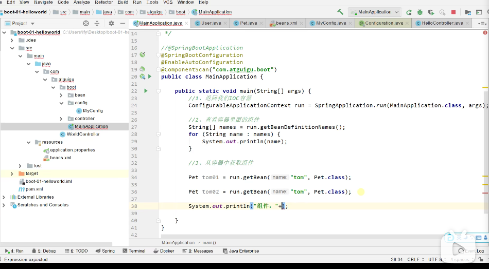
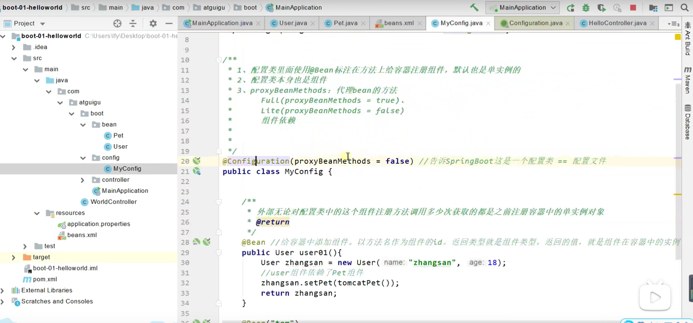
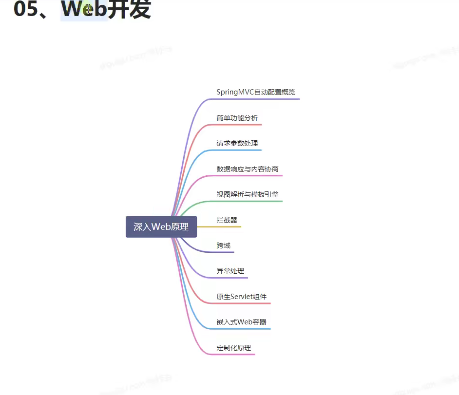
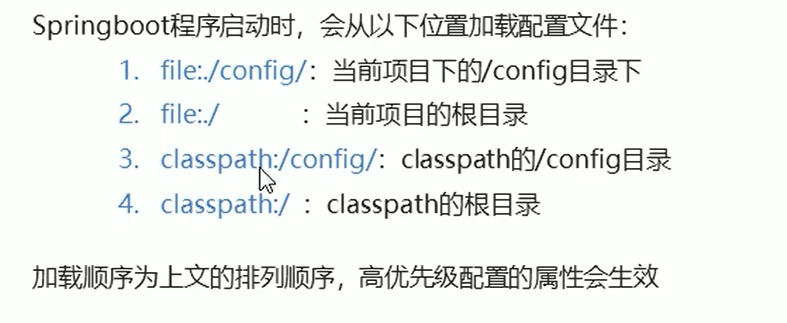

## SpringBoot2视频

### P1课程介绍

SpringBoot2: 

第一季：SpringBoot2核心技术:入门，核心功能，场景整合

第二季：SpringBoot2响应式编程:基础开发用响应式来替代，基础，Webflux开发web应用，少量资源——大并发，极高吞吐量的应用;持久化访问;响应式安全开发;响应式原理(Reactor, Netty)

语雀平台

### 官方笔记参考网站

[SpringBoot2核心技术与响应式编程 · 语雀 (yuque.com)](https://www.yuque.com/atguigu/springboot)


学习要求

- 熟悉Spring基础
- 熟悉Maven使用

底层注解

### P08底层注解`@Configuration`

@Configuration(proxyBeanMethods = true)    告诉SpringBoot这是一个配置类 == 配置文件

之前在beans.xml里面用 `bean`标签

现在使用 `@Bean`注解

默认是单实例的





配置速度， `false`的情况下启动会非常快。 `true`的情况下，容器依赖另外一个容器

笔记文档

[03、了解自动配置原理 · 语雀 (yuque.com)](https://www.yuque.com/atguigu/springboot/qb7hy2#0tCTs)

### P09 底层注解`@Import`

除了Spring里原先有的 

`@Import`导入组件

### P10 底层注解`@Conditional`

条件装配

### P11底层注解`@ImportResource`

`@ImportResource("classpath:beans.xml")`  允许使用以前Spring导入配置文件形式导入`Bean`

内路径

### P12 底层注解`@ConfigurationProperties`(prefix = "")配置绑定

在容器中生效，前面加上 `@Component`;和核心配置文件 `application.properties`下哪个 **'prefix'** 有关

2:配置类中其启动 `@EnableConfigurationProperties(Car.class)`

**P13 自动配置 自动包规则原理**

`@SpringBootApplication`点进去源码，`@SpringBootConfiguration`代表配置类

最重要`@EnableAutoConfiguration`源码 `@Import`下 `@AutoConfigurationPackage`自动配置包，将包下文件夹内所有组件导入

**P14 源码分析 初始加载自动配置类**

127个场景自动配置启动，默认全部加载。最终按照条件装配规则(`@Conditional`)，按需配置。

**P15 自动配置 自动装配流程**

 看得晕

### P16 最佳实践

 引入`start`,实践更改`banner`

### P22web场景-web开发简洁

先用在细节

雷电之神而不是锤子之神



### P25web场景，源码分析，静态资源管理


### P26请求处理Rest映射及源码分析

- 什么是请求处理？  `@xxxMapping`注解

- Rest风格（使用HTTP GET, POST, DELETE, PUT请求方式动词来表示对资源操作）

  

  问题 `PUT`, `DELETE`默认`GET`

  `@RequestMapping(value= , method = RequestMethod.XXX)` == `@XxxMapping("")`  注意大小写

- 查看 `WebMvcAutoConfiguration`

  

Rest风格

**P27请求处理怎么改变默认的method**

- 在 `config`目录下写 `WebConfig`。 写 `HiddenHttpMethodFilter`方法  自定义规则

### P28请求处理-源码分析-请求映射原理

所有的请求都回到 `DispatchServlet`

要研究（SPRIGNBOOT SpringMVC）请求处理最终都会到 `doDispatch`  官方笔记有图

自动调用 `HandlerMapping`

### P29请求处理常用参数注解使用

详细见视频和文档的使用，大致是接受请求，处理请求，打印请求，输出请求。

只要我们在括号参数里加上`@相应类型`注解, `SpringMVC`自动将参数确定好值

### P30请求处理-@RequestAttribute

页面转发的时候获取 `request`域属性

一个跳到另一个

### P31-@MatrixVariable与UrlPathHelper

补看，讲的针不错。需要结合文档，视频，慢慢领会。

### P32、请求处理-【源码分析】-各种类型参数解析原理

看源码 结合官方笔记

打断点，执行程度。不打断点，不执行程序，光靠Ctrl + Click 不能像断点debug模式下的那样一层层地深入。

从 `DispatchServlet`开始 `debug`来看每一个的过程

HandlerMapping中找到处理请求的Handler

HandlerAdapter适配器(四种 RequestMappingHandler, HandlerFunction, HttpRequestHandler, SimpleControllerHandler) 适配器处理方法

执行目标方法 

执行目标方法关键设置参数解析器(26个，Argument Resolver) (含判断参数支不支持解析，所以决定了放进去的参数)


### P33、请求处理-【源码分析】-Servlet API参数解析原理


### P34、请求处理-【源码分析】-Model、Map原理


### P35、请求处理-【源码分析】-自定义参数绑定原理

### P36、请求处理-【源码分析】-自定义Converter原理

### P37、响应处理-【源码分析】-ReturnValueHandler原理

### P38、响应处理-【源码分析】-HTTPMessageConverter原理


### P39、响应处理-【源码分析】-内容协商原理


### P40、响应处理-【源码分析】-基于请求参数的内容协商原理

### P44

模板解析经过请求处理最终由模板引擎来解析

直接访问只能访问静态文件夹

处理了一个请求，请求名叫 */main.html* *最终跳到main*页面


### P45


## Spring Boot（官方文档）

[GitHub - spring-projects/spring-boot: Spring Boot](https://github.com/spring-projects/spring-boot)

1. Introducing Spring Boot

   -  create stand-alone, production-grade Spring-based applications .

2. Developing Your First Spring Boot Application

   `@RestController`:  *stereotype* （刻板印象）annotation. 告诉你或者别的程序员our class is a web `@Controller`, so Spring considers it when handling incoming web requests.

   

   `@RequestMapping`:  provides “routing” information; The `@RestController("/")` annotation tells Spring ( any HTTP request with the `/` path) to render the resulting string(annotation下面的方法) directly back to the caller.

   

   `@EnableAutoConfiguration`. tells Spring Boot to “guess” how you want to configure Spring, based on the jar dependencies that you have added. 

   (e.g.)Since `spring-boot-starter-web` added Tomcat and Spring MVC, the auto-configuration assumes that you are developing a web application and sets up Spring accordingly.

   - 要在`pom.xml`下执行 `mvn spring-boot:run`

   - 执行`mvn spring-boot:run` `出现cannot find symbol   symbol: class "RestController"`错误。解决办法：在`Intellij`里导入项目，然后根据自动提示，`import`所需的类，IDEA里成功运行，换到命令行，运行成功。

     

     **main** method: SpringApplication.run(MyApplication.class, args);

   ### Creating an Executable Jar

   To create an executable jar, we need to add the `spring-boot-maven-plugin` to our `pom.xml`. 

   ```xml
   <build>
       <plugins>
           <plugin>
               <groupId>org.springframework.boot</groupId>
               <artifactId>spring-boot-maven-plugin</artifactId>
           </plugin>
       </plugins>
   </build>
   ```

   peek inside, "jar tvf"

   `$ jar tvf target/myproject-0.0.1-SNAPSHOT.jar`

   `java -jar target/myproject-0.0.1-SNAPSHOT.jar`

3. 进阶学习

   task-oriented type of developer: jump over to [spring.io](https://spring.io/) and check out some of the [getting started](https://spring.io/guides/) guides that solve specific “How do I do that with Spring?” problems. We also have Spring Boot-specific “[How-to](https://docs.spring.io/spring-boot/docs/current/reference/html/howto.html#howto)” reference documentation

   Otherwise, the next logical step is to read *[using.html](https://docs.spring.io/spring-boot/docs/current/reference/html/using.html#using)*.  impatient,  jump ahead and read about *[Spring Boot features](https://docs.spring.io/spring-boot/docs/current/reference/html/features.html#features)*.

4. Developing with Spring Boot

   - site: [Developing with Spring Boot](https://docs.spring.io/spring-boot/docs/current/reference/html/using.html#using)

   - Builder Systems, dependency management: 

     ​	**Maven**:	

     - Reference ([HTML](https://docs.spring.io/spring-boot/docs/2.5.4/maven-plugin/reference/htmlsingle/) and [PDF](https://docs.spring.io/spring-boot/docs/2.5.4/maven-plugin/reference/pdf/spring-boot-maven-plugin-reference.pdf))

     - [API](https://docs.spring.io/spring-boot/docs/2.5.4/maven-plugin/api/)

     - ###      Gradle

       - Reference ([HTML](https://docs.spring.io/spring-boot/docs/2.5.4/gradle-plugin/reference/htmlsingle/) and [PDF](https://docs.spring.io/spring-boot/docs/2.5.4/gradle-plugin/reference/pdf/spring-boot-gradle-plugin-reference.pdf))

       - [API](https://docs.spring.io/spring-boot/docs/2.5.4/gradle-plugin/api/)

         **Ant**:Apache Ant+Ivy

   - Starters

     Starters are a set of convenient dependency descriptors that you can include in your application. 

     one-stop shop for all the Spring and relative technologies.(e.g. Spring and JPA to access the database, `spring-boot-starter-data-jpa`)

     starters: application starters, production starters, technical starters

     More details about the starters([Developing with Spring Boot](https://docs.spring.io/spring-boot/docs/current/reference/html/using.html#using))

   - Structuring your code

     A class which does not have a `package` declaration is "default package". But, it is not recommended. It will cause problems when use the `@ComponentScan`, `@ConfigurationPropertiesScan`, `@EntityScan`.

     `@SpringBootApplication` annotation locates your main application class in a root package above other classes.

     

   - Configuration Classes

     primary source be a single `@Configuration` class

     Spring配置： `SpringApplication` with XML

     The `@Import` annotation can be used to import additional configuration classes.

     `@ComponentScan`：pick up all Spring components

     **must** (如果一定要使用)use XML based configuration：start with a `@Configuration` class

     use an `@ImportResource` annotation to load XML configuration files

   - Auto-configuration

     automatically configure your Spring application based on the jar dependencies

     opt-in to auto-configuration: adding the `@EnableAutoConfiguration` or `@SpringBootApplication` annotations to one of your `@Configuration` classes

     - ### Gradually Replacing Auto-configuration: define your own configuration,  `--debug` switch to see the current configuration 

     - ### Disabling Specific Auto-configuration Classes

       ```java
       @SpringBootApplication(exclude = { DataSourceAutoConfiguration.class }) public class MyApplication { }
       ```

       

   - Spring Beans and Dependency Injection

     - Sprign Beans: 简单来讲就是被Ioc(Inversion of control)所管理的对象,具体需要通过案例理解：[What is a Spring Bean? | Baeldung](https://www.baeldung.com/spring-bean)

     - Recommend using constructor injection to wire up dependencies and `@ComponentScan` to find beans.

       ​	constructor injection: [Constructor Dependency Injection in Spring | Baeldung](https://www.baeldung.com/constructor-injection-in-spring)

     - If you use the recommended way: add `@ComponentScan` without any arguments or use the `@SpringBootApplication` annotation which implicitly includes it. 

       application components (`@Component`, `@Service`, `@Repository`, `@Controller` etc.) are automatically registered as Spring Beans

       (e.g. `@Service` Bean that uses constructor injection to obtain a required `RiskAssessor` bean:

       ​	

       ```java
       @Service
       public class MyAccountService implements AccountService {
       
           private final RiskAssessor riskAssessor;
       
           public MyAccountService(RiskAssessor riskAssessor) {
               this.riskAssessor = riskAssessor;
           }
       
           // ...
       
       }
       ```

       

       ```java
       @Service
       public class MyAccountService implements AccountService {
       
           private final RiskAssessor riskAssessor;
       
           private final PrintStream out;
       
           @Autowired  //use to mark which one you want Spring to use with @Autowired
           public MyAccountService(RiskAssessor riskAssessor) {
               this.riskAssessor = riskAssessor;
               this.out = System.out;
           }
       
           public MyAccountService(RiskAssessor riskAssessor, PrintStream out) {
               this.riskAssessor = riskAssessor;
               this.out = out;
           }
       
           // ...
       
       }
       ```

       

       )

     - Using the @SpringBootApplication Annotation

       `@SpringBootApplication` annotation enable three features: @SpringBootConfiguration, @ComponentScan, @EnableAutoConfiguration

       

       

     - Running Your Application

       - IDE

       - as a Packaged Application

       - Using the Maven Plugin

       - Using the Gradle Plugin

       - Hot Swapping: 

         ​	Hot swapping is the term given to **the process of replacing a key component of a computer system while it's still running**

         

     - Developer Tools

       make the application development experience a little more pleasant

       To include devtools support, add the module dependency to your build

       Maven:

       ```xml
       <dependencies>
           <dependency>
               <groupId>org.springframework.boot</groupId>
               <artifactId>spring-boot-devtools</artifactId>
               <optional>true</optional>
           </dependency>
       </dependencies>
       ```

       Gradle:

       ```groovy
       dependencies {
           developmentOnly("org.springframework.boot:spring-boot-devtools")
       }
       ```

        	

     - Developer Tools

       1. Spring Boot use caches to improve performance

          ​	it can be counter-productive during development, preventing you from seeing the changes you just made in your application. For this reason, spring-boot-devtools disables the caching options by default

          ​	For a complete list of the properties that are applied by the devtools:

          ​		[DevToolsPropertyDefaultsPostProcessor](https://github.com/spring-projects/spring-boot/tree/v2.5.4/spring-boot-project/spring-boot-devtools/src/main/java/org/springframework/boot/devtools/env/DevToolsPropertyDefaultsPostProcessor.java).

       2. Property Defaults

          - Automatic Restart
          - LiveReload
          - Global Settings
          - Remote Applications

       3. 

       4. 

   

   - Spring Boot Features

     dives into the details of Spring Boot;the key features that you may want to use and customize.

     [Spring Boot Features](https://docs.spring.io/spring-boot/docs/current/reference/html/features.html#features.spring-application)

     - Spring Application

       The `SpringApplication` class provides a convenient way to bootstrap a Spring application that is started from a `main()` method

       

     - 1

     - 2

   - Spring Boot Actuator: Production-ready Features

5. 

   

## **SpringBoot一些博客阅读**

[GitHub - ityouknow/spring-boot-examples: about learning Spring Boot via examples. Spring Boot 教程、技术栈示例代码，快速简单上手教程。](https://github.com/ityouknow/spring-boot-examples)

[Spring Boot 2(一)：【重磅】Spring Boot 2.0权威发布 - 纯洁的微笑博客 (ityouknow.com)](http://www.ityouknow.com/springboot/2018/03/01/spring-boot-2.0.html)

微笑看得博客：池建强

SpringBoot2

响应式编程：使用 Spring WebFlux/WebFlux.fn提供响应式 Web 编程支持， Webflux 是一个全新的非堵塞的函数式 Reactive Web 框架，可以用来构建异步的、非堵塞的、事件驱动的服务，在伸缩性方面表现非常好，此功能来源于Spring5.0。

Spring Boot2.0也提供对响应式编程的自动化配置，如：Reactive Spring Data、Reactive Spring Security 等

[SpringBoot2核心技术与响应式编程 · 语雀 (yuque.com)](https://www.yuque.com/atguigu/springboot)

结合尚硅谷的教程视频

## **SpringBoot(黑马6h入门Java微服务架构)**

1. 入门第一个应用程序

   Spring Initializr快速构建

   maven pom.xml文件解析，自动构建整个应用

   main

   resources 里面有一个 application.properties(我按照Spring官方文档上写的没有resources)

   test

   

2. 起步依赖原理

   starter 视频里称之为坐标

   可以追到其最上面的父依赖

   技术版本选择做的很好，拿来即用，如果自己配，容易出问题

3. 配置文件分类

   xml

   properties: 格式： server.port=8080

   yaml/yml

   优先级: application.properties > yml > yaml

   yaml优点：层次分明，计算机读取容易

   **语法**

   对象

   ​	server:

   ​		port: 8080(有一个空格, 大小写敏感)

   对象行内写法：

   ​	server: {port: 8080}

   数组：

   ​	address:

   ​		- beijing         （注意空格，不能用Tab,各个系统缩进不同）

   ​		- shanghai

   数组内行

   纯量

   **读取配置内容**

   ​	1 @Value   "${}"

   ​	2 Environment  @Autowired env.getProperty("")

   ​	3 @ConfigurationProperties  @Component  @ConfigurationProperties(prefix = "")

4. profile(完成不同环境下，配置动态切换功能的)

   程序被安装到不同环境（开发，测试，生产），服务器端口，数据库地址等配置不同。

   1)profile配置方式

   ​	多profile文件方式:

   ​		application.properties:

   ​		application-dev.properties

   ​		application-pro.properties

   ​		application-test.properties

   ​		如何激活：在application.properties中写 spring.profiles.active=

   ​	yml多文档方式:

   ​		server: 

   ​			port: 8081

   ​		spring:

   ​			profiles: dev

   

   ​		server:

   ​			port: 8082

   ​		spring:

   ​			profiles: test

   2)profile激活方式

   ​	配置文件

   ​	虚拟机参数:

   ​		VM options:

   ​		-Dspring.profiles.active=test

   ​	命令行参数:

   ​		maven工具打包成jar包，运行， 最后面加入 --spring.profiles.active=pro

   ​		Program arguments:

   ​		--spring.profiles.active=pro

      优点： 不用改原有配置文件

   

5. SpringBoot配置-项目内部配置文件加载顺序

   内部配置加载顺序：

   

   外部配置加载顺序：spring-config-location

6. SpringBoot 整合其他框架

   体验快速-快速整合其他框架

   **SpringBoot 整合 JUnit**

   @RunWith(SpringRunner.class)

   @SpringBootTest(classes = 引导类名称)

   **SpringBoot整合Redis**

   搭建SB工程

   引入redis起步依赖

   配置redis相关属性

   注入RedisTemplcate模板

   编写测试方法

7. 

## Building REST 

- **nonrest** — Simple Spring MVC app with no hypermedia
- **rest** — Spring MVC + Spring HATEOAS app with HAL representations of each resource
- **evolution** — REST app where a field is evolved but old data is retained for backward compatibility
- **links** — REST app where conditional links are used to signal valid state changes to clients

(Representational State Transfer)services with Spring（广泛应用在微服务领域）

- REST

  [表现层状态转换 - 维基百科，自由的百科全书 (wikipedia.org)](https://zh.wikipedia.org/wiki/表现层状态转换)

  

  表现层状态转换是根基于[超文本传输协议（HTTP）](https://zh.wikipedia.org/wiki/超文本传输协议)之上而确定的一组约束和属性，是一种设计提供万维网络服务的[软件构建风格](https://zh.wikipedia.org/wiki/軟件架構)。符合或兼容于这种架构风格（简称为 REST 或 RESTful）的网络服务，允许客户端发出以[统一资源标识符](https://zh.wikipedia.org/wiki/统一资源标志符)访问和操作网络资源的请求，而与预先定义好的无状态操作集一致化。因此表现层状态转换提供了在互联网络的计算系统之间，彼此资源可交互使用的协作性质（interoperability）。相对于其它种类的网络服务，例如SOAP服务，则是以本身所定义的操作集，来访问网络上的资源。

  

  目前在三种主流的[Web服务](https://zh.wikipedia.org/wiki/Web服务)实现方案中，因为REST模式与复杂的[SOAP](https://zh.wikipedia.org/wiki/SOAP)和[XML-RPC](https://zh.wikipedia.org/wiki/XML-RPC)相比更加简洁，越来越多的Web服务开始采用REST风格设计和实现。例如，[Amazon.com](https://zh.wikipedia.org/wiki/Amazon.com)提供接近REST风格的Web服务运行图书查询；[雅虎](https://zh.wikipedia.org/wiki/雅虎)提供的Web服务也是REST风格的。

  

  REST是设计风格而**不是**标准。REST通常基于[HTTP](https://zh.wikipedia.org/wiki/HTTP)、[URI](https://zh.wikipedia.org/wiki/URI)、[XML](https://zh.wikipedia.org/wiki/XML)以及[HTML](https://zh.wikipedia.org/wiki/HTML)这些现有的广泛流行的协议和标准。

  - 资源是由URI来指定。
  - 对资源的操作包括获取、创建、修改和删除，这些操作正好对应HTTP协议提供的GET、POST、PUT和DELETE方法。
  - 通过操作资源的表现形式来操作资源。
  - 资源的表现形式则是XML或者HTML，取决于读者是机器还是人、是消费Web服务的客户软件还是Web浏览器。当然也可以是任何其他的格式，例如JSON。

- 微服务

  **微服务**（英语：Microservices）是一种[软件架构风格](https://zh.wikipedia.org/wiki/软件架构)，它是以专注于单一责任与功能的小型功能区块 (Small Building Blocks) 为基础，利用模块化的方式组合出复杂的大型应用程序，各功能区块使用与语言无关 (Language-Independent/Language agnostic）的[API](https://zh.wikipedia.org/wiki/应用程序接口)集相互通信。

- aim

  use the Spring portfolio to build a RESTful service while leveraging the stackless features of REST.

- REST: the de-facto standard for building web services on the web

  - Pros: easy to build and easy to consume.

  - Why REST?

    embraces the precepts of the web, including its architecture, benefits, and everything else

  - By building on top of HTTP, REST APIs provide the means to build:

    - Backwards compatible APIs
    - Evolvable APIs
    - Scaleable services
    - Securable services
    - A spectrum of stateless to stateful services   

- Big picture

  We’re going to create **a simple payroll service** that manages the employees of a company. We’ll **store employee objects in a (H2 in-memory) database**, and **access them (via something called JPA)**. Then we’ll **wrap that with something** that will allow access over the internet (called the **Spring MVC layer**).

  - New keyword:

    microservices RESTful services: a software architecture, a style not a standard, independent small module for small building blocks

    建立Employee实例对象(Bean)新见到的东西

    ```java
    @Entity
    class Employee {
    
      private @Id @GeneratedValue Long id;
        
    //@Entity is a JPA annotation to make this object ready for storage in a JPA-based data store.
    
    //id, name, and role are attributes of our Employee domain object. id is marked with more JPA annotations to indicate it’s the primary key and automatically populated by the JPA provider.
        
    //引申到 Spring Data JPA to handle the tedious database interactions.
        地址 https://spring.io/guides/gs/accessing-data-jpa/
    ```

    #### Spring Date JPA

    - Spring Data JPA repositories

      Spring Data JPA repositories are interfaces with methods supporting creating, reading, updating, and deleting records against a back end data store. 

    - You need not write an implementation of the repository interface. Spring Data JPA creates an implementation when you run the application

    - Create an Application Class

      ```java
      package com.example.accessingdatajpa;
      
      import org.springframework.boot.SpringApplication;
      import org.springframework.boot.autoconfigure.SpringBootApplication;
      
      @SpringBootApplication
      public class AccessingDataJpaApplication {
      
        public static void main(String[] args) {
          SpringApplication.run(AccessingDataJpaApplication.class, args);
        }
      
      }
      ```

      `@SpringBootApplication` is a convenience annotation that adds all of the following:

      - `@Configuration`: Tags the class as a source of bean definitions for the application context.

      - `@EnableAutoConfiguration`: Tells Spring Boot to start adding beans based on classpath settings, other beans, and various property settings. For example, if `spring-webmvc` is on the classpath, this annotation flags the application as a web application and activates key behaviors, such as setting up a `DispatcherServlet`.

      - `@ComponentScan`: Tells Spring to look for other components, configurations, and services in the `com/example` package, letting it find the controllers.

      - 执行代码问题

        `No plugin found for prefix 'spring-boot' in the current project and in the plugin groups`

        原因：未在`pom.xml`文件所在位置执行命令

    - Build an executable JAR

      build the JAR file with `./mvnw clean package` and then run the JAR file, as follows:

      `java -jar target/gs-accessing-data-jpa-0.1.0.jar` 执行jar   

      注：和官方文档不太一样，没找到`gs-accessing-data-jpa-0.1.0.jar`

      `java -jar target/accessing-data-jpa-0.0.1-SNAPSHOT.jar`我改的命令运行成功

      

      进阶阅读**Converting a Spring Boot JAR Application to a WAR**

      这里粗略补充war和jar区别：

      war是JavaWeb可执行文件，通常在项目部署后转成war

      [Getting Started | Converting a Spring Boot JAR Application to a WAR](https://spring.io/guides/gs/convert-jar-to-war/)

    - 衍生阅读

      Accessing JPA Data with REST

      [Getting Started | Accessing JPA Data with REST (spring.io)](https://spring.io/guides/gs/accessing-data-rest/)

  - `EmployeeRepository`

    `interface EmployeeRepository extends JpaRepository<Employee, Long>`

    Spring makes accessing data easy. By simply declaring the following `EmployeeRepository` interface we automatically will be able to

    - Create new Employees

    - Update existing ones

    - Delete Employees

    - Find Employees (one, all, or search by simple or complex properties)

      ```java
      //Application执行代码
      //@SpringBootApplication is a meta-annotation that pulls in component scanning, autoconfiguration, and property support. 
      @SpringBootApplication
      public class PayrollApplication {
      
        public static void main(String... args) {
          SpringApplication.run(PayrollApplication.class, args);
        }
      }
      ```

  - `LoadDatabase`

    ```java
    @Configuration
    class LoadDatabase {
    
      private static final Logger log = LoggerFactory.getLogger(LoadDatabase.class);
    
      @Bean
      CommandLineRunner initDatabase(EmployeeRepository repository) {
    
        return args -> {
          log.info("Preloading " + repository.save(new Employee("Bilbo Baggins", "burglar")));
          log.info("Preloading " + repository.save(new Employee("Frodo Baggins", "thief")));
        };
      }
    }
    ```

    - Spring Boot will run ALL `CommandLineRunner` beans once the application context is loaded.
    - This runner will request a copy of the `EmployeeRepository` you just created.
    - Using it, it will create two entities and store them.

**HTTP is the Platform**

To wrap your repository with a web layer, you must turn to Spring MVC. 

- EmployeeController.java

  ```java
  @RestController
  class EmployeeController {
  
    private final EmployeeRepository repository;
  
    EmployeeController(EmployeeRepository repository) {
      this.repository = repository;
    }
  
  
    // Aggregate root
    // tag::get-aggregate-root[]
    @GetMapping("/employees")
    List<Employee> all() {
      return repository.findAll();
    }
    // end::get-aggregate-root[]
  
    @PostMapping("/employees")
    Employee newEmployee(@RequestBody Employee newEmployee) {
      return repository.save(newEmployee);
    }
  
    // Single item
    
    @GetMapping("/employees/{id}")
    Employee one(@PathVariable Long id) {
      
      return repository.findById(id)
        .orElseThrow(() -> new EmployeeNotFoundException(id));
    }
  
    @PutMapping("/employees/{id}")
    Employee replaceEmployee(@RequestBody Employee newEmployee, @PathVariable Long id) {
      
      return repository.findById(id)
        .map(employee -> {
          employee.setName(newEmployee.getName());
          employee.setRole(newEmployee.getRole());
          return repository.save(employee);
        })
        .orElseGet(() -> {
          newEmployee.setId(id);
          return repository.save(newEmployee);
        });
    }
  
    @DeleteMapping("/employees/{id}")
    void deleteEmployee(@PathVariable Long id) {
      repository.deleteById(id);
    }
  }
  ```

  - `@RestController` indicates that the data returned by each method will be written straight into the response body instead of rendering a template.

  - An `EmployeeRepository` is injected by constructor into the controller.

  - We have routes for each operation (`@GetMapping`, `@PostMapping`, `@PutMapping` and `@DeleteMapping`, corresponding to HTTP `GET`, `POST`, `PUT`, and `DELETE` calls). (NOTE: It’s useful to read each method and understand what they do.)

  - `EmployeeNotFoundException` is an exception used to indicate when an employee is looked up but not found.

    ```java
    class EmployeeNotFoundException extends RuntimeException {
    
      EmployeeNotFoundException(Long id) {
        super("Could not find employee " + id);
      }
    }
    ```

  - `EmployeeNotFoundAdvice.java`

    ```java
    @ControllerAdvice
    class EmployeeNotFoundAdvice {
    
      @ResponseBody
      @ExceptionHandler(EmployeeNotFoundException.class)
      @ResponseStatus(HttpStatus.NOT_FOUND)
      String employeeNotFoundHandler(EmployeeNotFoundException ex) {
        return ex.getMessage();
      }
    }
    ```

    - `@ResponseBody` signals that this advice is rendered straight into the response body.
    - `@ExceptionHandler` configures the advice to only respond if an `EmployeeNotFoundException` is thrown.
    - `@ResponseStatus` says to issue an `HttpStatus.NOT_FOUND`, i.e. an **HTTP 404**.
    - The body of the advice generates the content. In this case, it gives the message of the exception.

  - curl -v localhost:8080/employees

    curl is used in command lines or scripts to transfer data. curl is also used in cars, television sets, routers, printers, audio equipment, mobile phones, tablets, settop boxes, media players and is the Internet transfer engine for thousands of software applications in over *ten billion installations*.

    curl is used daily by virtually every Internet-using human on the globe.

    命令行工具，用来请求 Web 服务器。

    具体没太搞懂，大概是可以得到http请求的一些东西(更熟悉的是httpget)

    ```java
    *   Trying ::1...
    * TCP_NODELAY set
    * Connected to localhost (::1) port 8080 (#0)
    > GET /employees HTTP/1.1
    > Host: localhost:8080
    > User-Agent: curl/7.54.0
    > Accept: */*
    >
    < HTTP/1.1 200
    < Content-Type: application/json;charset=UTF-8
    < Transfer-Encoding: chunked
    < Date: Thu, 09 Aug 2018 17:58:00 GMT
    <
    * Connection #0 to host localhost left intact
    [{"id":1,"name":"Bilbo Baggins","role":"burglar"},{"id":2,"name":"Frodo Baggins","role":"thief"}]
    ```

    ```java
    //Add update delete
    curl -X POST localhost:8080/employees -H 'Content-type:application/json' -d '{"name": "Samwise Gamgee", "role": "gardener"}'
    curl -X PUT localhost:8080/employees/3 -H 'Content-type:application/json' -d '{"name": "Samwise Gamgee", "role": "ring bearer"}'
    curl -X DELETE localhost:8080/employees/3
    ```

    In fact, what we have built so far is better described as  **RPC** (**Remote Procedure Call**). That’s because there is no way to know how to interact with this service. If you published this today, you’d also have to write a document or host a developer’s portal somewhere with all the details.

  - What makes something RESTful?

    So far, you have a web-based service that handles the core operations involving employee data. But that’s not enough to make things "RESTful".

    - Pretty URLs like `/employees/3` aren’t REST.
    - Merely using `GET`, `POST`, etc. isn’t REST.
    - Having all the CRUD operations laid out isn’t REST.

    This statement of Roy Fielding’s may further lend a clue to the difference between **REST** and **RPC**:

    > I am getting frustrated by the number of people calling any HTTP-based interface a REST API. Today’s example is the SocialSite REST API. That is RPC. It screams RPC. There is so much coupling on display that it should be given an X rating.
    >
    > What needs to be done to make the REST architectural style clear on the notion that hypertext is a constraint? In other words, if the engine of application state (and hence the API) is not being driven by hypertext, then it cannot be RESTful and cannot be a REST API. Period. Is there some broken manual somewhere that needs to be fixed?

    — Roy Fielding
    https://roy.gbiv.com/untangled/2008/rest-apis-must-be-hypertext-driven

  The side effect of NOT including hypermedia in our representations is that clients MUST hard code URIs to navigate the API. This leads to the same brittle nature that predated the rise of e-commerce on the web. It’s a signal that our JSON output needs a little help.（JSON需要一点帮助的信号？预示了电子商务的兴起？）

**Spring HATEOAS**

a Spring project aimed at helping you write hypermedia-driven outputs.

 A key design goal of Spring HATEOAS is to make it easier to do The Right Thing™. In this scenario: adding hypermedia to your service without hard coding a thing.

Adding Spring HATEOAS to `dependencies` section of `pom.xml`

```xml
<dependency>
	<groupId>org.springframework.boot</groupId>
	<artifactId>spring-boot-starter-hateoas</artifactId>
</dependency>
```

```java
@GetMapping("/employees/{id}")
EntityModel<Employee> one(@PathVariable Long id) {

  Employee employee = repository.findById(id) //
      .orElseThrow(() -> new EmployeeNotFoundException(id));

  return EntityModel.of(employee, //
      linkTo(methodOn(EmployeeController.class).one(id)).withSelfRel(),
      linkTo(methodOn(EmployeeController.class).all()).withRel("employees"));
}
```

- `EntityModel<T>` is a generic container from Spring HATEOAS that includes not only the data but a collection of links.

- `linkTo(methodOn(EmployeeController.class).one(id)).withSelfRel()` asks that Spring HATEOAS build a link to the `EmployeeController` 's `one()` method, and flag it as a [self](https://www.iana.org/assignments/link-relations/link-relations.xhtml) link.
- `linkTo(methodOn(EmployeeController.class).all()).withRel("employees")` asks Spring HATEOAS to build a link to the aggregate root, `all()`, and call it "employees".

One of Spring HATEOAS’s core types is `Link`. It includes a **URI** and a **rel** (relation). Links are what empower the web. Before the World Wide Web, other document systems would render information or links, but it was the linking of documents WITH this kind of relationship metadata that stitched the web together.

Roy Fielding encourages building APIs with the same techniques that made the web successful, and links are one of them.

```java
{
  "id": 1,
  "name": "Bilbo Baggins",
  "role": "burglar",
  "_links": {
    "self": {
      "href": "http://localhost:8080/employees/1"
    },
    "employees": {
      "href": "http://localhost:8080/employees"
    }
  }
}
```

This decompressed output shows not only the data elements you saw earlier (`id`, `name` and `role`), but also a `_links` entry containing two URIs. This entire document is formatted using [HAL](http://stateless.co/hal_specification.html).

HAL is a lightweight [mediatype](https://tools.ietf.org/html/draft-kelly-json-hal-08) that allows encoding not just data but also hypermedia controls, alerting consumers to other parts of the API they can navigate toward. In this case, there is a "self" link (kind of like a `this` statement in code) along with a link back to the **[aggregate root](https://www.google.com/search?q=What+is+an+aggregate+root)**.

To make the aggregate root ALSO more RESTful, you want to include top level links while ALSO including any RESTful components within.


```java
@GetMapping("/employees")
CollectionModel<EntityModel<Employee>> all() {

  List<EntityModel<Employee>> employees = repository.findAll().stream()
      .map(employee -> EntityModel.of(employee,
          linkTo(methodOn(EmployeeController.class).one(employee.getId())).withSelfRel(),
          linkTo(methodOn(EmployeeController.class).all()).withRel("employees")))
      .collect(Collectors.toList());

  return CollectionModel.of(employees, linkTo(methodOn(EmployeeController.class).all()).withSelfRel());
}
```

`CollectionModel<>` is another Spring HATEOAS container; it’s aimed at encapsulating collections of resources—instead of a single resource entity, like `EntityModel<>` from earlier. 

`CollectionModel<>`, too, lets you include links.

- Simplifying Link Creation

  ```java
  @Component
  class EmployeeModelAssembler implements RepresentationModelAssembler<Employee, EntityModel<Employee>> {
  
    @Override
    public EntityModel<Employee> toModel(Employee employee) {
  
      return EntityModel.of(employee, //
          linkTo(methodOn(EmployeeController.class).one(employee.getId())).withSelfRel(),
          linkTo(methodOn(EmployeeController.class).all()).withRel("employees"));
    }
  }
  ```

This simple interface has one method: `toModel()`. It is based on converting a non-model object (`Employee`) into a model-based object (`EntityModel<Employee>`).

All the code you saw earlier in the controller can be moved into this class. And by applying Spring Framework’s `@Component` annotation, the assembler will be automatically created when the app starts.

**Getting single item resource using the assembler**

```java
@GetMapping("/employees/{id}")
EntityModel<Employee> one(@PathVariable Long id) {

  Employee employee = repository.findById(id) //
      .orElseThrow(() -> new EmployeeNotFoundException(id));

  return assembler.toModel(employee);
}
```

**Getting aggregate root resource using the assembler**

```java
//这块可以对比下，运用了流
/*.map(employee -> EntityModel.of(employee,
          linkTo(methodOn(EmployeeController.class).one(employee.getId())).withSelfRel(),
          linkTo(methodOn(EmployeeController.class).all()).withRel("employees")))
          */
@GetMapping("/employees")
CollectionModel<EntityModel<Employee>> all() {

  List<EntityModel<Employee>> employees = repository.findAll().stream() //
      .map(assembler::toModel) //
      .collect(Collectors.toList());

  return CollectionModel.of(employees, linkTo(methodOn(EmployeeController.class).all()).withSelfRel());
}
```

At this stage, you’ve created a **Spring MVC REST controller** that actually produces **hypermedia-powered content**! Clients that don’t speak HAL can ignore the extra bits while consuming the pure data. Clients that DO speak HAL can navigate your empowered API.

But that is not the only thing needed to build a truly RESTful service with Spring.

**Evolving REST APIs**

An important facet of REST is the fact that it’s neither a technology stack nor a single standard.

REST is a collection of architectural constraints that when adopted make your application much more resilient. A key factor of resilience is that when you make upgrades to your services, your clients don’t suffer from downtime.

With REST-based practices, it’s much easier. Especially using the Spring stack.

- Supporting changes to the API

  Imagine this design problem: You’ve rolled out a system with this `Employee`-based record. The system is a major hit. You’ve sold your system to countless enterprises. Suddenly, the need for an employee’s name to be split into `firstName` and `lastName` arises.

  You can always add columns (fields) to a database table. But don’t take one away. The principle in RESTful services is the same.

Add new fields to your JSON representations, but don’t take any away. Like this:

JSON that supports multiple clients

```json
//没搞懂在哪里加
{
  "id": 1,
  "firstName": "Bilbo",
  "lastName": "Baggins",
  "role": "burglar",
  "name": "Bilbo Baggins",
  "_links": {
    "self": {
      "href": "http://localhost:8080/employees/1"
    },
    "employees": {
      "href": "http://localhost:8080/employees"
    }
  }
}
```

You can always add columns (fields) to a database table. But don’t take one away. The principle in RESTful services is the same.

```java
private String firstName;
private String lastName;
private String role;

Employee() {}

Employee(String firstName, String lastName, String role) {
this.firstName = firstName;
this.lastName = lastName;
this.role = role;
public String getName() {
   return this.firstName + " " + this.lastName;
}

public void setName(String name) {
   String[] parts = name.split(" ");
   this.firstName = parts[0];
   this.lastName = parts[1];
}
//还是可以使用getName和setName的方法名
```

- Proper Responses(不是很懂)

  大意是将name 改为`firstName` 和 `lastName`后，进行以下的`PostMapping`然后使用curl命令进行请求web服务器，相应的http相应的结果回传回来，供直接观察。

  ```java
  @PostMapping("/employees")
  ResponseEntity<?> newEmployee(@RequestBody Employee newEmployee) {
  
    EntityModel<Employee> entityModel = assembler.toModel(repository.save(newEmployee));
  
    return ResponseEntity //
        .created(entityModel.getRequiredLink(IanaLinkRelations.SELF).toUri()) //
        .body(entityModel);
  }
  ```

  - The new `Employee` object is saved as before. But the resulting object is wrapped using the `EmployeeModelAssembler`.
  - Spring MVC’s `ResponseEntity` is used to create an **HTTP 201 Created** status message. This type of response typically includes a **Location** response header, and we use the URI derived from the model’s self-related link.


**Building links into your REST API**

**Summary**


**一些概念**

- RPC(Remote Procedure Call)

- Hypermedia

  **Hypermedia**, an extension of the term [hypertext](https://en.wikipedia.org/wiki/Hypertext), is a [nonlinear medium](https://en.wikipedia.org/wiki/Nonlinear_medium) of information that includes graphics, audio, video, plain text and [hyperlinks](https://en.wikipedia.org/wiki/Hyperlink). 

  

  The [World Wide Web](https://en.wikipedia.org/wiki/World_Wide_Web) is a classic example of hypermedia, whereas a non-interactive [cinema](https://en.wikipedia.org/wiki/Movie_theatre) presentation is an example of standard multimedia due to the absence of hyperlinks.

- Hypermedia as the Engine of Application State (**HATEOAS**)

  

## SpringBoot guides

Building a RESTful Web Service

- [Accessing JPA Data with REST](https://spring.io/guides/gs/accessing-data-rest/)

  Java Persistence API (JPA) is a specification provided by Java for APIs accessing various SQL databases. ... Spring Data JPA is **a sub-project of Spring Data** and provides abstraction over the Data Access Layer using Java Persistence API and ORM implementations like Hibernate.

- [Accessing data with MySQL](https://spring.io/guides/gs/accessing-data-mysql/)

- [Accessing MongoDB Data with REST](https://spring.io/guides/gs/accessing-mongodb-data-rest/)

  

  **MongoDB** is a [source-available](https://en.wikipedia.org/wiki/Source-available) [cross-platform](https://en.wikipedia.org/wiki/Cross-platform) [document-oriented database](https://en.wikipedia.org/wiki/Document-oriented_database) program. Classified as a [NoSQL](https://en.wikipedia.org/wiki/NoSQL) database program, MongoDB uses [JSON](https://en.wikipedia.org/wiki/JSON)-like documents with optional [schemas](https://en.wikipedia.org/wiki/Database_schema). MongoDB is developed by [MongoDB Inc.](https://en.wikipedia.org/wiki/MongoDB_Inc.) and licensed under the [Server Side Public License](https://en.wikipedia.org/wiki/Server_Side_Public_License) (SSPL)

  

- [Accessing GemFire Data with REST](https://spring.io/guides/gs/accessing-gemfire-data-rest/)

  Pivotal GemFire is **a data management platform** that provides real-time, consistent access to data-intensive  applications throughout widely distributed cloud architectures. GemFire  pools memory, CPU, network resources, and optionally local disk across  multiple processes to manage application objects and behavior.

- [Building REST services with Spring](https://spring.io/guides/tutorials/rest/)

- [Consuming a RESTful Web Service with rest.js](https://spring.io/guides/gs/consuming-rest-restjs/)

- [Consuming a RESTful Web Service with jQuery](https://spring.io/guides/gs/consuming-rest-jquery/)

- [Consuming a RESTful Web Service with AngularJS](https://spring.io/guides/gs/consuming-rest-angularjs/)

- [Consuming a RESTful Web Service](https://spring.io/guides/gs/consuming-rest/)

- [Building an Application with Spring Boot](https://spring.io/guides/gs/spring-boot/)

- [Creating API Documentation with Restdocs](https://spring.io/guides/gs/testing-restdocs/)

- [Securing a Web Application](https://spring.io/guides/gs/securing-web/)

  


### Building a RESTful Web Service(15min)

```java
package com.example.restservice;

import java.util.concurrent.atomic.AtomicLong;

import org.springframework.web.bind.annotation.GetMapping;
import org.springframework.web.bind.annotation.RequestParam;
import org.springframework.web.bind.annotation.RestController;

@RestController
public class GreetingController {

	private static final String template = "Hello, %s!";
	private final AtomicLong counter = new AtomicLong();

	@GetMapping("/greeting")
	public Greeting greeting(@RequestParam(value = "name", defaultValue = "World") String name) {
		return new Greeting(counter.incrementAndGet(), String.format(template, name));
	}
}
```

@RestController: @Controller + @ResponseBody

`Greeting`对象必须要转换成JSON,不过因为 `Spring's HTTTP`支持,你不需要手动转换，因为 `Jackson2`在路径内,[`MappingJackson2HttpMessageConverter`](https://docs.spring.io/spring/docs/current/javadoc-api/org/springframework/http/converter/json/MappingJackson2HttpMessageConverter.html) is automatically chosen to convert the `Greeting` instance to JSON.

@SpringBootApplication: @Configuration  + @EnableAutoConfiguration + @ComponentScan

- @Configuration: Tags the class as a source of bean
- @EnableAutoConfiguration: 告诉 `SpringBoot`加入`bean`根据路径配置，e.g. `spring-webmvc`在路径里, 一些关键behaviors被激活,比如 `DispatcherServlet`
- @ComponentScan: 告诉Spring寻找其他组件，配置,服务; find the controllers


### Building an Application with Spring Boot(15min)

```java
package com.example.springboot;

import java.util.Arrays;

import org.springframework.boot.CommandLineRunner;
import org.springframework.boot.SpringApplication;
import org.springframework.boot.autoconfigure.SpringBootApplication;
import org.springframework.context.ApplicationContext;
import org.springframework.context.annotation.Bean;

@SpringBootApplication
public class Application {

	public static void main(String[] args) {
		SpringApplication.run(Application.class, args);
	}

	@Bean
	public CommandLineRunner commandLineRunner(ApplicationContext ctx) {
		return args -> {

			System.out.println("Let's inspect the beans provided by Spring Boot:");

			String[] beanNames = ctx.getBeanDefinitionNames();
			Arrays.sort(beanNames);
			for (String beanName : beanNames) {
				System.out.println(beanName);
			}

		};
	}

}
```

**`CommandLineRunner**:

There is also a `CommandLineRunner` method marked as a `@Bean`, and this runs on start up. It retrieves all the beans that were created by your application or that were automatically added by Spring Boot. It sorts them and prints them out.

```java
package com.example.springboot;

import static org.hamcrest.Matchers.equalTo;
import static org.springframework.test.web.servlet.result.MockMvcResultMatchers.content;
import static org.springframework.test.web.servlet.result.MockMvcResultMatchers.status;

import org.junit.jupiter.api.Test;

import org.springframework.beans.factory.annotation.Autowired;
import org.springframework.boot.test.autoconfigure.web.servlet.AutoConfigureMockMvc;
import org.springframework.boot.test.context.SpringBootTest;
import org.springframework.http.MediaType;
import org.springframework.test.web.servlet.MockMvc;
import org.springframework.test.web.servlet.request.MockMvcRequestBuilders;

@SpringBootTest
@AutoConfigureMockMvc
public class HelloControllerTest {

	@Autowired
	private MockMvc mvc;

	@Test
	public void getHello() throws Exception {
		mvc.perform(MockMvcRequestBuilders.get("/").accept(MediaType.APPLICATION_JSON))
				.andExpect(status().isOk())
				.andExpect(content().string(equalTo("Greetings from Spring Boot!")));
	}
}
```

没看懂：

`MockMvc` send HTTP requests into the `DispatcherServlet` and make assertions about the result. Note the use of `@AutoConfigureMockMvc` and `@SpringBootTest` to inject a `MockMvc` instance. Having used `@SpringBootTest`, we are asking for the whole application context to be created. 

An **alternative** would be to ask Spring Boot to create only the web layers of the context by using `@WebMvcTest`. In either case, Spring Boot automatically tries to locate the main application class of your application, but you can override it or narrow it down if you want to build something different.

As well as mocking the HTTP request cycle, **a simple full-stack integration test**.

```java
package com.example.springboot;

import org.junit.jupiter.api.Test;

import org.springframework.beans.factory.annotation.Autowired;
import org.springframework.boot.test.context.SpringBootTest;
import org.springframework.boot.test.web.client.TestRestTemplate;
import org.springframework.http.ResponseEntity;

import static org.assertj.core.api.Assertions.assertThat;

@SpringBootTest(webEnvironment = SpringBootTest.WebEnvironment.RANDOM_PORT)
public class HelloControllerIT {

	@Autowired
	private TestRestTemplate template;

    @Test
    public void getHello() throws Exception {
        ResponseEntity<String> response = template.getForEntity("/", String.class);
        assertThat(response.getBody()).isEqualTo("Greetings from Spring Boot!");
    }
}
```

#### 小插曲

参考的教程：

[Graphite (graphiteapp.org)](https://graphiteapp.org/quick-start-guides/synthesize.html)

折腾`actuator`，`有一个graphite`,本想简单尝试一下，然后发现网络环境不行，尝试vb虚拟机和wsl2，结果网络问题，尝试改wsl2的网络环境。没有成功，网络环境如下。

https://jiayaoo3o.github.io/2020/06/23/%E8%AE%B0%E5%BD%95%E4%B8%80%E6%AC%A1WSL2%E7%9A%84%E7%BD%91%E7%BB%9C%E4%BB%A3%E7%90%86%E9%85%8D%E7%BD%AE/

```
ping: https://gems.hashicorp.com/: Name or service not known
```

**Windows Powershell:**

执行命令`vagrant plugin install vagrant-vbguest`

```
Vagrant failed to load a configured plugin source. This can be caused
by a variety of issues including: transient connectivity issues, proxy
filtering rejecting access to a configured plugin source, or a configured
plugin source not responding correctly. Please review the error message
below to help resolve the issue:

  Errno::ETIMEDOUT: Failed to open TCP connection to gems.hashicorp.com:443 (A connection attempt failed because the connected party did not properly respond after a period of time, or established connection failed because connected host has failed to respond. - connect(2) for "gems.hashicorp.com" port 443) (https://gems.hashicorp.com/specs.4.8.gz)

Source: https://gems.hashicorp.com/
```

**Wsl2:**

```
Vagrant failed to load a configured plugin source. This can be caused
by a variety of issues including: transient connectivity issues, proxy
filtering rejecting access to a configured plugin source, or a configured
plugin source not responding correctly. Please review the error message
below to help resolve the issue:

  no such name (https://gems.hashicorp.com/specs.4.8.gz)

Source: https://gems.hashicorp.com/
```

**VB:**

换了阿里源

```
bash: vagrant: command not found
[root@localhost synthesize-master]# yum -y install vagrant
Loaded plugins: fastestmirror
Loading mirror speeds from cached hostfile
 * base: mirrors.ustc.edu.cn
 * extras: mirrors.ustc.edu.cn
 * updates: mirrors.aliyun.com
No package vagrant available.
Error: Nothing to do
=======================================================================
Loaded plugins: fastestmirror
Cannot open: https://releases.hashicorp.com/vagrant/2.2.18/vagrant_2.2.18_x86_64.rpm. Skipping.
Error: Nothing to do

```

#### 一些教训：

`ping` 不带`https`的试一试

```
ping: https://gems.hashicorp.com/: Name or service not known --> ping gems.hashicorp.com
```

